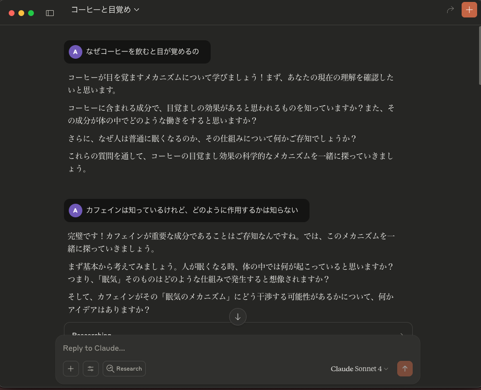
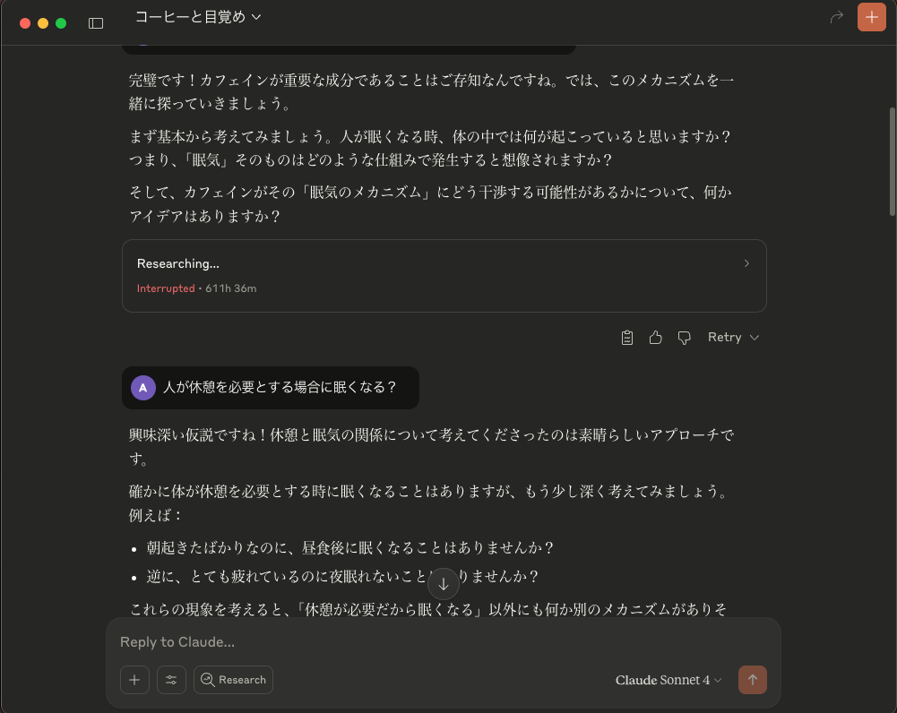
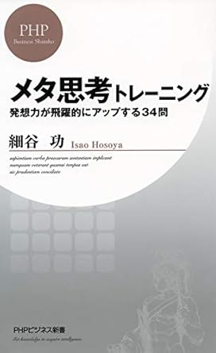

# AIと共存する時代の学習法
### Claude Codeの学習モードを例に

---

## 本日の問いかけ

**「AIに聞けば3秒で答えが出る時代に、なぜ私たちは学び続ける必要があるのか？」**

<!-- 
本日のテーマは「AIに聞けば3秒で答えが出る時代に、なぜ私たちは学び続ける必要があるのか？」です
 -->

---

## 今日話す内容

- AIの登場により懸念されている「思考力の低下」について
- 「思考力の低下」という課題に対するアプローチである「学習モード」
- 学習モードはどのように機能し、どのような効果があるのか
- 学習モードの具体例としてClaude Codeの学習モードを紹介

<!-- 
今日は以下の内容についてお話しします。
始めに、AIの登場により懸念されている「思考力の低下」についてです。
次に、「思考力の低下」という課題に対するアプローチである「学習モード」について説明します。学習モードはどのように機能し、どのような効果があるのかを解説します。
最後に、学習モードの具体例としてClaude Codeの学習モードのデモを通じて使い方を紹介します。

 -->

---

## 知識の獲得方法の変化

### Before ChatGPT

- Google検索
- 周囲の人に質問
- 図書館に出向いて関連書籍を調査

**情報を得るために自ら能動的に動き、取捨選択を行う必要があった**

### After ChatGPT

- 自然言語で質問すると、瞬時に答えが得られる
- 情報収集の手間が大幅に削減された

**受動的に答えが得られる**

<!-- 
ChatGPT が発表されてからの数年で私達の情報収集の仕方は大きく変わりました。
以前までは、わからないことや知りたいことがあった場合には Google 検索で調べたり、詳しい人に質問したり、あるいは図書館に出向いて関連する書籍を調査するといった方法が一般的でした。これらの方法にある程度共通していることは、情報を得るために自ら能動的に動き、取捨選択を行う必要があったことです。

現在では、AIがその役割を担うようになり、私たちは自然言語で質問するだけで、瞬時に答えを得られるようになりました。もちろん、AIが提供する情報の正確性や信頼性を自分で判断する必要はありますが、情報収集の手間が大幅に削減されたことは間違いありません。情報収集のあり方は、受動的に答えが得られる形に変わっています。
 -->

---

## コードの大部分はAIが生成するようになった

- Claude Code や Devin といった AI コーディングエージェントの登場
- 開発者は自然言語で指示を出すだけでエージェントが自律的にコードを生成してくれる、いわゆる「Agentic Coding」の時代が到来
- AIが自動生成したコードをベースに、開発者が微調整を加えるスタイルが主流に

<!-- 
コーディングの分野でも同様の変化が起きています。Claude Code や Devin といった AI コーディングエージェントの登場により、開発者は自然言語で指示を出すだけでエージェントが自律的にコードを生成してくれる、いわゆる「Agentic Coding」の時代が到来しました。これにより、コードの大部分は AI が生成するようになり、開発者はコードの生成からコードのレビューや設計、AI エージェントの管理へと仕事の内容がシフトしつつあります。

現時点ではAIエージェントが生成したコードをそのまま採用できるケースは少なく、開発者が微調整を加えるスタイルが主流です。
 -->

---

## 従来の問題解決例

```
問題発生「」React useEffect を使ったら無限ループが発生した
  ↓
Google検索「React useEffect infinite loop」
  ↓
Stack Overflow の回答や技術ブログを複数参照
  ↓
公式ドキュメントを熟読
  ↓
試行錯誤（3-4回のエラー体験）
  ↓
解決（所要時間：2-4時間）
  ↓
副産物：
  - なぜ依存関係の警告が出るのか理解できた
  - useEffectの挙動についての理解が深まった
```

<!-- 
具体的な問題解決の例を見てみましょう。例えば、React の useEffect を使ったら無限ループが出た場合、従来は Google 検索で「React useEffect infinite loop」と調べて Stack Overflow の回答や技術ブログを複数参照し、公式ドキュメントを熟読して試行錯誤を繰り返しながら解決していました。このプロセスには 2-4 時間かかることも珍しくありませんでした。

1 つの問題を解決するために多くの時間を費やしてしまうと言う点では確かに非効率的かもしれませんが、このプロセスを通じて、なぜ依存関係の警告が出るのか理解できたり、useEffect の挙動についての理解が深まったりといった副産物も得られていました。
 -->

---

## 問題の本質を見失うリスク

```
問題発生
  ↓
「React useEffect を使ったら無限ループが発生したので、修正して」
  ↓
解決策が瞬時にコードに反映される（所要時間：数秒）
  ↓
副産物：なし？依存への慣れ？
```

<!-- 
一方で、AIエージェントに「React useEffect を使ったら無限ループが発生したので、修正して」と依頼すると、解決策が瞬時にコードに反映されます。このプロセスは非常に効率的で、数秒で問題が解決しますが、副産物として得られるものはほとんどありません。むしろ、なぜその警告が出るのかを理解しないまま慣れてしまったりするリスクがあります。

このように、AIに頼ることで短期的な解決は得られるものの、長期的な学びの機会を失ってしまう可能性があるのです。
-->

---

## なぜ本質的な理解が重要なのか？

- AIが生成したコードの品質を評価し、改善点を指摘する能力
- 最終的な意思決定は人間が行う必要がある
- 似たような問題に直面した際に、適切な解決策を自分で考え出す能力

<!-- 
とはいえ、なぜ本質的な理解が重要なのでしょうか？今後もコーディングエージェントが発展して開発者がコードを書く量が減っていくのであれば、コードを書けなくとも問題ないのではないかと思うかもしれません。

しかし、いくつかの点でコードがどのように動くのか、なぜそのように動くのかを理解しておくことは重要です。まず、今後コードレビューが重要なスキルになることが予測されます。AIが生成したコードの品質を評価し、改善点を指摘する能力は人間にしかできない仕事です。コードの本質的な理解がなければ、コードレビューを適切に行うことはできません。

AIエージェントはあくまでツールであって、最終的な意思決定や責任は人間が行う必要があることを忘れてはなりません。どのようにコードが動いているのが自分の言葉で説明できないのであれば、今後コードを保守していくことは困難です。

また、似たような問題に直面した際に、適切な解決策を自分で考え出す能力も重要です。コードがどのような原理で動くのかを理解していれば、似たような問題に直面した際に、記憶の断片を組み合わせて既存のコードを応用、修正して解決策を考え出すことができます。
 -->

---

<div class="center" style="flex-direction: column;">

## 生成AIの盲信

AI が生成したコードを無批判に受け入れてしまう危険性

批判的思考力を身につけて、AI を適切に活用しよう

</div>


<!--
ここからは、AI エージェントを活用する上で重要な「批判的思考」について説明します。

AI が提案するコードを妄信的に受け入れてしまった結果、設計にそぐわないコードが量産されてしまうという事例がすでに報告されています。AI の出力を無批判に受け入れるのではなく、批判的な思考を持って活用することが重要です。
-->

---

## 劇場のイドラ（Theater of Idols）

<div class="flex" style="gap: 12rem;">

<div>

**フランシス・ベーコンの「4つのイドラ」より**

権威や流行に盲従してしまう認知バイアス

### AI時代における「劇場のイドラ」

- **AI の権威性**：「AI が言うから正しい」
- **技術の流行性**：「最新のAIツールなら間違いない」
- **自動化への過信**：「機械の方が人間より正確」

</div>

<div style="text-align: center;">
  <div style="font-size: 10rem;">🎭</div>
  <div >
    権威への盲従は<br>
    判断力を奪う
  </div>
</div>

</div>

<!--
AI の発言を妄信的に受け入れてしまうということは、誰にでも起こりうることです。これは、17世紀の哲学者フランシス・ベーコンが提唱した「4つのイドラ」の中の「劇場のイドラ」に該当します。

「劇場のイドラ」は、権威や流行に盲従してしまう認知バイアスを指します。

AI 時代においても、この「劇場のイドラ」が強く働く可能性があります。「AI が言うから正しい」「最新のAIツールなら間違いない」という思い込みは、批判的思考を停止させてしまいます。

特に高性能な AI ほど、その出力が説得力を持って見えるため、無批判に受け入れてしまう危険性が高いのです。
-->

---

## 批判的思考力の重要性

<div class="flex" style="flex-wrap: nowrap;">

<div>

批判的思考：与えられた情報や状況を鵜呑みにせず、多角的な視点から分析し、論理的に考察して、客観的な判断や評価を行うための思考力

### AI時代に必要な批判的思考

- **出力の検証**：生成されたコードの妥当性確認
- **複数の視点**：異なるアプローチの検討
- **根拠の確認**：なぜその解決策なのかを自分の言葉で説明できるように

</div>


</div>

<!--
批判的思考とは、与えられた情報や状況を鵜呑みにせず、多角的な視点から分析し、論理的に考察して、客観的な判断や評価を行うための思考力です。AIはハルシネーションと呼ばれる現象があり、生成されたコードが必ずしも正しいとは限りません。そのため、AIの出力は必ず検証をする癖をつけましょう。

また AI の出力が唯一の解決策ではないか、他のアプローチはないかを検討することも重要です。

AI がなぜそのコードを出力し、どのような根拠でその解決策を提案しているのかを自分の言葉で説明できるようにすることも、批判的思考の一環です。「どうしてこのコードを書いたの？」問われた際に、AIが生成したからという答えは何も説明になりません。

批判的思考力を鍛えるためには、「思考力改善ドリル」という書籍がおすすめです。
-->

---

## コード生成の便利さと落とし穴

### 便利さの実例
```javascript
// AIに「React TODOアプリを作って」と依頼
// → 5分で完成度の高いアプリが生成

function TodoApp() {
  const [todos, setTodos] = useState([]);

  const addTodo = (todo) => {
    setTodos([...todos, todo]);
  };

  // 完璧に動作するコードが一瞬で...
}
```

---

## コードの意図を理解できていない

```javascript
// 理解度の実態
質問：「useState([])の[]は何を意味しますか？」
回答：「えーっと...初期値？」

質問：「setTodosを呼ぶとき、.push() メソッドを使わないのはなぜ？」
回答：「よくわかりません...」

質問：「このコードのパフォーマンス上の問題点は？」
回答：「うーん...」
```

**問題**：動作するコードは書けるが、**なぜ動くかが分からない**

---

## 学習曲線の変化

### 従来の健全な成長パターン
```
スキル
 ↑           ／￣￣￣￣ 深い理解
 |         ／       
 |       ／プラトー期間（重要）        
 |     ／           
 |   ／基礎固め期間            
 | ／            
 |／_________________→ 時間
 基礎→応用→熟練
```

<!-- 
学習曲線の変化について説明します。従来の健全な成長パターンは、始めに急激にスキルが伸び、その後プラトー期間と呼ばれる停滞期を経て、さらに深い理解へと進んでいく形です。このプラトー期間は非常に重要で、基礎を固める期間でもあります。基礎がしっかりしていれば、応用や熟練の段階に進んだ際により深い理解が得られます。

 -->

---

## AI時代の問題パターン

```
スキル（見かけ上）
 ↑
 | ￣￣￣￣￣￣￣￣￣ 表面的な成果
 |          
 |          実際のスキル
 | ー ー ー ー ー ー ー ー ↓
 |／________________→ 時間
```

**問題**：瞬間的成果と持続的成長の**深刻な乖離**

<!-- 
しかし、AI のよって見かけ上は動作するコードがかけてしまうと、実際のスキルが伴わないまま表面的な成果だけが得られることになります。m従来の学習曲線ですとちょうどプラトー期間の手前ぐらいのスキルが得られたように見えますが、実際には基礎が伴っていないため、応用や熟練の段階に進んだ際に深い理解が得られません。この乖離は非常に深刻な問題です。
 -->

---

## AIとの理想的な関係性
**「答えを出す道具」から「思考を深めるパートナー」へ**

→ 元からよく思考してた人は更に深く考えるようになり、AI時代により差がつく

### 目指すべきAI活用像
- **問いを立てる**
- AIの解答を鵜呑みにしない **批判的思考**

<!-- 
AIとの理想的な関係性は、「答えを出す道具」と私鉄可能ではなく、「思考を深めるパートナー」として共に学び続けることです。AI時代になると、知識の民主化が期待されるような見通しがありましたが、実際には元からよく思考してた人は更に深く考えるようになり、AI時代により差がつくことが予測されます。

AIの出力をよりよいものにするためには、自分の知りたいことをよく言語化したプロンプトが不可欠です。つまり、AIに質問をする前に自分で仮説を立て、問いを立てる力が重要になります。またAIの回答を鵜呑みにしない批判的思考も必要です。AIの回答に対して「なぜ？」を追求し、根拠を自分の言葉で説明できるようにすることが求められます。

 -->

---

## AIをパートナーとして活用するために、AIを学習に使う


<!-- 

それではAIをパートナーして活用するために、我々はどのような学習法を取るべきでしょうか？幸いAIがもたらした問題は、AIによって解決できる可能性があります。つまり、AIを学習に使うことです。
 -->

---

## 各社の学習支援機能

### [ChatGPTの学習モード](https://openai.com/ja-JP/index/chatgpt-study-mode/)

> すぐに解答を示すのではなく、ソクラテス式問答法（対話を通じて自ら考えさせる方法）やヒント、問いかけを組み合わせ、学生自身の考える力を導きます。これにより、理解を深め、能動的な学習を促進します。

### [Geminiのガイド付き学習](https://blog.google/outreach-initiatives/education/guided-learning/)   

> ガイド付き学習は、掘り下げた質問や自由回答形式の質問を通して参加を促し、議論を促し、テーマをより深く掘り下げる機会を提供します。その目的は、単に答えを得るだけでなく、深い理解を育むことです。

### [Claude for Education](https://www.anthropic.com/solutions/education)

> 直接答えるのではなく発見を導く, ソクラテス式質問を通して思考力を養う, 解決策ではなく原則に焦点を当てる

<!-- 
LLMプロバイダーの各社は、学習支援に特化した機能を提供し始めています。これらの学習支援機能は、大学生を対象にしているものが多いですが、基本的な考え方は同じです。

例えば、ChatGPTの学習モードは、すぐに解答を示すのではなく、ソクラテス式問答法（対話を通じて自ら考えさせる方法）やヒント、問いかけを組み合わせ、学生自身の考える力を導くことを目的としています。

Geminiのガイド付き学習も同様に、掘り下げた質問や自由回答形式の質問を通して参加を促し、議論を促し、テーマをより深く掘り下げる機会を提供します。その目的は、単に答えを得るだけでなく、深い理解を育むことです。

Claude では output style で「学習モード」を選択することで、直接答えるのではなく発見を導く、ソクラテス式質問を通して思考力を養う、解決策ではなく原則に焦点を当てるといった特徴があります。

 -->

---

## AIをメンターとして活用する

- AIからの質問に答える形式で自分の頭で考える力を養う
- AI をメンターとして活用することの利点
  - 恥を欠かない
  - 24時間365日いつでも利用できる

<!-- 
AI の学習モードは自分自身のメンターとして活用するイメージです。AI は答えを直接教えるのではなく、質問やヒントを通じて自分で考える力を養います。これにより、表面的な知識ではなく、本質的な理解が深まります。

AI をメンターとして活用することの利点として、以下の 2 点があると考えられます。恥を欠かないということ、24時間365日いつでも利用できるということです。例えば従来の講義形式の授業では、間違った内容の質問をしていないかというおそれや不安からわからないことがあっても質問に踏み切れずに疑問をそのままにしてしまうことがありました。しかし、AI メンターであれば周囲の目も気にしないでよいですし、自分をよく見せたいという気持ちも働かないため、自分の考えていることを言語化することに集中できます。

また、AI メンターは 24 時間 365 日いつでも利用できるため、自分のペースで学習を進めることができます。わからないことがあったときにすぐに質問できる環境が整っていることは、学習の継続性を高める上で非常に重要です。
-->

---

## 実際の学習モードの例

<div style="display: flex; justify-content: space-between; gap: 16px;">




</div>

<!-- 
学習モードを実際に Claude で使用している例を示します。ここでは私が Claude に対して「なぜコーヒーを飲むと眠気が覚めるのか？」と尋ねた際のチャットの一部を抜粋しています。

まずコーヒーに含まれている成分が何であるかの問いかけから始まり、カフェインであることは知っているがどのように作用するかについては知らないと回答しています。次に、カフェインが脳内でどのように作用するかを考えるために、なぜ人が眠くなるのか順を追って考えるように促されています。

問答を繰り返すうちに、カフェインがアデノシン受容体に結合することで眠気を抑制すること、またドーパミンやノルアドレナリンの分泌を促進することで覚醒効果があることを自分で導き出しています。
 -->

---

## メタ認知の重要性

<div style="display: flex; gap: 16px;">


<div>

**自分の思考プロセスを客観視する能力**

- 自分の理解度を把握する → 不足している知識を特定する
- 自分の頭で考えることで、どの部分が理解できていないかを認識する
- AIが自分では気づかない視点を提供してくれる

</div>




</div>


<!-- 
AI の学習モードを活用することで、メタ認知の能力も養われます。メタ認知とは、自分の思考プロセスを客観視する能力です。物事を一つ上の視点から考えるとも言えます。

メタ認知は自己成長のために必須の能力です。自分が理解できていない部分を認識できなければ、どの知識を補うべきかがわからず、効率的に学習を進めることができません。自分の言葉で誰かに物事を説明したり、AIの質問に答えたりする行為は、その物事を深く理解していないとできません。自分の言葉で説明をしようとする過程の上で、どの部分が理解できていないかを認識することができます。

AIの質問では、自分では気づかない視点を提供してくれるので、いわゆる無知の知を得ることができるえしょう。
 -->

---

## 最近接発達領域（ZPD）理論

### Zone of Proximal Development
```
[一人ではできない] ← [支援があればできる] ← [一人でできる]
                    ↑
                  ZPD領域
```

### AIが「知識のある他者」として機能
- **適切な難易度**の問題を提示
- **ヒント**を段階的に提供
- **励まし**と**フィードバック**で学習継続を支援

<!-- 
また、AIはヴィゴツキーの提唱した最近接発達領域（ZPD）理論に基づく学習支援を提供できます。ZPDとは、一人ではできないが、適切な支援があればできる領域を指します。

 -->

---

## コーディングエージェントの学習モード

- AIがなぜそのコードを書いたのかを「Insight」として説明
- AIがすべてのコードを生成するのではなく、ユーザーにヒントを与え、コードを自分で書かせる
- どのようなコードを書くべきか思考する余地を残す

<!-- 

Claude Code では学習モードが提供されています。

このモードではAIがコードを生成する際に、なぜそのコードを書いたのかを「Insight」として説明します。多々漠然と生成されるコードを眺めていると、そのコードがなぜそのように動くのか、なぜそのように書かれているのかがわからなくなってしまいます。Insightを通じて、コードの動作原理や設計意図を理解することができます。

コーディングエージェントの学習モードでは、AIがすべてのコードを生成するのではなく、時折ユーザーにヒントを与えたうえで、コードを自分で書かせる形式を取ります。これにより、ユーザーはコードの動作原理を理解しながら学習を進めることができます。

私はAI時代だからこそ、自分の力で考えてコードを書く練習をすることが重要だと考えています。第一に、自分でどのようなコードを書くべきか思考する余地を残すことです。第二に、コードを書く過程で試行錯誤を経験し、問題解決能力を養うことです。これらはAIに頼り切ってしまうと得られない学びです。
 -->

---

## 自分で手を動かした経験は長期的に記憶に残る

<div style="display: flex; gap: 16px;">

- インプット（読む、聞く）だけでは記憶に定着しない
- アウトプット（書く、話す、行動する）を通じて初めて定着する
- 誰かに説明するという過程で自分の曖昧な理解が明確になり、知識がより深く定着する
- コードをそのまま書き写す「写経」と呼ばれる学習法も長く知られてきた


</div>


<!-- 
また、自分で手を動かした経験は長期的に記憶に残ることが知られています。学習においては、インプット（読む、聞く）だけでは記憶に定着しません。アウトプット（書く、話す、行動する）を通じて初めて定着します。漫然とコードを眺めているだけではなく、自分で手を動かしてコードを書く経験を積むことが重要です。また、誰かに説明するという行為を通じると、自分の曖昧な理解が明確になり、知識がより深く定着します。

他にも、プログラミング学習ではコードをそのまま書き写す「写経」と呼ばれる学習法も長く知られてきました。これはサンプルコードをそのまま手で書き写す方法で、体系的にコードを理解するのに役立ちます。

 -->

---

## Claude Code学習モード デモ

### 課題：Next.js でカンバンアプリケーションに機能を追加する

---

## まとめ：AIとの新しい関係性

### 従来の関係性（依存モデル）
- AI = **答えを出す道具**
- 人間 = **答えを受け取る受動的存在**

### 新しい関係性（協働モデル）  
- AI = **学習をサポートするパートナー**
- 人間 = **主体的に学び続ける存在**

---

## 個人レベルのアクションプラン

### 1. 意識的な学習モード使用
- **簡単に答えを求めず**、まず自分で考える
- AIに質問する前に**自分なりの仮説**を立てる
- **「なぜ？」を3回**繰り返す習慣

### 2. 実践的な学習設計
- **実際に手を動かして**学ぶ
- **他人に説明できるレベル**まで理解する
- **異なる文脈で応用**してみる
