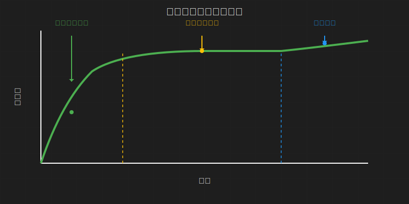
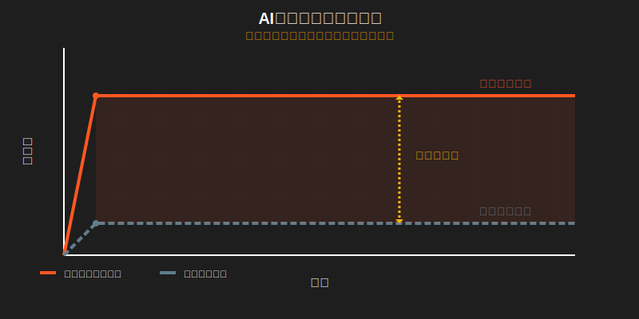
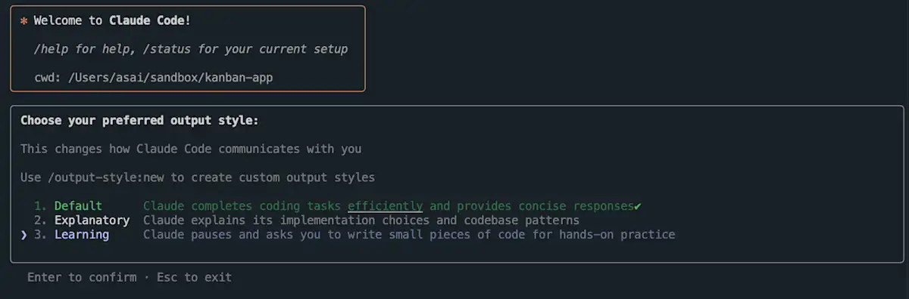
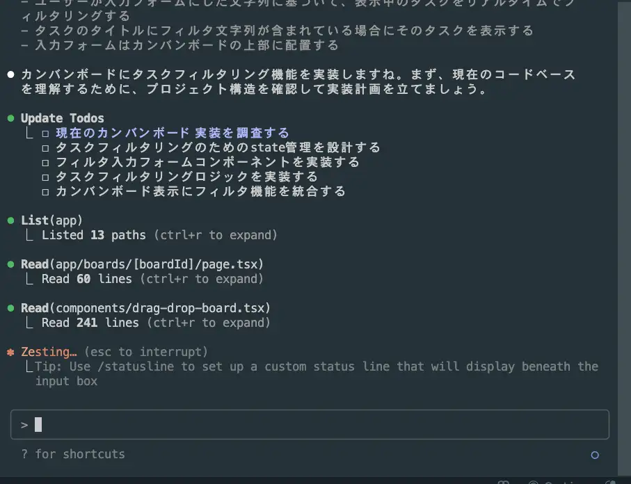
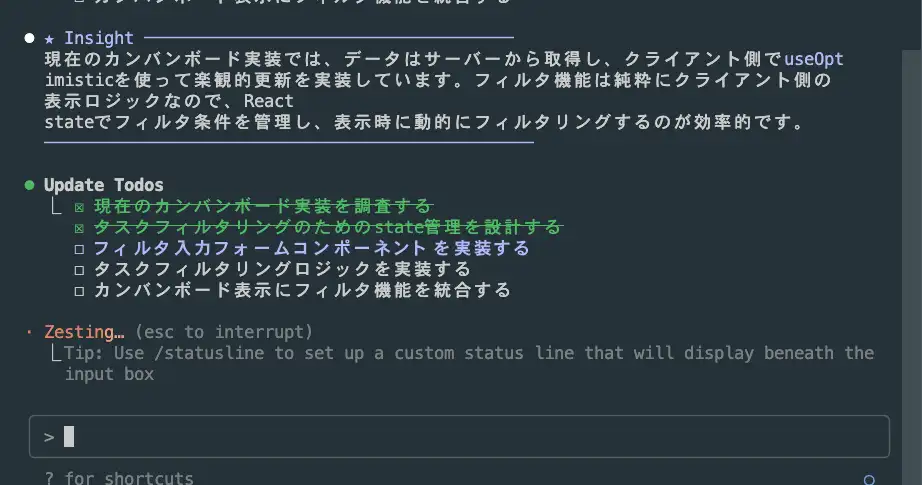
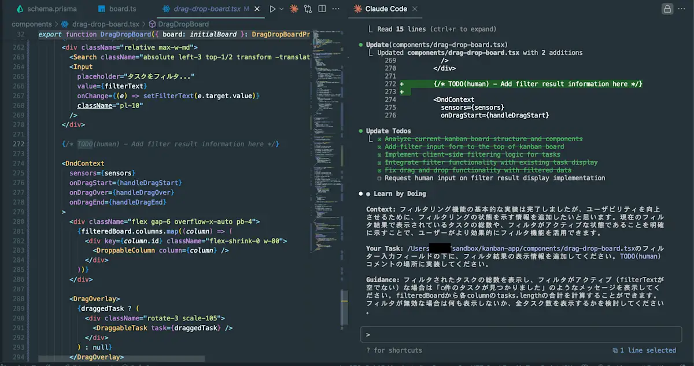
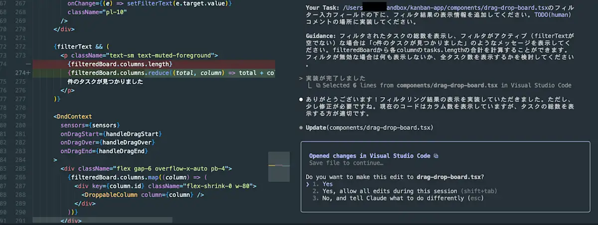

# AIと私たちの学習の変化を考える
### Claude Codeの学習モードを例に

---

## 自己紹介

- azukiazusa
- https://azukiazusa.dev
- FE（フロントエンド|ファイアーエムブレム）が好き


<!-- はじめに簡単に自己紹介です。普段 azukiazusa という名前で活動していています。azukiazusa.dev というブログを運営しています。。 -->


---

## 本日の問いかけ

**「AIに聞けば3秒で答えが出る時代に、なぜ私たちは学び続ける必要があるのか？」**

<!-- 
本日のテーマは「AIに聞けば3秒で答えが出る時代に、なぜ私たちは学び続ける必要があるのか？」です
 -->

---

## 今日話す内容

- AIの登場により懸念されている「思考力の低下」について
- AIとどのように付き合い、学び続けるべきか
- 学習モードはどのように機能し、どのような効果があるのか
- 学習モードの具体例としてClaude Codeの学習モードを紹介

<!-- 
今日は以下の内容についてお話しします。
始めに、AIの登場により懸念されている「思考力の低下」についてです。そして、このような状況において、AIとどのように付き合い、学び続けるべきかを考えます。次に、学習モードはどのように機能し、どのような効果があるのかを解説します。
最後に、学習モードの具体例としてClaude Codeの学習モードのデモを通じて使い方を紹介します。

 -->

---

## 知識の獲得方法の変化

### Before ChatGPT

- Google検索
- 周囲の人に質問
- 図書館に出向いて関連書籍を調査

**情報を得るために自ら能動的に動き、取捨選択を行う必要があった**

<!-- 
ChatGPT が発表されてからの数年で私達の情報収集の仕方は大きく変わりました。
以前までは、わからないことや知りたいことがあった場合には Google 検索で調べたり、詳しい人に質問したり、あるいは図書館に出向いて関連する書籍を調査するといった方法が一般的でした。これらの方法にある程度共通していることは、情報を得るために自ら能動的に動き、取捨選択を行う必要があったことです。
 -->

---

### After ChatGPT

- 自然言語で質問すると、瞬時に答えが得られる
- 情報収集の手間が大幅に削減された

**受動的に答えが得られる**

<!-- 

現在では、AIがその役割を担うようになり、私たちは自然言語で質問するだけで、瞬時に答えを得られるようになりました。もちろん、AIが提供する情報の正確性や信頼性を自分で判断する必要はありますが、情報収集の手間が大幅に削減されたことは間違いありません。情報収集のあり方は、受動的に答えが得られる形に変わっています。
 -->

---

## コードの大部分はAIが生成するように

- Claude Code や Devin といった AI コーディングエージェントの登場
- 開発者は自然言語で指示を出すだけでエージェントが自律的にコードを生成してくれる、いわゆる「Agentic Coding」の時代が到来
- 開発者はコードの生成からコードのレビューや設計、AI エージェントの管理へと仕事の内容がシフトしつつある
- AIが自動生成したコードをベースに、開発者が微調整を加えるスタイルが主流に

<!-- 
コーディングの分野でも同様の変化が起きています。Claude Code や Devin といった AI コーディングエージェントの登場により、開発者は自然言語で指示を出すだけでエージェントが自律的にコードを生成してくれる、いわゆる「Agentic Coding」の時代が到来しました。これにより、コードの大部分は AI が生成するようになり、開発者はコードの生成からコードのレビューや設計、AI エージェントの管理へと仕事の内容がシフトしつつあります。

現時点ではAIエージェントが生成したコードをそのまま採用できるケースは少なく、開発者が微調整を加えるスタイルが主流です。
 -->

---

## 従来の問題解決例

```
問題発生: React useEffect を使ったら無限ループが発生した
  ↓
Google検索「React useEffect infinite loop」
  ↓
Stack Overflow の回答や技術ブログを複数参照
  ↓
公式ドキュメントを熟読
  ↓
試行錯誤（3-4回のエラー体験）
  ↓
解決（所要時間：2-4時間）
  ↓
副産物：
  - なぜ依存関係の警告が出るのか理解できた
  - useEffectの挙動についての理解が深まった
```

<!-- 
具体的な問題解決の例を見てみましょう。例えば、React の useEffect を使ったら無限ループが出た、という問題が発生したとします。
従来は Google 検索で「React useEffect infinite loop」と調べて Stack Overflow の回答や技術ブログを複数参照し、公式ドキュメントを熟読して試行錯誤を繰り返しながら解決していました。このプロセスには 2-4 時間かかることも珍しくありませんでした。

1 つの問題を解決するために多くの時間を費やしてしまうと言う点では確かに非効率的かもしれませんが、このプロセスを通じて、なぜ依存関係の警告が出るのか理解できたり、useEffect の挙動についての理解が深まったりといった副産物も得られていました。
 -->

---

## 問題の本質を見失うリスク

```
問題発生
  ↓
「React useEffect を使ったら無限ループが発生したので、修正して」
  ↓
解決策が瞬時にコードに反映される（所要時間：数秒）
  ↓
副産物：なし？依存への慣れ？
```

短期的な解決は得られるが、長期的な学びの機会を失う可能性

<!-- 
一方で、AIエージェントを活用した問題解決の例はより単純です。

「React useEffect を使ったら無限ループが発生したので、修正して」と依頼すると、解決策が瞬時にコードに反映されます。このプロセスは非常に効率的で、数秒で問題が解決しますが、副産物として得られるものはほとんどありません。むしろ、なぜその警告が出るのかを理解しないまま慣れてしまったりするリスクがあります。

このように、AIに頼ることで短期的な解決は得られるものの、長期的な学びの機会を失ってしまう可能性があるのです。
-->

---

## コード生成の便利さと落とし穴

```javascript
// AIに「React TODOアプリを作って」と依頼
// → 5分で完成度の高いアプリが生成

function TodoApp() {
  const [todos, setTodos] = useState([]);

  const addTodo = (todo) => {
    setTodos([...todos, todo]);
  };

  // 実施に動作するコードが一瞬で...
}
```

<!-- 
AIによるコード生成を活用すれば。「React TODOアプリを作って」と依頼するだけで、実際に動作するコードが一瞬で生成されるという便利さがあります。

 -->

---

## コードの意図を理解できていない

```javascript
// 理解度の実態
質問：「useState([])の[]は何を意味しますか？」
回答：「えーっと...初期値？」

質問：「setTodosを呼ぶとき、.push() メソッドを使わないのはなぜ？」
回答：「よくわかりません...」

質問：「このコードのパフォーマンス上の問題点は？」
回答：「うーん...」
```

**問題**：動作するコードは書けるが、**なぜ動くかが分からない**

<!-- 
しかし、コードが動作するからといって、そのコードの意図を理解できているとは限りません。例えば、useState([]) の [] は何を意味するのか、setTodos を呼ぶときに .push() メソッドを使わないのはなぜか、といった質問に問われた際に、うまく答えられないことがあります。これは理解が曖昧なままでコードを書いてしまっている典型的な例です。

なぜこのコードを書いたのか問われた際に、AIが生成したからという答えは何も説明にならないのです。
 -->

---

## なぜ本質的な理解が重要なのか？

🤔 AIエージェントがコードを書くようになれば、自身の力で解決できなくても問題ないのでは

- コードレビューが仕事の大部分を占めるようになる
  - AIが生成したコードの品質を評価し、改善点を指摘する能力
- 最終的な責任は人間が負う
  - コードを保守していくためには、コードがどのように動いているのかを理解している必要がある
- 似たような問題に直面した際に、適切な解決策を自分で考え出す能力

<!-- 
とはいえ、なぜ本質的な理解が重要なのでしょうか？今後もAIエージェントが発展して開発者がコードを書く量が減っていくのであれば、自分自身でコードを書いて修正できなくても問題ないのでは、と思うかもしれません。

しかし、いくつかの点でコードがどのように動くのか、なぜそのように動くのかを理解しておくことは重要です。まず、今後コードレビューが仕事の大部分を占めるようになることが予測されます。

AIが生成したコードの品質を評価し、改善点を指摘する行為は人間にしかできない仕事です。コードの本質的な理解が欠けていれはお、なぜそのコードが良いのか、悪いのかを自分の言葉で説明することができません。

AIエージェントはあくまでツールであって、最終的な意思決定や責任は人間が負う必要があることを忘れてはなりません。どのようにコードが動いているのが自分の言葉で説明できないのであれば、今後コードを保守していくことは困難です。

また、似たような問題に直面した際に、適切な解決策を自分で考え出す能力も重要です。コードがどのような原理で動くのかを理解していれば、似たような問題に直面した際に、記憶の断片を組み合わせて既存のコードを応用、修正して解決策を考え出すことができます。
 -->

---

## 「グライダー人間」から「飛行機人間」へ

<div class="flex-space-between">

<div>

グライダー人間（受動的な学習者）
  - 他者に引っ張られて飛ぶだけ
  - AIに答えを聞くだけの使い方では、いずれAIに取って代わられる可能性

飛行機人間（能動的な思考者）
  - 自力で飛翔できる
  - 自ら考え、創造する力を持つ

https://www.chikumashobo.co.jp/product/9784480020475/

</div>


</div>


<!-- 
外山滋比古の『思考の整理学』では、受動的な学習者を「グライダー」、能動的な思考者を「飛行機」に例えています。

グライダーは他者に引っ張られて飛ぶだけで、与えられた知識を受け入れるのみです。現代の教育は「グライダー人間」を量産しがちですが、AI時代においてこのような受動的な姿勢では、いずれAIに取って代わられるリスクがあります。この書籍が出版されたのは1986年ですが、当時もグライダー人間はコンピューターに取って代わられる可能性があると指摘されていました。

一方、飛行機は自力で飛翔でき、自ら考え、創造する力を持っています。AI時代では、AIを使って+αの価値を生み出せる「飛行機人間」になることが重要です。
-->

---

## VUCA時代に求められる能力

### VUCA = Volatility（変動性）, Uncertainty（不確実性）, Complexity（複雑性）, Ambiguity（曖昧性）

- 問題を解決する能力だけでなく、**問題を発見する能力**が重要に
- AIは既知の問題を効率的に解決することに長けているが、未知の課題を見つけ出したり、創造的な価値を生み出すことは人間の仕事


<!-- 
今の世の中は VUCAの時代と呼ばれています。VUCAとは、Volatility（変動性）, Uncertainty（不確実性）, Complexity（複雑性）, Ambiguity（曖昧性）の頭文字を取った造語であり、特に急速な技術革新、グローバル化、予測困難な出来事が頻発する現代社会を特徴づける言葉として定着しています。

VUCA（変動性、不確実性、複雑性、曖昧性）の時代では、従来の「問題を解決する能力」だけでなく、「問題を発見する能力」が重要になります。

AIは既知の問題を効率的に解決することに長けていますが、未知の課題を見つけ出したり、創造的な価値を生み出すことは人間の得意分野です。これこそが人間がAIと差別化できるポイントなのです。
-->

---

<div class="center-column">

## 生成AIの盲信

AI が生成したコードを無批判に受け入れてしまう危険性
 - セキュリティ上のリスク
 - 技術的負債の蓄積

批判的思考力を身につけて、AI を適切に活用しよう

</div>


<!--
そして AI が提案するコードを妄信的に受け入れてしまった結果、セキュリティ上のリスクが発生したり、技術的負債を抱え込んでしまったりする危険性もあります。
AI の出力を無批判に受け入れるのではなく、批判的な思考を持って活用することが重要です。
-->

---

## 劇場のイドラ（Theater of Idols）

<div class="flex-space-between">

<div>

**フランシス・ベーコンの「4つのイドラ」より**

権威や流行に盲従してしまう認知バイアス

### AI時代における「劇場のイドラ」

- **AI の権威性**：「AI が言うから正しい」
- **技術の流行性**：「最新のAIツールなら間違いない」
- **自動化への過信**：「機械の方が人間より正確」

</div>

<div class="text-center">
  <div class="font-size-10rem">🎭</div>
  <div>
    権威への盲従は<br>
    判断力を奪う
  </div>
</div>

</div>

<!--
AI の発言を妄信的に受け入れてしまうということは、誰にでも起こりうることです。これは、17世紀の哲学者フランシス・ベーコンが提唱した「4つのイドラ」の中の「劇場のイドラ」に該当します。

「劇場のイドラ」は、権威や流行に盲従してしまう認知バイアスを指します。

AI 時代においても、この「劇場のイドラ」が強く働く可能性があります。「AI が言うから正しい」「最新のAIツールなら間違いない」という思い込みは、批判的思考を停止させてしまいます。

特に高性能な AI ほど、その出力が説得力を持って見えるため、無批判に受け入れてしまう危険性が高いのです。
-->

---

## 批判的思考力の重要性

<div class="flex-space-between">

<div>

批判的思考：与えられた情報や状況を鵜呑みにせず、多角的な視点から分析し、論理的に考察して、客観的な判断や評価を行うための思考力

- **出力の検証**：生成されたコードの妥当性確認
- **複数の視点**：異なるアプローチの検討
- **根拠の確認**：なぜその解決策なのかを自分の言葉で説明できるように

<div class="link">

https://www.keisoshobo.co.jp/book/b534036.html

</div>

</div>


</div>

</div>

<!--
そこで批判的思考が重要になります。

批判的思考とは、与えられた情報や状況を鵜呑みにせず、多角的な視点から分析し、論理的に考察して、客観的な判断や評価を行うための思考力です。AIはハルシネーションと呼ばれる現象があり、生成されたコードが必ずしも正しいとは限りません。そのため、AIの出力は必ず検証をする癖をつけましょう。

また AI の出力が唯一の解決策ではないか、他のアプローチはないかを検討することも重要です。

AI がなぜそのコードを出力し、どのような根拠でその解決策を提案しているのかを自分の言葉で説明できるようにすることも、批判的思考の一環です。

批判的思考力を鍛えるためには、「思考力改善ドリル」という書籍がおすすめです。
【10分】
-->

---

## 学習曲線の変化



<!-- 
学習曲線の変化について説明します。従来の健全な成長パターンは、始めに急激にスキルが伸びつ期間があり、その後プラトー期間と呼ばれる停滞期を経て、さらに深い理解へと進んでいくのです。

 -->

---

## 学習曲線の変化

<div class="flex">


- プラトー期間は、脳が知識を整理・成熟させる期間
- この期間を乗り越えることで、さらなる応用力や思考速度の向上につながるとも言われている

</div>

<!-- 
プラトー期間は、脳が知識を整理・成熟させる期間と考えられており、この期間を乗り越えることで、さらなる応用力や思考速度の向上につながるとも言われています。

 -->

---

## AI時代の問題パターン



基礎が伴わないまま表面的な成果だけが得られる

<!-- 
しかし、AI によって見かけ上は動作するコードが書けてしまうと、実際のスキルが伴わないまま表面的な成果だけが得られることになります。

従来の学習曲線でいえばちょうどプラトー期間の手前ぐらいのスキルが得られたように見えますが、実際には基礎が伴っていないため、応用や熟練のための期間を経ることができません。

またすでに表面上成果が得られているのであれば、プラトー期間を乗り越えるためのモチベーションも維持しづらくなります。

 -->

---

## AIとの理想的な関係性
**「答えを出す道具」から「思考を深めるパートナー」へ**

→ 元からよく思考してた人は更に深く考えるようになり、AI時代により差がつく

<!-- 
AIとの理想的な関係性は、「答えを出す道具」ではなく、「思考を深めるパートナー」として共に学び続けることです。生成AIが登場した頃には知識の民主化が期待されるような見通しがありましたが、実際には元からよく思考してた人はAIの力を借りて更に深く考えるようになり、AI時代により差がつくことが予測されます。
 -->

---

### 目指すべきAI活用像
- AIを「答えを得るため」ではなく、「思考を深める（＝学ぶ）」 ために使う
- よりよい出力を得るために問いを立てる
- AIの解答を鵜呑みにしない 批判的思考

<!-- 

AIの出力をよりよいものにするためには、自分の知りたいことをよく言語化したプロンプトが不可欠です。つまり、AIに質問をする前に自分で仮説を立て、問いを立てる力が重要になります。またAIの回答を鵜呑みにしない批判的思考も必要です。AIの回答に対して「なぜ？」を追求し、根拠を自分の言葉で説明できるようにすることが求められます。
 -->


---

## AIをパートナーとして活用するために、AIを学習に使う


<!-- 

それではAIをパートナーして活用するために、我々はどのような学習法を取るべきでしょうか？

AIは新たな課題をもたらしたと同時に、学習を支援する強力なツールとして機能する側面も持っています。ここでは、AIを学習に使う方法について考えてみます。
 -->

---

## 各社の学習支援機能

### [ChatGPTの学習モード](https://openai.com/ja-JP/index/chatgpt-study-mode/)

> すぐに解答を示すのではなく、ソクラテス式問答法（対話を通じて自ら考えさせる方法）やヒント、問いかけを組み合わせ、学生自身の考える力を導きます。これにより、理解を深め、能動的な学習を促進します。

### [Geminiのガイド付き学習](https://blog.google/outreach-initiatives/education/guided-learning/)   

> ガイド付き学習は、掘り下げた質問や自由回答形式の質問を通して参加を促し、議論を促し、テーマをより深く掘り下げる機会を提供します。その目的は、単に答えを得るだけでなく、深い理解を育むことです。

### [Claude for Education](https://www.anthropic.com/solutions/education)

> 直接答えるのではなく発見を導く, ソクラテス式質問を通して思考力を養う, 解決策ではなく原則に焦点を当てる

<!-- 
LLMプロバイダーの各社は、学習支援に特化した機能を提供し始めています。これらの学習支援機能は、大学生を対象にしているものが多いですが、基本的な考え方は同じです。

例えば、ChatGPTの学習モードは、すぐに解答を示すのではなく、ソクラテス式問答法やヒント、問いかけを組み合わせ、学生自身の考える力を導くことを目的としています。

Geminiのガイド付き学習も同様に、掘り下げた質問や自由回答形式の質問を通して参加や議論を促し、テーマをより深く掘り下げる機会を提供します。その目的は、単に答えを得るだけでなく、深い理解を育むことです。

Claude では output style で「学習モード」を選択することで、直接答えるのではなく発見を導く、ソクラテス式質問を通して思考力を養う、解決策ではなく原則に焦点を当てるといった特徴があります。

 -->

---

## AIをメンターとして活用する

- AIからの質問に答える形式で自分の頭で考える力を養う
  - 曖昧に理解した知識が明確になる
  - 答えを出す過程が重要
- AI をメンターとして活用することの利点
  - 恥を欠かない→素直に質問できる
  - 24時間365日、低コストでいつでも利用できる

<!-- 
AI の学習モードは自分自身のメンターとして活用するイメージです。AI は答えを直接教えるのではなく、質問やヒントを通じて自分で考える力を養います。これにより、曖昧に理解した知識が明確になります。答えを出す過程自体が重要なのです。

AI をメンターとして活用することの利点として、以下の 2 点があると考えられます。この2つの利点について次のスライドで詳しく説明します。
-->

---

## 恥をかかない環境での学習

<div class="flex-space-between">

<div>

### 従来の学習環境での課題

- 質問への恐れや不安
  - 間違った内容の質問をしていないか
  - 他の人にどう思われるか
- 自尊心が邪魔をする
  - 自分をよく見せたいという気持ち
  - わからないことを認めたくない
- **結果として疑問をそのままにしてしまう**

</div>

<div>

### AIメンターの利点

- 周囲の目を気にしない
- 素直に質問できる
- 自分の考えていることの言語化に集中できる

</div>

</div>

<!-- 
AIをメンターとして活用することの1つめの利点は、恥をかかない環境での学習ができることです。

従来の講義形式の授業や対面での質問では、間違った内容の質問をしていないかという恐れや不安から、わからないことがあっても質問に踏み切れずに疑問をそのままにしてしまうことがありました。また、他の人からどう思われるかを気にして、自分をよく見せたいという気持ちが働き、わからないことを素直に認められないこともあります。

しかし、AIメンターであれば周囲の目も気にしないでよいですし、自分をよく見せたいという気持ちも働かないため、自分の考えていることを言語化することに集中できます。この安心して学べる環境こそが、AIメンターの大きな利点の一つです。
-->

---

## 24時間365日、いつでも利用可能

<div class="flex-space-between">

<div>

### 従来の学習支援の制約

- 時間的制約
  - 先生の都合に合わせる必要
- コスト的制約
  - 家庭教師は高額な費用
  - 個別指導は限られた人のみ

</div>

<div>

### AIメンターの利点

- いつでも質問できる環境
- 自分のペースで学習を進められる
- 低コストで利用可能

</div>

</div>


<!-- 
AIをメンターとして活用することの2つめの利点は、24時間365日いつでも利用できることです。

従来の学習支援には様々な制約がありました。先生や講師の都合に合わせる必要があり、オフィスアワーや営業時間内でしか質問できませんでした。また、家庭教師を雇う場合には高額な費用がかかり、すべての人が利用できるわけではありませんでした。さらに、居住地域によって学習機会に格差が生じることもありました。

一方、AIメンターは24時間365日いつでも利用できるため、自分のペースで学習を進めることができます。わからないことがあったときにすぐに質問できる環境が整っていることは、学習の継続性を高める上で非常に重要です。また、AIメンターであれば低コストで利用できるため、貧富の格差による学習機会の格差を減らすことにもつながります。これは学習機会の民主化とも言えるでしょう。
-->

---

## 実際の学習モードの例

<div class="flex-space-between">


</div>

<!-- 
学習モードを実際に Claude で使用している例を示します。ここでは私が Claude に対して「なぜコーヒーを飲むと眠気が覚めるのか？」と尋ねた際のチャットの一部を抜粋しています。

まずコーヒーに含まれている成分が何であるかの問いかけから始まり、カフェインであることは知っているがどのように作用するかについては知らないと回答しています。ここでは最初の段階でユーザーの理解度を把握し、それに応じて質問のレベルを調整しています。

次に、カフェインが脳内でどのように作用するかを考えるために、なぜ人が眠くなるのか順を追って考えるように促されています。

問答を繰り返すうちに、自分で答えを導き出しています。
 -->

---

## なぜ一人で学習するのではなく、AIとともに学習するのか？

- 多様な視点の提供
- 学習の道筋を示してくれる
- 対話による理解の深化


<!-- 
一人での学習には限界があります。自分の知識の範囲内でしか考えられず、思い込みに気づくことができません。また、何を学ぶべきか、どの順序で学習を進めるべきかもわからず、モチベーションの維持も困難です。

一方、AIとともに学習することで、自分では気づかない観点を教えてもらえたり、異なるアプローチを提案してもらえます。AIは適切な質問を通じて思考を導き、段階的な理解を促進してくれます。対話を通じて自分の理解度を確認し、知識の穴を発見することができるのです。
-->

---

## メタ認知の重要性

<div class="flex-gap-16">


<div>

**自分の思考プロセスを客観視する能力**

- 自分の理解度を把握する → 不足している知識を特定する
- 自分の頭で考えることで、どの部分が理解できていないかを認識する
- AIが自分では気づかない視点を提供してくれる

<div class="link">
  
https://www.php.co.jp/books/detail.php?isbn=978-4-569-82773-5

</div>

</div>


</div>


<!-- 
AI の学習モードを活用することで、メタ認知の能力も養われます。メタ認知とは、自分の思考プロセスを客観視したり、物事を一つ上の視点から捉えたりする能力を指します。

メタ認知は自己成長のために必須の能力です。自分が理解できていない部分を認識できなければ、どの知識を補うべきかがわからず、効率的に学習を進めることができません。自分の言葉で誰かに物事を説明したり、AIの質問に答えたりする行為は、その物事を深く理解していないとできません。自分の言葉で説明をしようとする過程の上で、どの部分が理解できていないかを認識することができます。

AIの質問では、一人で学習する場合は見落としていた視点を提供してくれるので、いわゆる無知の知を得ることができるでしょう。
 -->

---

## コーディングエージェント（Claude Code）の学習モード

ユーザーが自分の力で考えてコードを書く練習をすることを重視

- AIがなぜそのコードを書いたのかを「Insight」として説明
- AIがすべてのコードを生成するのではなく、ユーザーにヒントを与え、コードを自分で書かせる
- どのようなコードを書くべきか思考する余地を残す

<!-- 

Claude Code では学習モードが提供されています。これは、ユーザーが自分の力で考えてコードを書く練習をすることを重視しているモードです。

このモードではAIがコードを生成する際に、なぜそのコードを書いたのかを「Insight」として説明します。ただ漠然と生成されるコードを眺めていても、そのコードがなぜそのように動くのか、どうしてその書き方を選択したのか理解できません。Insightを通じて、コードの動作原理や設計意図を理解することができます。先輩エンジニアがコードを書いている様を横から眺めるようなイメージです。

コーディングエージェントの学習モードでは、AIがすべてのコードを生成するのではなく、時折ユーザーにヒントを与えたうえで、コードを自分で書かせる形式を取ります。つまり、ユーザーに自分で考える余地を残すのです。
【20分】
 -->

---

## 試行錯誤を経験し、問題解決能力を養う経験はAIに頼り切ってしまうと得られない学び

<!-- 
私はAI時代だからこそ、自分の力で考えてコードを書く練習をすることが重要だと考えています。試行錯誤を経験し、問題解決能力を養うという経験は、AIに頼り切ってしまうと得られない学びです。
 -->

---

## 自分で手を動かした経験は長期記憶に残る

<div class="flex-gap-16">

<div>

- インプット（読む、聞く）だけでは記憶に定着しない
- アウトプット（書く、話す、行動する）を通じて初めて定着する
- コードをそのまま書き写す「写経」と呼ばれる学習法も長く知られてきた

<div class="link">

https://www.sanctuarybooks.jp/book/detail/1018

</div>
</div>


</div>


<!-- 
また、自分で手を動かした経験は長期的に記憶に残ることが知られています。学習においては、インプット（読む、聞く）だけでは記憶に定着しません。アウトプット（書く、話す、行動する）を通じて初めて定着します。そのため、自分で手を動かしてコードを書く経験を積むことが重要です。また、誰かに説明するという行為を通じると、自分の曖昧な理解が明確になり、知識がより深く定着します。

他にも、プログラミング学習ではコードをそのまま書き写す「写経」と呼ばれる学習法も長く知られてきました。これはサンプルコードをそのまま手で書き写す方法で、体系的にコードを理解するのに役立ちます。

 -->

---

## 長期的な投資としての学び

- 「タイパ」という観点では、AIにコードを書かせる方が速い
- しかし、AIに頼り切ってしまうとコードを書く経験が積めず、長期的にはスキルが伸び悩む可能性
- 短期的に成果が出る速度は落ちるかもしれないが、将来の自分への投資と考える

<!-- 
確かに「タイパ」という観点では、AIにコードを書かせる方が速いです。しかし、AIに頼り切ってしまうとコードを書く経験が積めず、長期的にはスキルが伸び悩む可能性があります。

AIを使わないでコードを書くことは、短期的に成果が出る速度は落ちるかもしれませんが、将来の自分への投資と考えるべきです。
 -->

---

## Claude Code学習モード デモ

### 課題：Next.js でカンバンアプリケーションに機能を追加する

<!-- 
ここからは実際のClaude Codeの学習モードのデモをお見せします。課題として、Next.jsで作成されたカンバンアプリケーションに機能を追加することを考えます。
 -->

---

## `output-style` を設定

- Claude Code の学習モードは [output-style](https://docs.anthropic.com/en/docs/claude-code/output-styles) の 1 つ
- `output-style` は Claude Code のシステムスタイルを直接変更する
- デフォルトで以下の3つのスタイルが用意されている
  - `default`
  - `explanatory`（説明型）：Claude が選択したコードの実装方針やコードパターンについて説明しながらコードを生成する
  - `learning`（学習型）：Claude がユーザーの学習をサポートするために、「インサイト」を共有したり、一部のコードの生成をユーザーに依頼

<!-- 
Claude Codeの学習モードは、output-style の 1 つです。output-style は Claude Code のシステムスタイルを直接変更するもので、これを使用することでカスタマイズした動作を実現できます。ユーザー独自のスタイルを作成することも可能ですが、デフォルトで以下の3つのスタイルが用意されています。

ここで設定するのは learning ですね。

 -->

---

```sh
/output-style
```

<!-- 
Claude Code を起動したら、output-style スラッシュコマンドを実行して、学習モードを設定します。
 -->

---

## Learning を選択



---

## プロンプト例

```txt
カンバンボードにおいて、表示中のタスクを文字列でフィルタリングする機能を実装してください。
- ユーザーが入力フォームに入力した文字列に基づいて、表示中のタスクをリアルタイムでフィルタリングする
- タスクのタイトルにフィルタ文字列が含まれている場合にそのタスクを表示する
- 入力フォームはカンバンボードの上部に配置する
```

---

## 実行計画を立てる



---

## インサイトが表示される



---

## ユーザーの入力を促す



---

## フィードバック



---

## 本日の問い（再掲）
**「AIに聞けば3秒で答えが出る時代に、なぜ私たちは学び続ける必要があるのか？」**

---

## 回答

AIが生成したコードの品質を評価し、責任を持ち、応用できる **「自ら考える力」** が、これまで以上に重要になるから。

---

## まとめ

  - AIの登場によりコードの大部分を生成してくれるようになったが、コードの本質的な理解が欠けていると、コードレビューや保守、応用が困難に
  - AIを「答えを出す道具」から「思考を深めるパートナー」へ転換
  - 学習モード活用により、ソクラテス式問答でメタ認知を養い、自分で考える力を維持できる
  - 手を動かした経験は長期記憶に残る
  - Claude Codeの学習モードを活用し、実際にコードを書くデモを行った

