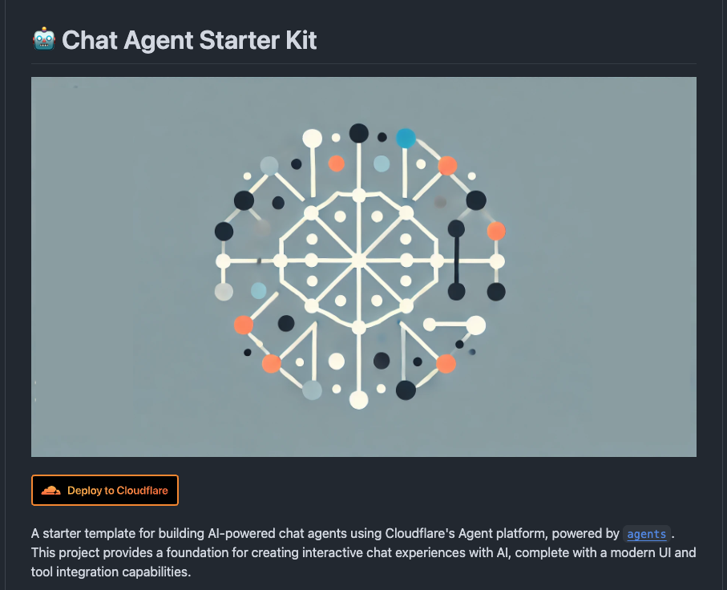
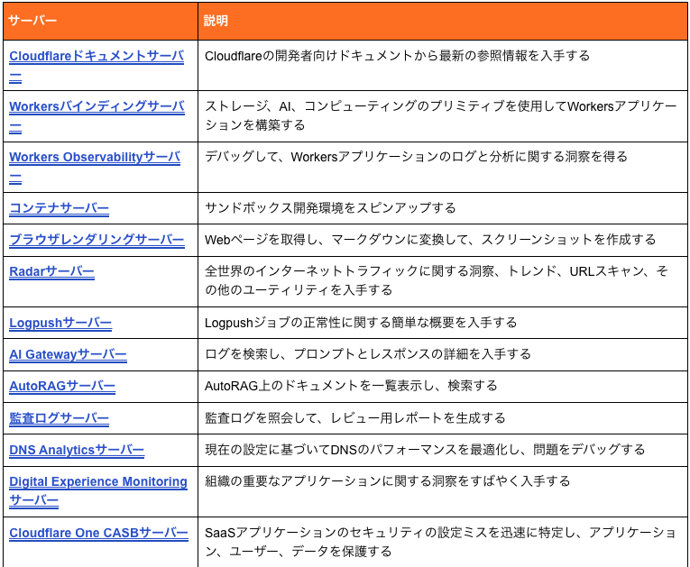
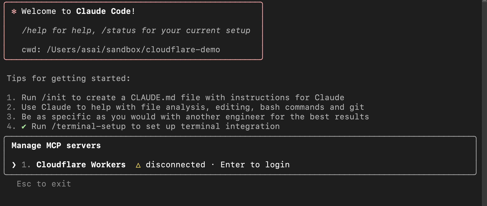
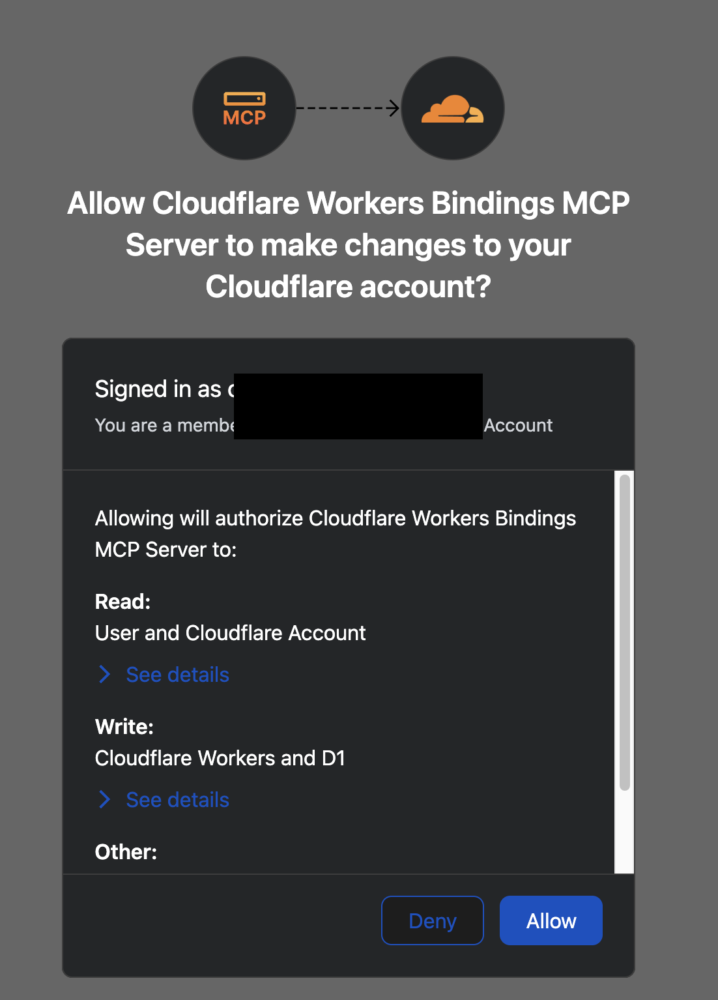
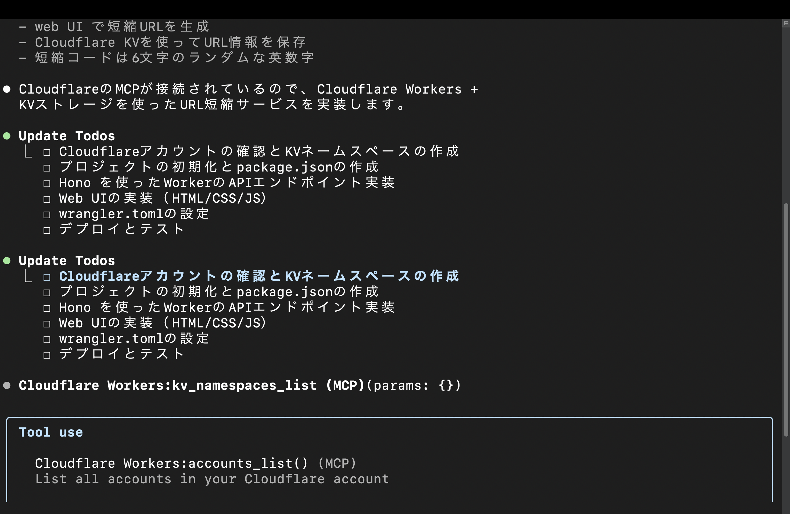
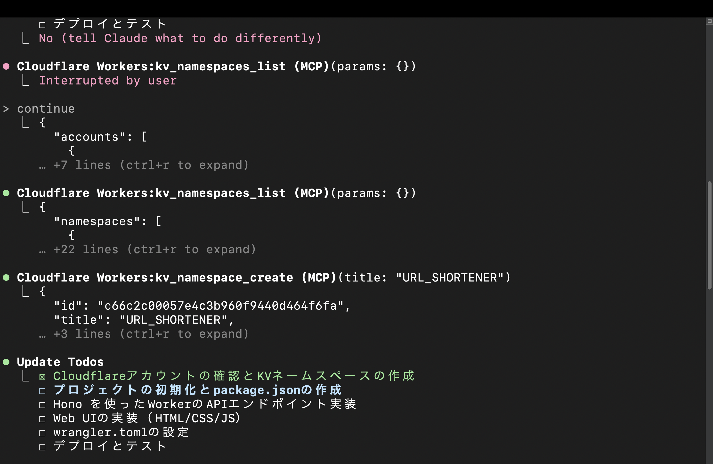
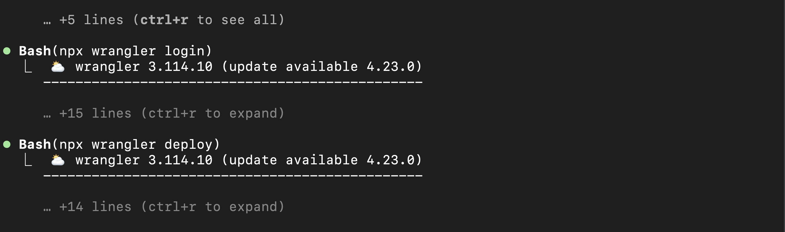
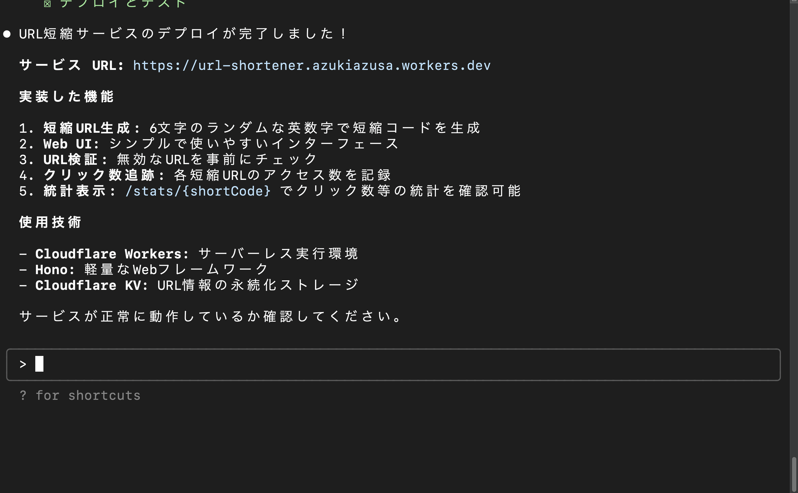
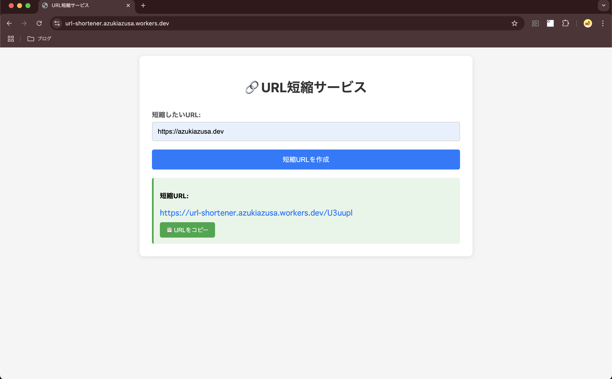

# バイブコーディング超えてバイブデプロイ

### 〜<span class="cloudflare">Cloudflare</span> MCPで実現する、未来のアプリケーションデリバリー〜

Workers Tech Talks in Kyoto #1

---


<h1 class="blur-content">自己紹介</h1>

<ul>
  <li class="blur-content">azukiazusa</li>
  <li>https://azukiazusa.dev</li>
  <li class="blur-content">FE（フロントエンド|ファイアーエムブレム）が好き</li>
</ul>


<div class="cloudflare-arrow">Cloudflare Workers</div>

<!-- はじめに簡単に自己紹介です。普段 azukiazusa という名前で活動していています。azukiazusa.dev というブログを運営してフロントエンドや AI 関連の記事を書いています。
好きなものはフロントエンドとファイアーエムブレムです。 -->
---

# バイブコーディング

---

# バイブコーディングとは？

AIエージェントが自律的にコードを生成・実行する技術

- AI に自然言語で指示を出す 
- AI エージェントが主体になってアプリケーションの開発を進める
- 雰囲気・フィーリング・ノリ

---

# Cloudflareの特徴

---

# Cloudflareの特徴

## <span class="cloudflare">驚異的なデプロイの簡単さ</span>

---

ドキュメントのボタンをクリックするだけでデプロイを開始



---

# もっと気軽にデプロイしたい

バイブコーディングのようなノリで...

---

# Cloudflare MCP

13の新しいMCPサーバーを提供



https://blog.cloudflare.com/ja-jp/thirteen-new-mcp-servers-from-cloudflare/

---

# MCPとは？

- LLMが外部システムと連携するためのプロトコル
- AIエージェントが様々なサービスを直接操作可能

---

# Workers Bindings Server

## LLMから直接Cloudflare Workerへデプロイ

- AIエージェントがWorkerを作成
- 設定もデプロイも自動化
- **真の「バイブデプロイ」**

---

# 実際にやってみよう！

## ライブコーディングデモ

AIエージェントと一緒に
Cloudflare Workerをデプロイしてみます

---

# Claude Code に MCP サーバーを追加

```sh
claude mcp add --transport sse -s project  "Cloudflare Workers" "https://bindings.mcp.cloudflare.com/sse"
```
---

# .mcp.json ファイルが生成される

```json
{
  "mcpServers": {
    "Cloudflare Workers": {
      "type": "sse",
      "url": "https://bindings.mcp.cloudflare.com/sse"
    }
  }
}
```

# 認証

`/mcp` コマンドで認証が必要



# Cloudflare の認証画面



# プロンプト

```plaintext
Claude Codeを使って、URL短縮サービスをCloudflare Workers + KVストレージで実装してデプロイしてください。

要件：
- Hono を使ってHTTPサーバーを実装
- web UI で短縮URLを生成
- Cloudflare KVを使ってURL情報を保存
- 短縮コードは6文字のランダムな英数字
```

---



---

# KV が MCP を通じて生成される



---

# wrangler deploy で Worker をデプロイ



---

# Worker のデプロイが完了



---

# URL短縮サービスの完成



---

# まとめ

- バイブコーディングはAIエージェントが主体となる開発スタイル
- Cloudflare MCP は LLM から Cloudflare のリソースにアクセスしたり、作成・削除するためのツールを提供
- Cloudflare MCP の Workers Bindings Server により、AIエージェントが直接Workerをデプロイ可能

---
