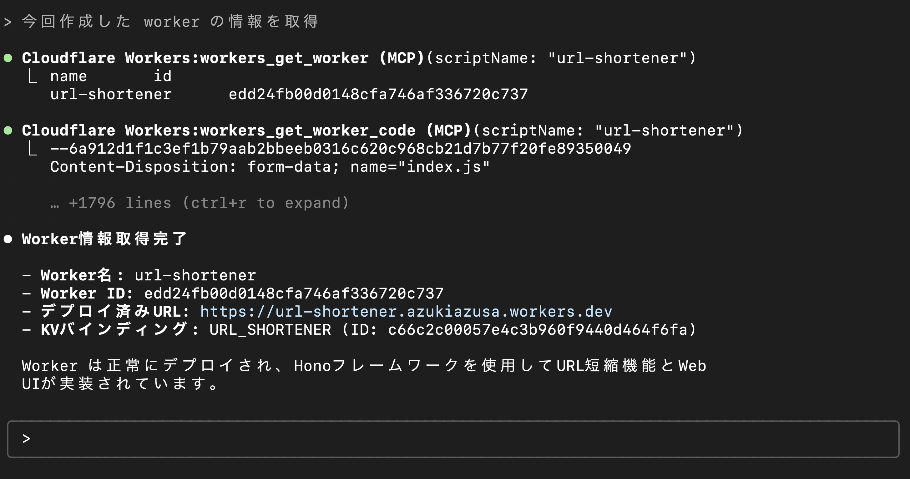

# バイブコーディング超えてバイブデプロイ

### 〜<span class="cloudflare">Cloudflare</span> MCPで実現する、未来のアプリケーションデリバリー〜

Workers Tech Talks in Kyoto #1

---

# 自己紹介

- azukiazusa
- https://azukiazusa.dev
- FE（フロントエンド|ファイアーエムブレム）が好き


<!-- はじめに簡単に自己紹介です。普段 azukiazusa という名前で活動していています。azukiazusa.dev というブログを運営しています。。 -->

---

<h1 class="blur-content">自己紹介</h1>

<ul>
  <li class="blur-content">azukiazusa</li>
  <li><a href="https://azukiazusa.dev">https://azukiazusa.dev</a></li>
  <li class="blur-content">FE（フロントエンド|ファイアーエムブレム）が好き</li>
</ul>


<div class="cloudflare-arrow">Cloudflare Workers にホスト</div>

<!-- azukiazusa.dev は Cloudflare Workers にホストさせていいただいております。そのお陰でブログサイトの高いパフォーマンスと好可用性を実現できているわけですね。 -->


---

# バイブコーディング

<!-- さてはじめに、タイトルにもある「バイブコーディング」について説明したいと思います。 -->

---

# バイブコーディングとは？

AIエージェントが自律的にコードを生成・実行する技術

- AI に自然言語で指示を出す 
- AI エージェントが主体になってアプリケーションの開発を進める
- 雰囲気・フィーリング・ノリ


<!-- バイブコーディングとは、AIエージェントが自律的にコードを生成・実行する技術のことです。AI に自然言語で指示を出すことで、AI エージェントが主体になってアプリケーションの開発を進めていきます。バイブコーディングのバイブは雰囲気・フィーリング・ノリという意味で、開発者は技術的詳細にとらわれずに、自分のアイディアを直感的に伝えてノリよく開発を進めるというスタイルです。 -->
---

# Cloudflareの特徴

<!-- Cloudflare のイベントですので、Cloudflare の特徴についても触れておきたいと思います。 -->

---

# Cloudflareの特徴

## <span class="cloudflare">驚異的なデプロイの簡単さ</span>

<!-- Cloudflare の特徴と聞いてみなさんそれぞれ思い浮かべることがあると思いますが、私が一番に思い浮かぶのは驚異的なデプロイの簡単さです。 -->

---

ドキュメントのボタンをクリックするだけでデプロイを開始


<!-- Cloudflare のドキュメントを見たことある方はわかると思いますが、いたるところに「Deploy to Cloudflare」ボタンがあって、クリックするだけで Web UI 上からデプロイを開始できます。 -->

---

# もっと気軽にデプロイしたい

バイブコーディングのようなノリで...

<!-- とはいえ、もっと気軽にデプロイしたいというのが開発者の本音ではないでしょうか。バイブコーディングのようなノリで、LLM に直感的な指示を出すだけで、アプリケーションがデプロイできればもっと楽しいですよね。 -->

---

# Cloudflare MCP

13のMCPサーバーを提供


https://blog.cloudflare.com/ja-jp/thirteen-new-mcp-servers-from-cloudflare/

<!--
こんな開発者の願いを叶えるのが Cloudflare MCP です。Cloudflare は 13 の MCP サーバーを提供していて、これらのサーバーを通じて LLM が Cloudflare のリソースにアクセスしたり、作成・削除するためのツールを提供しています。 
 -->

---

# Model Control Protocol (MCP)とは？

- LLMが外部システムと連携するためのプロトコル
- AIエージェントが様々なサービスを直接操作可能

<!-- MCP とは、LLM が外部システムと連携するためのプロトコルです。AI エージェントが様々なサービスを直接操作できるようにすることで、開発者はより直感的にアプリケーションを構築できます。 -->

---

# Workers Bindings Server

- AIエージェントがKVやR2, D1などのCloudflareリソースを操作可能
- 自然言語で指示を出すだけでリソースの作成・削除が可能
- **真の「バイブデプロイ」**

<!-- 
MCP サーバーの一つに Workers Bindings Server があります。これにより、AI エージェントは KV や R2, D1 などの Cloudflare リソースを操作できるようになります。自然言語で指示を出すだけでリソースの作成・削除が可能になり、真の「バイブデプロイ」が実現します。
 -->

---

# 実際にやってみよう！

URL短縮サービスを Cloudflare Workers + KV ストレージで実装

<!-- それでは実際にやってみましょう。URL短縮サービスを Cloudflare Workers + KV ストレージで実装してみます。 
みなさんもぜひ並走してやってみてください。 -->

---

# 下準備

- [Cloudflare Workers](https://cloudflare.com/) アカウントを作成
- Claude Code をインストール

```sh
npm install -g @anthropics/claude-code
```

<!-- まずは下準備として、Cloudflare Workers のアカウントを作成してください。AI エージェントとして Claude Code を利用するために、以下のコマンドでインストールします。 -->

---

# Claude Code に MCP サーバーを追加

```sh
claude mcp add --transport sse -s project "Cloudflare Workers" "https://bindings.mcp.cloudflare.com/sse"
```

<!-- このコマンドを実行して、Claude Code にリモート MCP サーバーを追加します。`--transport sse` オプションは Server-Sent Events を使用することを指定しています。-s オプションは MCPサーバーのスコープを指定します。個人単位とプロジェクト単位のどちらかを選択できます。ここではプロジェクト単位で追加しています。 -->

---

# .mcp.json ファイルが生成される

```json
{
  "mcpServers": {
    "Cloudflare Workers": {
      "type": "sse",
      "url": "https://bindings.mcp.cloudflare.com/sse"
    }
  }
}
```

<!-- このコマンドを実行すると、プロジェクトのルートに`.mcp.json` ファイルが生成されます。このファイルには、追加した MCP サーバーの情報が含まれています。 --> 

---

# 認証

`/mcp` コマンドで認証が必要


<!-- Claude Code を初めて実行すると、MCP サーバーへの認証が必要になります。`/mcp` コマンドを実行すると、Cloudflare の認証画面が表示されます。ここで Cloudflare アカウントにログインして、MCP サーバーへのアクセスを許可します。 -->

---

# Cloudflare の認証画面

<div style="text-align: center;">
  
</div>

<!-- Cloudflare の認証画面です。ここで Cloudflare アカウントにログインして、MCP サーバーへのアクセスを許可します。 -->

---

# プロンプト

```sh
Claude Codeを使って、URL短縮サービスをCloudflare Workers + KVストレージで実装してデプロイしてください。

要件：
- Hono を使ってHTTPサーバーを実装
- web UI で短縮URLを生成
- Cloudflare KVを使ってURL情報を保存
- 短縮コードは6文字のランダムな英数字
```

---

# Claude Code が実行計画を立てる

<div style="text-align: center;">
  
</div>

---

# KV が MCP を通じて生成される

<div style="text-align: center;">
  
</div>

---

# wrangler deploy で Worker をデプロイ

<div style="text-align: center;">
  
</div>

---

# Worker のデプロイが完了

<div style="text-align: center;">
  
</div>

---

# Worker の情報を取得

<div style="text-align: center;">
  
</div>

---

# URL短縮サービスの完成

<div style="text-align: center;">
  
</div>


---

# まとめ

- バイブコーディングはAIエージェントが主体となる開発スタイル
- Cloudflare MCP は LLM から Cloudflare のリソースにアクセスしたり、作成・削除するためのツールを提供
- Cloudflare MCP の Workers Bindings Server により、AIエージェントが直接Workerをデプロイ可能

---
