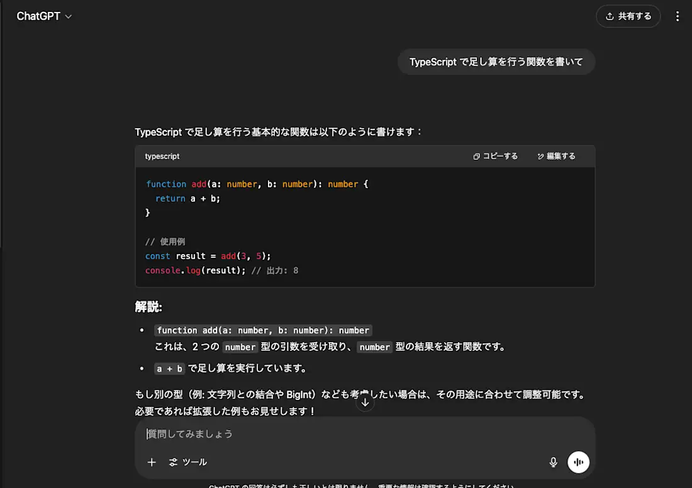
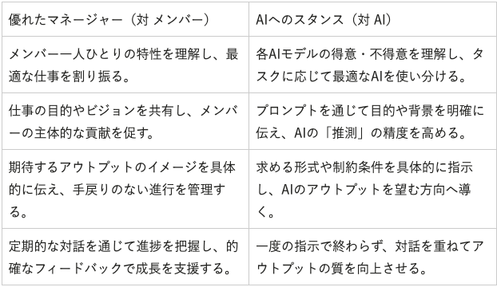
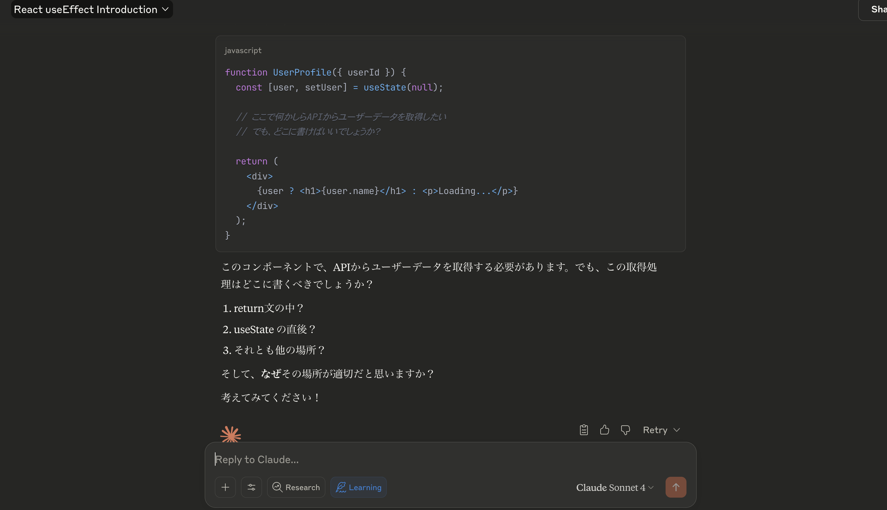

# 自己紹介

- azukiazusa
- https://azukiazusa.dev
- FE（フロントエンド|ファイアーエムブレム）が好き


<!-- はじめに簡単に自己紹介です。普段 azukiazusa という名前で活動していています。azukiazusa.dev というブログを運営しています。。 -->
---

# アジェンダ - コーディングにおける AI との協業は避けられなくなっている

- 2025 年現在ではどのような類型のコーディングエージェントが存在するのか？
- エンジニアの仕事はどのように変化し、そして変わらないものは何か？
- 急速な技術革新に伴いどのような課題が生じているのか

<!-- 
今日は以下の3つのトピックについてお話しします。
はじめに、2025年現在ではどのような類型のコーディングエージェントが存在するのかを説明します。
続いて、AI エージェントの登場に伴いエンジニアの仕事はどのように変化し、そして変わらないものは何かを考えます。
最後に、急速な技術革新に伴いどのような課題が生じていていて、それに対してどのように対処していくべきかを考えます。
 -->

---

# AIコーディング支援の進化

<div class="flow-container">
<div class="box">
  <div class="icon-large">⌨️</div>
  <div class="box-title">補完型</div>

  <p>コード補完やリファクタリングを支援</p>
  <p>GitHub Copilot</p>
</div>

<div class="arrow-blue">→</div>

<div class="box">
  <div class="icon-large">💬</div>
  <div class="box-title">チャット型</div>

  自然言語での指示に基づくコード生成

  <p>ChatGPT</p>
</div>

<div class="arrow-blue">→</div>

<div class="box">
  <div class="icon-large">🤖</div>
  <div class="box-title">エージェント型</div>

  自律的にタスクを完了するAI

  <p>Claude Code, Devin</p>
</div>
</div>

<!-- まず、AI によるコーディング支援がどのように進化してきたかを振り返ります。
大きく3つの段階に分けることができます。
最初は補完型AIとして、GitHub Copilotのようなツールが登場しました。
次に、ChatGPTのようなチャット型AIが自然言語での指示に基づいてコードを生成するようになりました。
そして現在、Claude CodeやDevinのようなエージェント型AIが登場し、自律的にタスクを完了することが可能になっています。

簡単にそれぞれの特徴について見ていきましょう。

 -->

---

# 補完型AI（GitHub Copilotなど）

```typescript
function add // ← ここまで書くと...
```

```typescript
function add(a: number, b: number): number {
  return a + b;
}
```

- 開発者が書き始めたコードを補完し Tab キーで提案を受け入れ
- ペアプログラミングのような体験
- **開発者が主導権を持つ**

<!-- 
補完型AIの代表例がGitHub Copilotです。

コード例で示している通り、開発者が「function add」と書き始めると、AIがその後の関数の定義を補完してくれます。

Copilot という名前が示すとおりに、副操縦士的な存在で、開発者が主体でAIが補助する形です。
 -->

---

## 補完型AIの利点と制約

### 利点 👍

- 定型的なコードの自動生成: テストのモックデータの生成のように決まり切ったコードを素早く生成
- 新しい言語やフレームワークの学習: ユーザーが知らない書き方を提案

### 制約 👎

- ユーザーが何かを書き始めない限り、AIは何も提案してくれない
- 従来の「開発者がコードを書く」という基本的なワークフローは変わらない
- コードベース全体を理解していないため、コンテキストを無視した提案が多い

<!--
利点としては、テストのモックデータ作成やconsole.logを使ったデバッグコードなど、退屈で反復的な作業を任せられることです。また、新しい言語やフレームワークを学ぶ際の支援にもなります。

一方でユーザーが何かを書き始めない限り、AIは何も提案してくれません。つまり、従来の「開発者がコードを書く」という基本的なワークフローは変わりませんでした。
-->

---

# チャット型AI（ChatGPTなど）

<div class="grid">

- 自然言語での指示が可能
- プログラミングの知識がなくても使える



</div>

<!--
ChatGPTの登場により、チャット型AIが普及しました。ChatGPTの登場が世間を大きく騒がせた記憶が新しい方も多いと思います。

これは大きな変化でした。なぜなら、1文字もコードを書かなくても、「2つの数値を足す関数をTypeScriptで書いてください」という自然言語の指示だけで、AIが完全なコードを生成してくれるからです。

補完型AIでは「function add」と書き始める必要があり、前提としてTypeScriptの関数定義方法を知っている必要がありました。しかしチャット型AIでは、プログラミングの知識がない非エンジニアでも、自然言語でコードを生成できる可能性が生まれました。
-->

---

## チャット型AIの利点と制約

### 利点 👍

- 自然言語での指示が可能: プログラミングの知識がなくても使える
- コードの生成だけでなく、コードの説明やデバッグも可能

### 制約 👎

- コードの品質やセキュリティに関する保証がない
  - コードをレビューするエンジニアのスキルが依然として重要
- チャット型の UI であるため、往復のやり取りが必要
- コードベース全体のアーキテクチャを理解し、適切なコードを生成するといったことは難しい

<!--
Chat型のAIは自然言語でプログラミングを行うという新たなパラダイムを提供しました。また既存のコードの意味を説明させたり、エラーコードを共有してデバッグを行うという新しい使い方も可能になりました。

ただし、同時に新たな課題も生まれました。意図しないコードや品質の低いコードが生成されてしまうということです。そのため、コードをレビューするエンジニアのスキルは依然として重要です。

また、チャット型では「ユーザーからAI」という往復のやり取りが必要で、AIがコードを生成するたびに人間エディタにコピーペーストして、フィードバックを与える必要があります。AIに完全に作業を任せるといったことはできなかったので、生産性の向上には限界がありました。

-->

---

# そして、コーディングエージェントの登場

## 自律的にタスクを完了する

- ユーザーからの指示に基づいて自律的にコードを生成し、実行するAI
- 人間の介入を最小限に抑えて、タスクの完了を目指す
- [Cursor](https://cursor.so/) が登場したあたりから注目を集めた


<div class="margin-top-lg text-center" style="font-size: 36px;">

日本では[CLINEに全部賭けろ](https://zenn.dev/mizchi/articles/all-in-on-cline)の記事が出た頃から話題に

</div>

<!--
そして現在、「コーディングエージェント」と呼ばれるものが登場しています。

コーディングエージェントとは、ユーザーからの指示に基づいて自律的にコードを生成し、実行するAIのことです。Cursor と呼ばれるAIエディタが登場したあたりから注目を集め始めた記憶があります。

日本ではCLINEに全部賭けろという記事が出た頃から話題になりました。
-->

---
# AI エージェントの仕組み

<div class="text-2xl mt-6 space-y-6">

- 複雑なタスクを最終的な解決に向けた論理的なステップの連続に区切る（Chain of Thought）
- 外部と対話するための「ツール」を使用してタスクを実行
  - ファイルの読み書き
  - シェルコマンドの実行
- ツールの実行結果からフィードバックを受け取り、次のステップを決定（Self-Correction）
  - 例えばテストが失敗した場合、元の計画を修正しコードの修正を試みる
- 計画・実行・フィードバックのループを繰り返すことで、タスクの完了を目指す

</div>

<!-- 
AI エージェントがどのような仕組みで動作しているのかを簡単に説明します。

AI エージェントは、複雑なタスクを最終的な解決に向けた論理的なステップの連続に区切る「Chain of Thought」という手法を使用します。 Claude Code と呼ばれるエージェントでは、ユーザーからの指示を受けてます TODO リストを作成し、そこからタスクを一つずつ実行していきます。

また、外部と対話するための「ツール」を使用してタスクを実行します。例えば、ファイルの読み書きやシェルコマンドの実行などです。AI はユーザーからの指示でフィードバックを受け取るのではなく、ツールの実行結果からフィードバックを受け取り、次のステップを決定します。例えば、テストが失敗した場合はエラーメッセージを元にどうして失敗したのかを分析し、元の計画を修正し、コードの修正を試みます。

このように、計画・実行・フィードバックのループを繰り返すことで、AI エージェントはタスクを完了を目指します。

 -->

---

# コーディングエージェントの3つの類型 <sup class="text-sm">(1)</sup>

<div class="grid-3-col">

<div class="box">
  <div class="icon-large">📝</div>
  <div class="box-title">エディタ型</div>

  - 開発者が常に監視・介入可能
  - よく使い慣れたエディタで動作

  <p class="text-sm">Cursor, Cline, Windsurf</p>
</div>

<div class="box">
  <div class="icon-large">💻</div>
  <div class="box-title">CLI型</div>

  - ターミナルやファイルシステムで動作
  - 重要な判断時に確認を求める

  <p class="text-sm">Claude Code, Codex CLI</p>
</div>

<div class="box">
  <div class="icon-large">🤖</div>
  <div class="box-title">自律型</div>

  - 目標設定と結果確認のみ
  - 緊急時以外は介入しない

  <p class="text-sm">Devin, OpenHands</p>

</div>
</div>

(1): https://blog.lai.so/agent/

<!-- 
現在コーディングエージェントは非常に多くの製品が登場していますが、エージェントの自律性に応じて3つのタイプに大別できます。

1つ目は「エディタ型」です。リアルタイムに変更内容を確認・承認・修正できるため、自律レベルは低いです。また普段使い慣れているエディタで動作するため、どのコードを参照するかなどのコンテキストを把握しやすいという特徴があります。

2つ目は「CLI型」です。ターミナルやファイルシステムで動作し、エージェントが開発を担当しますが、重要な判断の際には人間に確認を求めます。自律レベルは中程度です。

3つ目は「自律型」です。目標設定と結果確認のみ人間が行い、緊急時以外は介入しません。自律レベルは高く、生産性の最大化を目指しています。
 -->

---

# どのタイプのエージェントを使うべきか？

<div class="text-2xl mt-8 space-y-6">

- タスクに応じて使い分けられるのが理想
- ユーザーの介入をほとんど必要としない自律型エージェントが最も効率的だが、タスクが複雑になると失敗する可能性が高い
- 人間の仕事の進め方に例えるならば、マイクロマネジメントと放任主義をどのように使い分けるか
- 大まかに以下の 3 つのタスクの分類で使い分けを考えると良い
  - 小規模なタスク
  - チャレンジングなタスク
  - 大規模なタスク

</div>

<!-- 
多くのコーディングエージェントが登場している現在、どのタイプのエージェントを使うべきなのでしょうか？

取り組むタスクの性質に応じて使い分けるのが理想です。ユーザーの介入をほとんど必要としない自律型エージェントが最も効率的ですが、タスクが複雑になると失敗する可能性が高くなります。タスクの複雑さに応じて、人間がどのくらい介入するかを調整することが重要です。

これは人間の仕事の進め方に例えると、マイクロマネジメントと放任主義をどのように使い分けるかに近いでしょう。例えば新人の社員であれば、はじめのうちは仕事の進め方もわかっておらず、信頼関係もきづけていないため、つきっきりで仕事に取り掛かります。段々と新人が仕事に慣れてきた頃になると、放任主義に移っていき、多くの裁量を持たせられるようになります。

タスクの分類として、私自身は以下の3つの分類で使い分けを考えると良いと思っています。
 -->

---

# 30分以内の小規模なタスク

## 自律型エージェントが最適

- 例：バグ修正（表示崩れ、ボタン位置調整など）、フィーチャーフラグの掃除など
  - 目的が明確かつ、影響範囲が小さいもの
- 複数タスクの並行処理
- 開発者のコンテキストスイッチの削減

### 活用例
Slackで「フィーチャーフラグxxxを削除して」と指示
→ エージェントが自動でPR作成

<!--
30分以内で完了できる小さなタスクには、自律型エージェントが最適です。

これらのタスクは、バグ修正や小さな機能追加など、明確な目的があるものが該当します。現在の優秀なAIモデルであれば、既存のコードベースを理解して適切なコードを生成してくれる可能性が高いです。

小さなタスクをエージェントに任せる最大のメリットは「仕事のスケーリング」です。一人の開発者が複数のタスクを同時に処理できるため、生産性の向上に繋がります。

例えば、Slackで「フィーチャーフラグのxxxを削除して」と指示するだけで、エージェントが自動的にコードを生成し、プルリクエストを作成してくれます。
-->

---

# チャレンジングなタスク

### CLI型 or エディタ型、状況により自律型

- **特徴**: 既存コードベースに参考がない、情報が不十分
  - 多くのタスクはこれに該当
- 自律型エージェントでは袋小路に入る可能性が高く、手戻り作業のほうが多くなる可能性がある

<!-- 
チャレンジングなタスクは、既存のコードベースに参考となるコードが存在しなかったり、AIが理解するのに十分な情報が与えられないようなタスクです。

このようなタスクを自律型エージェントに任せると、袋小路に入ってしまい結局は手戻り作業のほうが多くなる可能性が高くなります。
 -->

---

## CLI型、エディタ型を選ぶ場合

- 実装方針を AI と相談しながら決める
  - Plan モードなどが有効
- 間違った方向に進みそうであれば、随時人間が介入する

## 自律型を選ぶ場合

- ミーティング中など介入できない時間帯
- 何もしないよりは60%程度の成果でも後で修正すれば効率的
  - 気に入らなければ捨ててしまってもいい

<!--
基本的には、人間が介入可能なCLI型のエージェントを使用すべきです。2025年現在でClaude Codeがおすすめですね。実装方針をAIと相談しながら決めて、間違った方向へ進みそうであれば随時人間が介入するという使い方ができます。

ただし、状況によっては自律型エージェントも活用できます。例えば、この後にミーティングが入っており、介入できない時間帯がある場合です。何もしないよりは60%程度の成果で一旦出してもらって、人間が後で修正すれば効率的な場合があります。もし成果物が気に入らなければ、そのまま捨ててしまっても構わないわけです。
-->

---

# 大規模なタスク

## 人間によるタスク分解が必要

- 複数のサブタスクへの適切な分割が必要
  - [When to Use Devin - Devin Docs](https://docs.devin.ai/essential-guidelines/when-to-use-devin)
- 高度な知識と経験を持つテックリードやアーキテクトの判断が必要
- AI に限らず人間の開発者にタスクを任せるときも同じ

<!--
大規模なタスクに取り組む場合には、まず人間によるタスク分解が必要です。AI は基本的にタスクの複雑度が増すほど失敗する可能性が高くなります。

アプリケーションの大規模なリファクタリングや、複数のマイクロサービスの修正が必要な新機能の追加などが該当します。

これらのタスクは、通常複数のサブタスクに分割される必要があります。タスクの内容を理解し、適切なサブタスクに分割するためには、高度な知識と経験を持つテックリードやアーキテクトの判断が必要です。これはAIに限らず人間の開発者にタスクを任せるときも同じですね。

-->


---

## エンジニアの仕事はこう変わった

<div class="grid-2-col-gap">
<div class="box">
  <div class="icon-large">👨‍💻</div>
  <div class="box-title">コードを書く</div>

  - コードを書く時間が多くを占めていた
  - コードの書き直しには相応のコストがかかる
  

</div>

→

<div class="box">
  <div class="icon-large">👨‍💼</div>
  <div class="box-title">タスクを管理する</div>

  - コードはAIが高速で生成
  - タスクの分割・割り当て、指示能力が重要
  - コードレビューの割合が増加
</div>
</div>
</div>

<p class="text-center" style="font-size: 24px; margin-top: 20px;">
戦略的で俯瞰的な役割へとシフトしていく  
</p>

<!--
コーディングエージェントが登場することで、開発者の仕事は根本的に変わろうとしています。

これまでは、開発者の仕事の中心は「コードを書く」ことでした。どうしてもコードを書くという作業の高速化は限界があるので、仕事の大部分を占めていました。また、コードの書き直しには相応のコストがかかるので、捨てる前提でコードを書くことはできませんでした。

コードを書くという行為が AI が高速で生成できるようになると、開発者の仕事の中心は「タスクを管理する」ことに移っていきます。具体的には、タスクの分割・割り当て、プロンプトエンジニアリング（指示能力）が重要になります。また、AI が生成したコードをレビューする割合も増加します。

これは、従来のプロジェクトマネージャーやテックリードが担っていた役割の一部を、より多くの開発者が担うようになることを意味します。

次のスライドから、具体的にどのようなスキルが求められるようになるのかを詳しく説明していきます。

【10分】
-->


---


# タスクを管理するスキル

### **適切なタスク分解**
- プロジェクト全体の目標理解し、実現可能なサブタスクへの分解
- 各タスクの特性を見極めて、適切な実行者（エージェント）を選定

### **質の高い指示作成**
- AIが理解しやすい明確な指示
- プロジェクトの設計や目的を記述したドキュメント

<!--
まず「適切なタスク分解」の能力です。これは、プロジェクト全体の目標を理解し、それを実現可能なサブタスクへと分解する能力です。そして各タスクの特性を見極めるたうえで、適切な実行者（エージェント）を選定することも必要です。

そして「質の高い指示作成」の能力です。AIが理解しやすく、期待する成果物を生み出せるような明確で質の高いプロンプトを作成するスキルです。

-->

---

# AIを使うことは、もはやマネジメントである<sup class="text-sm">(1)</sup>

<div class="grid-2-col">

- マネージャーの仕事は作業分担と権限委譲
- 指示の言語化が重要
  - 上司が「あれやっといて」と言うだけでは不十分
  - AI に指示するプロンプトも同様



</div>

(1): https://baigie.me/nippo/2025/07/10/ai_ma/

<!-- 
AIを使うことは、もはやマネジメントであるという記事がこの状況を的確に表現しています。
マネージャーの仕事は、作業分担と権限委譲です。AIに任せられるようにタスクを適切に分解するという仕事が当てはめるでしょう。

また指示の言語化も重要なスキルです。上司が「あれやっといて」と言うだけでは部下は何をやればいいのかわからず、期待した成果を得る可能性が低くなります。AIに指示するプロンプトも同様で、悪いプロンプトを投げれば悪い結果が返ってくる可能性が高くなります。
 -->

---

# 指示の言語化

### 曖昧な指示 🙅‍♀️

```md
カンバンボードのテストを書いてください
```

### 明確な指示 🙆‍♀️

```md
カンバンボードのタスク操作に関するテストケースを作成してください
- カンバンボードに表示されるタスクは、API から取得したデータに基づいていること
- タイトルを入力するまで submit ボタンは無効化されていること
- API のコールに失敗した場合、エラーメッセージがトーストで表示されること

テストの記述は以下の要件に従ってください
- API のモックは `msw` を使用すること
- テストを書く際の注意事項は `docs/test-guidelines.md` を参照すること
```

<!-- 
指示の言語化の例を見てみましょう。ただ「テストを書いてください」という指示するだけでは、期待に沿わないコードが生成される可能性が高いです。

指示を与える際には、どのようなテストケースを作成してほしいのかを具体的に記述することが重要です。またプロジェクト固有の技術要件やコーディング規約を明確に指示することも必要でしょう。
 -->

---
<div class="background-blur">

# 指示の言語化

### 曖昧な指示 🙅‍♀️

<div class="my-4">

```md
カンバンボードのテストを書いてください
```
</div>

### 明確な指示 🙆‍♀️

<div class="mt-4">

```md
カンバンボードのタスク操作に関するテストケースを作成してください

- カンバンボードに表示されるタスクは、API から取得したデータに基づいていること
- 「新規追加」ボタンをクリックすると「新規追加ダイアログ」が表示されること
- タイトルを入力するまで submit ボタンは無効化されていること
- API のコールに失敗した場合、エラーメッセージがトーストで表示されること

テストの記述は以下の要件に従ってください
- API のモックは `msw` を使用すること
- テストを書く際の注意事項は `docs/test-guidelines.md` を参照すること
- `KanbanBoard.test.tsx` のテストの書き方が参考になります
```

</div>

</div>

<div class="diagonal-overlay">
AI時代も人間が設計・技術選定する点は<br>
変わらない。コードに書き起こす手段が<br>
変わっただけ。

</div>

<!--
ここで伝えたいことは、AI時代も人間が設計・技術選定する点は変わらないということです。頭の中で考えていることをキーボードを使ってコードに書き起こすのか、AIに指示してコードを生成してもらうのか、その手段が変わっただけなのです。

 -->


---

# ドキュメントを育てる

- AI コーディングエージェントには長期記憶（メモリ）を管理する手段が用意されている
  - Claude Code: `CLAUDE.md`
  - Cursor: `.cursor/rules/`

- プロジェクトの設計やコーディング規約などを記述する
- Kiro により広まったスペック駆動開発
  - AI と相談しながら要件定義書や仕様書を作成し、その内容を元に AI にコードを書いてもらう
- コンテキストエンジニアリング
  - AI に与える情報（コンテキスト）全体を体系的に設計・最適化する技術

<!--
実際にプロジェクト固有の要件なプロンプトで渡すのではなく、長期記憶を管理する手段を用意しておくと良いでしょう。

プロジェクトの設計やコーディングなどを記述したドキュメント類を記述しておくことで、AI エージェントはセッションの開始時に自動でコンテキストに取り込むため、毎回同じ情報をプロンプトで渡す必要がなくなります。

最近ではスペック駆動開発という考え方も広まっています。これはAIと相談しながら要件定義書や仕様書を作成し、その内容を元にAIにコードを書いてもらうというものです。Kiroが有名ですね。
-->

---

# プロンプトエンジニアリングの学習

AI エージェントを効果的に活用するためには、プロンプトエンジニアリングの理解が重要

→ LLM の仕組みを理解し、適切なプロンプトを設計する

<div class="flex-gap">

- [Prompt Engineering Guide](https://www.promptingguide.ai/jp)
- [プロンプトエンジニアリングの概要 - Anthropic](https://docs.anthropic.com/ja/docs/build-with-claude/prompt-engineering/overview)
- [ChatGPT プロンプトエンジニアリング](https://www.promptingguide.ai/jp/models/chatgpt)
- AI エージェント OSS のプロンプトを読むのもおすすめ


</div>

<!-- 
AI エージェントを効果的に活用するためには、プロンプトエンジニアリングの理解が重要です。プロンプトエンジニアリングと聞くと、小手先のテクニックのように思うかもしれません。しかし、プロンプトエンジニアリングの本質は LLM の仕組みを理解して適切なプロンプトを設計することにあり、主要 AI エージェントの裏側を覗いてみると精緻に設計されたプロンプトが使われていることがわかります。そしてこのプロンプトが AI エージェントの能力の差にも影響しているのです。

プロンプトエンジニアリングの学習には、以下のリソースがおすすめです。

Prompt Engineering Guide は、プロンプトエンジニアリングの研究の成果を元に、基礎的な知識を体系的に学ぶことができます。また ChatGPT や Anthropic のような主要な LLM プロパイダーもプロンプトエンジニアリングの技術について公開しているので、参照しておくと良いでしょう。

書籍としては少し内容は古くなるものの、LLM のプロンプトエンジニアリングというものがおすすめです。これは GitHub Copilot の開発者が書いたもので、実際のプロダクトにおけるプロンプトエンジニアリングの実践的な知識を学ぶことができます。
 -->

---

# テストや Lint の重要性

- AI エージェントを十分に活用するためには、テストや Lint の整備が不可欠
  - AI エージェントはフィードバックを受けて自己内省するため、テストや Lint の結果が重要な情報源となる
- AI がコードを書く速度に比べてテストや Lint の実行時間はボトルネックになりがち
  - CI の高速化が生産性の向上に直結する
- ガードレールとしての役割

<!-- 
AI エージェントを十分に活用するためには、テストや Lint の整備が不可欠です。AI エージェントはフィードバックを受けて自己内省するため、テストや Lint の結果が重要な情報源となるためです。

AI がコードを書く速度と比較すると、テストや Lint を実行する時間は長くなりがちなので、この点がボトルネックになりがちです。CI の高速化は、AI エージェントを活用する上で生産性の向上に直結します。
-->

---

# コードレビュー中心の仕事

- AI が素早くコードを生成するため、開発者の仕事はコードレビュー中心にシフト
- 自分が出すプルリクエストも知らないコードとして、自己レビューする必要がある
- **レビュー比率の増加**: コードを書く楽しさの減少
  - 簡単なタスクは AI がすべて処理してしまい、人間には重要な判断だけが残される
- **AI生成コードの速度**: 人間がボトルネックに

<!--
続いてコードレビューという観点について見ていきましょう。

コーディングエージェントがコード生成の大部分を担うようになると、開発者の主な仕事の一つとして「コードレビュー」の比重が格段に高まると予想されます。

一方で、潜在的な問題もあります。コードレビューの比率が高くなりすぎるという点です。

コードレビューの比率が増えることで、コードを書く楽しさが減少する可能性があります。簡単なタスクはAIがすべて処理してしまい、人間には重要な判断だけが残されるという状況は　AI の発展に伴い懸念されている問題です

またAIがコードを生成する速度があまりにも早いため、レビューを行う人間がボトルネックになってしまうことも考えられます。
-->

---

## コードレビューがボトルネックにならないために

- レビューの自動化: Lint や自動テストを活用
- プルリクエストを適切なサイズに分割
  - 適切にモジュール化されているコードベースでは、AI エージェントが生成するコードも小さなモジュールに分割されるため、レビューの負担が軽減される
- AI によるコードレビュー
  - 論理的な誤りやセキュリティの問題を検出するのは得意

[Claude Codeによる生産性向上の限界｜すてぃお](https://note.com/suthio/n/n45a179642d7d)

<!--
人間のコードレビューがボトルネックになってしまうこと防ぐためには、以下のような対策が考えられます。
1 つ目は、レビューの自動化です。Lint や自動テストを活用して、コードの品質を自動的にチェックすることで、人間のレビューの負担を軽減できます。
2 つ目は、プルリクエストを適切なサイズに分割することです。適切にモジュール化されているコードベースでは、AI エージェントが生成するコードも小さなモジュールに分割されるため、レビューの負担が軽減されます。
3 つ目は、AI によるコードレビューです。AI は論理的な誤りやセキュリティの問題を検出するのが得意です。AI エージェントであらかじめコードレビューを行い、人間は最終的な判断だけを行うという使い方が有効です。
-->

---

# 従来の開発生産性が高い組織がそのまま AIエージェントを活用できる可能性が高い

- ドキュメントの整備
- テストや Lint の整備
- コードを小さなモジュールに分割
- コードレビューの文化

- これらの文化が根付いている組織は、AIエージェントを活用する際にもスムーズに移行できる

<!-- 
ここまで AI エージェントの活用方法や、開発者の役割の変化について説明してきましたが、ここまで説明してきた内容についてどこかで聞いたことがあるなと思った方も多いのではないでしょうか。

実は、AIエージェントの活用方法は、従来の開発生産性が高い組織が実践してきた手法と非常に似ています。つまり、これまでの成功体験を活かしつつ、新たな技術を取り入れていくことが重要です。
-->

---

<div class="background-blur">

# 従来の開発生産性が高い組織がそのまま AIエージェントを活用できる可能性が高い

- ドキュメントの整備
- テストや Lint の整備
- コードを小さなモジュールに分割
- コードレビューの文化

- これらの文化が根付いている組織は、AIエージェントを活用する際にもスムーズに移行できる
</div>

  <div class="diagonal-overlay">
    AI がコードを書くようになっても、<br>
    根本の部分は変わらない。
  </div>

<!-- 
もう一つ重要な点は、AI がコードを書くようになっても、開発生産性に関する根本の部分は変わらないということです。つまりわたしたちがこれまで培ってきた開発の文化やプロセスは、AI エージェントを活用する際にもそのまま活かすことができるということです。

 -->

---

# ジュニアエンジニアの役割はどうなる？

- 2027年までにジュニアエンジニアが行っているタスクの約26%が、AIによって拡張または完全に自動化されると予測されている
  - [The impact of AI on junior application developer skills](https://www.servicenow.com/workflow/learn/impact-ai-junior-application-developer-skills.html)
- ジュニアエンジニアが不要になるのではないかとの懸念もある

<!-- 
ジュニアエンジニアの役割はどうなるのか、という点についても触れておきましょう。現時点では、ジュニアエンジニアの役割について、悲観的な意見が散見されます。ある調査では2027年までにジュニアエンジニアが行っているタスクの約26%が、AIによって拡張または完全に自動化されると予測されており、ジュニアエンジニアが不要になるのではないかとの懸念にもつながっています。
 -->

---

# AI に精通したジュニアエンジニアが活躍するチャンス

- AI の登場でむしろエンジニアの仕事の密度が濃くなった
- 新しいAI時代のエンジニアは、AIを活用したうえでプログラミングの学習を始めることが予測される
  - AIは学習コーチとして適切な存在であり、わからないことを自然言語で質問したり、知らない知識を教えてくれたりする
  - AIネイティブの世代が登場した場合、始めから AI とうまく付き合うことができる可能性がある

https://github.blog/ai-and-ml/generative-ai/junior-developers-arent-obsolete-heres-how-to-thrive-in-the-age-of-ai/

<!-- 
しかし、私はジュニアエンジニアが不要になるとは考えていません。むしろ、AIに精通したジュニアエンジニアが活躍するチャンスが広がると考えています。

大前提として、AIの登場によりエンジニアの仕事の密度が濃くなったことは間違いありません。エンジニアの需要が今よりも高まることはあっても、低下することはないでしょう。

確かにジュニアエンジニアにまかせていたような単純作業はAIに置き換わる可能性があります。しかし、AIを効果的に活用することで、学習の効率を高めることもまた期待できます。

AIは学習コーチとして適切な存在です。わからないことを自然言語で質問したり、知らない知識を教えてくれたりします。

 -->

---

<div class="center column-left">

# 生成 AI との付き合い方

- コーディングエージェントに期待しすぎない
- 学習でのAI活用法
- 生成AIの盲信

</div>

<!-- 
最後に、生成AIとの付き合い方について見ていきましょう。
ここでは、学習でのAI活用法と生成AIの盲信という2つのトピックに分けて説明します。
 -->

---

<div class="center">

# コーディングエージェントに期待しすぎない

</div>


<!--
個人的にコーディングエージェントを使う上で最も重要なことは、適切な期待値設定です。コーディングエージェントは万能ではなく、あくまで人間の補助ツールです。最近はバイブコーディングがもてはやされていますが、実際に AI だけでコードを完璧に仕上げられることはほとんどありません。AI は完璧にコードを書けるものだと期待しすぎてしまうと、実際とのギャップが大きくなり、失望してしまうことがあります。
-->

---

# 「始めの一歩」のハードルを下げる

<div class="g">
<div class="box">
  <h3 class="text-2xl">期待しすぎてはいけないこと</h3>
    <ul class="">
      <li>何も介入せずに完璧なコードが仕上がる</li>
      <li>複雑な要求も一発で正確に実装してくれる</li>
      <li>プロジェクト全体の設計を任せられる</li>
</div>

<div class="box">
  <h3 class="text-2xl">実際の価値</h3>
    <ul class="">
      <li>コードを書き始めるハードルを下げる</li>
      <li>最初の足がかりを提供してくれる</li>
      <li>そこから人間が改善・修正していく</li>
    </ul>
</div>

</div>
</div>

<!--
コーディングエージェントに対して、何も介入せずに完璧なコードが仕上がることや、複雑な要求を一発で正確に実装してくれることを期待してはいけません。

実際の価値は、コードを書き始めるハードルを下げることにあると思っています。なにもないところからコードを書き始めるのって結構億劫なことなのです。AI エージェントは空白のファイルから「何か」を作り出してくれて、最初の足がかりを提供してくれる。そこから人間が改善・修正していくというのが現実的なアプローチです。

実際の業務でも、まず Claude Code に骨格コードを生成してもらい、そこから人間が生成したコードをレビューして、Copilot とともに手直ししてく、という流れが多いです。
-->

---

# 「机に5分座る」効果

<div class="grid">

<div class="box">
  <h3 class="gradient-text">勉強のやる気を出すテクニック</h3>
  <div class="highlight">
    <div class="text-2xl">「とりあえず机に5分座る」</div>
  </div>
    <div>
      <strong class="gradient-text">作業興奮</strong><br>
      <p class="text-sm">「やる気が出るから行動する」のではなく、「行動するからやる気が出る」</p>
    </div>
</div>

<div class="box">
  <h3 class="gradient-text">コーディングでも同じ</h3>
  <div class="highlight">
    <div class="text-2xl">「とりあえずAIに骨格コードを生成してもらう」</div>
    <div class="text-sm margin-top-small">→ 何かができてしまえば、そこから改善していくやる気が湧く</div>
  </div>
    <div>
      <p class="gradient-text">動くコードが目の前にあると「もう少し改善しよう」という気持ちが自然に湧く</p>
    </div>
</div>

</div>

<!--
これは「机に5分座る」効果と同じです。勉強のやる気が出ないとき、とりあえず机に5分座って問題を解くというテクニックを聞いたことはないでしょうか？これは作業興奮という心理効果に基づいています。

作業興奮とは、作業を始めると脳が興奮状態になり、やる気が自然と湧いてくる現象です。つまり、「やる気が出るから行動する」のではなく、「行動するからやる気が出る」ということです。

コーディングでも同じで、「とりあえずAIに骨格コードを生成してもらう」ことで、動くコードが目の前に現れると「もう少し改善しよう」という気持ちが自然に湧いてきます。これがコーディング版の作業興奮です。

【20分】
-->

---

# 学習でのAI活用法

- **学習目的では**AIに頼らずに書く
  - すぐに答えを求めるのではなく、自分で考える
- プログラミングでは**写経**と呼ばれる学習方法が広く行われてきた
- 自ら手を動かした経験は記憶に残りやすい
- **自分の言葉でAIに質問する**
  - 知らなかった構文や書き方を学ぶためにAIを活用
  - AIをパーソナルコーチのように活用することで、学習の効率を高める
  - 学習モードの活用

<!-- 

1つ目の学習でのAI活用法についてです。
学習目的コードを書く場合には、AIに頼らずに自分で書くことをおすすめします。すぐに答えを求めるのではなく、自分で考えることで問題解決能力や批判的思考力を養うことができます。
また、プログラミングでは写経と呼ばれる学習方法が広く行われてきました。これは、既存のコードを手で書き写すことで、コードの構造や動作を理解する方法です。自ら手を動かした経験は記憶に残りやすく、学習効果が高いです。

一方で自分の言葉でAIにコードの質問をしたり、知らなかった構文や書き方を学ぶためにAIを活用するのは非常に有効です。AIをパーソナルコーチのように活用することで、学習の効率を高めることができます。

最近は学習モードのような機能も提供されており、AI が直接答えを教えるのではなく、ヒントを出してユーザーに考えさせるようなインタラクションも可能です。

 -->

---

## 学習モード

<div class="center">



</div>

---

<div class="grid-center">
基礎力 + 瞬発力

</div>

<!-- 
ジュニアエンジニアに向けてのアドバイスとして、基礎力と瞬発力が重要です。
 -->

---

## 基礎力 → プログラミングの基礎的な知識やスキル

- AI はあくまでツールであり、最終的な判断は人間に委ねられる
- AI が生成したコードが正しいかどうかを判断するためには、プログラミングの基礎的な知識やスキルが必要
- 基礎的な知識は普遍的であり、長期間にわたって役立つ
- AI とのチャットでのやり取りでは体系的に学習することは難しい
  → 書籍での学習をおすすめ https://azukiazusa.dev/blog/computer-it-books/

<!--
基礎力は、プログラミングの基本的な知識やスキルを指します。

AIが生成したコードが正しいかどうかを判断するためには、プログラミングの基礎的な知識やスキルが必要です。AIはあくまでツールであり、最終的な判断は人間に委ねられます。技術的な判断力や問題解決能力は、基礎的な知識の上に成り立っています。

また、基礎的な知識は普遍的であり、長期間にわたって役立つものです。将来 AI ではない新たな技術が登場したとしても、基礎的な知識は変わらずに役立ちます。
AIとのチャットでのやり取りでは、体系的に学習することは難しいため、書籍での学習をおすすめします。例えば、私のブログでは私のキャリアに影響与えた定番本を紹介しています。

-->

---

## 瞬発力 → 新しい技術やツールに対して迅速に適応できる能力

- 日々新しい AI ツールが登場している
- 新しいツールが出たらとりあえず触ってみよう
  - いち早く試すことで優位に立てる
  - 新しいツールに触れることで、異なるアプローチや設計思想を学べる
- サンクコストを捨てる
- 子どものような好奇心旺盛な姿勢で新しい技術に触れる人が強い

<!-- 
瞬発力は、新しい技術やツールに対して迅速に適応できる能力を指します。
日々新しい AI ツールが登場してますが、新しいツールが出たらとりあえず触ってみることをおすすめします。新しいツールをいち早く試すことで優位に立てるという側面もありますし、新しいツールに触れることで、異なるアプローチや設計思想を学べます。たとえ最終的にそのツールを採用しなくても、そこから得た知見は既存のツールの使い方を改善したり、問題解決の新しい視点を得たりすることにつながります。

周囲のいわゆる「強いエンジニア」と呼ばれる人たちも、新しいおもちゃを与えられた子どものような、好奇心旺盛な姿勢で新しい技術に取り組んでいます。

 -->


---

<div class="center column-left">

# 生成AIの盲信

AI が生成したコードを無批判に受け入れてしまう危険性

批判的思考力を身につけて、AI を適切に活用しよう

</div>


<!--
ここからは、AI エージェントを活用する上で重要な「批判的思考」について説明します。

AI が提案するコードを妄信的に受け入れてしまった結果、設計にそぐわないコードが量産されてしまうという事例がすでに報告されています。AI の出力を無批判に受け入れるのではなく、批判的な思考を持って活用することが重要です。
-->

---

# 劇場のイドラ（Theater of Idols）

<div class="flex flex-gap-12">

<div class="text-2xl space-y-6">

**フランシス・ベーコンの「4つのイドラ」より**

権威や流行に盲従してしまう認知バイアス

### AI時代における「劇場のイドラ」

- **AI の権威性**：「AI が言うから正しい」
- **技術の流行性**：「最新のAIツールなら間違いない」
- **自動化への過信**：「機械の方が人間より正確」

</div>

<div style="text-align: center;">
  <div class="icon-emoji">🎭</div>
  <div >
    権威への盲従は<br>
    判断力を奪う
  </div>
</div>

</div>

<!--
AI の発言を妄信的に受け入れてしまうということは、誰にでも起こりうることです。これは、17世紀の哲学者フランシス・ベーコンが提唱した「4つのイドラ」の中の「劇場のイドラ」に該当します。

「劇場のイドラ」は、権威や流行に盲従してしまう認知バイアスを指します。

AI 時代においても、この「劇場のイドラ」が強く働く可能性があります。「AI が言うから正しい」「最新のAIツールなら間違いない」という思い込みは、批判的思考を停止させてしまいます。

特に高性能な AI ほど、その出力が説得力を持って見えるため、無批判に受け入れてしまう危険性が高いのです。
-->

---

# 批判的思考力の重要性

<div class="flex flex-nowrap">

<div>

批判的思考：与えられた情報や状況を鵜呑みにせず、多角的な視点から分析し、論理的に考察して、客観的な判断や評価を行うための思考力

### AI時代に必要な批判的思考

- **出力の検証**：生成されたコードの妥当性確認
- **複数の視点**：異なるアプローチの検討
- **根拠の確認**：なぜその解決策なのかを自分の言葉で説明できるように

</div>


</div>

<!--
批判的思考とは、与えられた情報や状況を鵜呑みにせず、多角的な視点から分析し、論理的に考察して、客観的な判断や評価を行うための思考力です。AIはハルシネーションと呼ばれる現象があり、生成されたコードが必ずしも正しいとは限りません。そのため、AIの出力は必ず検証をする癖をつけましょう。

また AI の出力が唯一の解決策ではないか、他のアプローチはないかを検討することも重要です。

AI がなぜそのコードを出力し、どのような根拠でその解決策を提案しているのかを自分の言葉で説明できるようにすることも、批判的思考の一環です。「どうしてこのコードを書いたの？」問われた際に、AIが生成したからという答えは何も説明になりません。

批判的思考力を鍛えるためには、「思考力改善ドリル」という書籍がおすすめです。
-->

---

# 時代の転換点を楽しもう


<div class="flex flex-nowrap">
<div>

**人類の歴史は技術革新による仕事の変化の連続**

狩猟採集 → 農耕社会 → 産業革命 → 情報化社会 → **AI時代**


<div class="margin-top-2rem">

- 歴史の転換点に立ち会える貴重な体験  
- 数年後に「2025年は変化に戸惑っていたけど、確かに時代の転換点だったね」と言える日が来る

</div>
</div>


</div>
</div>

<!-- 
【時間配分 2分】
最後に伝えたいのは、時代の転換点を楽しもうということです。人類の歴史は技術革新による仕事の変化の連続でした。狩猟採集から農耕社会、産業革命、情報化社会と様々なゲームチェンジを経て、そのたびに人類は新しい技術を受け入れ、適応してきました。そして今、AI時代という新たな転換点に立ち会っています。
この歴史の転換点に立ち会えることは、非常に貴重な体験です。変化を楽しみ、時代の波に乗ることで、より良い未来を築いていきましょう。
 -->

---

## まとめ

- 自律型エージェントの 3 つの類型
- エンジニアの役割は「コードを書く」仕事から「タスクを指示し、レビューする」仕事へシフト
- しかし、開発の根本の部分は変わらない
- 生成 AI との付き合い方のポイントは、基礎力と瞬発力、そして批判的思考力

---

<div class="center">

<h2 class="heading-96"> ここで一句</h2>

</div>

---

<div class="center column-left font-56">

はい、承知いたしました。プレゼンテーションのまとめとして、最後のスライドに俳句を追加します。

</div>