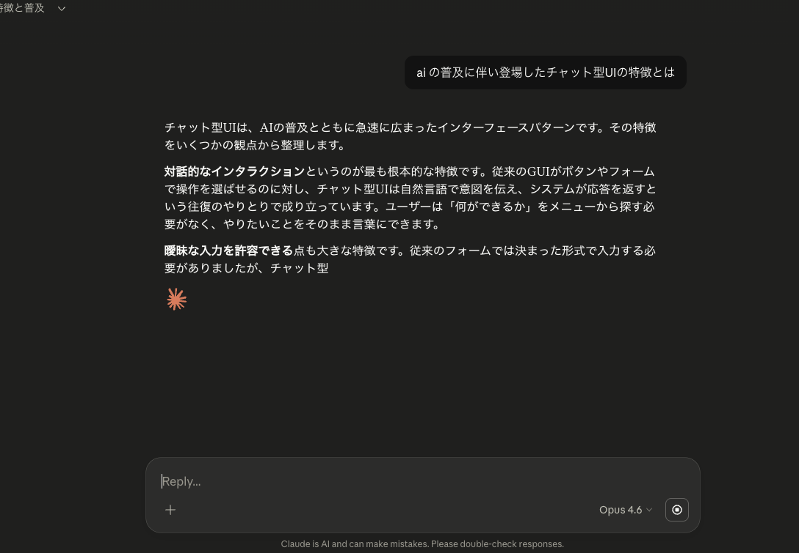
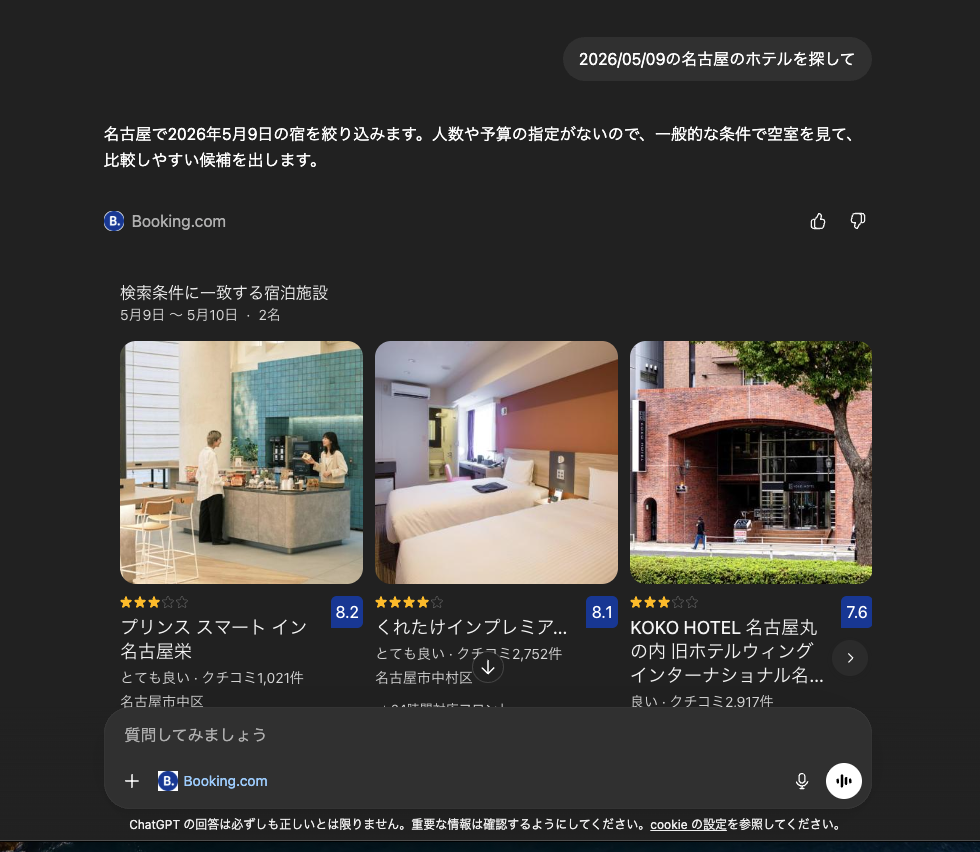

<div class="hero">
  <div class="eyebrow">Frontend Conference Nagoya 2026</div>
  <h1 class="title">フロントエンドの相手が変わった<br />AIが加わったWebの新しいインターフェース設計</h1>
  <div class="lead">人間と AI が協業する UI へ</div>
  <div class="mono muted">azukiazusa</div>
</div>

<!--
それでは、「フロントエンドの相手が変わった。AIが加わったWebの新しいインターフェース設計」というタイトルでお話しします。
今回の発表のテーマの一言でいうと、「人間と AI が協業する UI へ」です。
-->

---

## 自己紹介

<div class="columns">

<div class="card">

- **azukiazusa**
- Frontend Engineer
- https://azukiazusa.dev
- 週に 1 回、Web 開発と AI の記事を書いています
- FE（フロントエンド | ファイアーエムブレム）が好き

</div>

<div class="center">


</div>

</div>

<!--
簡単に自己紹介です。
azukiazusa という名前で活動していて、フロントエンド中心に情報発信をしています。
最近は特に、AI 周りの技術を扱っていることが多いです。
今日はその中で見えてきた変化を共有できればと思います。
-->

---

## あなたのフロントエンドの "相手" は誰ですか？

- 従来のフロントエンドの仕事は、**人間とシステムの間のインターフェース**を作ることだった
- ところが 2023 年以降、AI が Web のコンテンツを**読んで、生成して、操作する**ようになった
- つまり Web の相手に **AI が加わった**

<!--
最初に、1 つ問いです。
あなたのフロントエンドの相手は誰でしょうか。従来のフロントエンドの仕事は、人間とシステムの間のインターフェースを作ることでした。ですが今その前提が変わりつつあります。AI がコンテンツを読むし、AI が UI を生成するし、AI が操作もするようになっています。つまり、Web の相手に AI が加わったということです。
-->

---

## 2つの AI

<div class="columns">

<div class="card">
  <div class="label">Producer</div>
  <h3>出力者の AI</h3>

- チャットで応答を生成する
- ユーザーが理解・操作しやすいような UI を返す
- コンテンツを生成する

</div>

<div class="card">
  <div class="label">Consumer</div>
  <h3>消費者の AI</h3>

- 正確な応答を生成するために、Web の情報にアクセスする
- ユーザーのタスクを完了するために、Web アプリを操作する

</div>

</div>

<!--
今回の発表では、AI を大きく 2 つに分けて考えます。
大きく 2 つに分けると、出力者としての AI と、消費者としての AI です。
出力者の AI はチャットで応答を生成したり、ユーザーが理解しやすい UI を返したりします。時にはブログ記事のようなコンテンツを生成し、web ページを作ることもあるでしょう。
一方、消費者の AI は、正確な応答を生成するために Web の情報にアクセスしたり、ユーザーのタスクを完了するために Web アプリを操作したりします。

それぞれの視点からみた AI について、これから詳しく見ていきましょう。
-->

---

<div class="hero">
  <div class="eyebrow">Part 1</div>
  <div class="huge">AI は Web の<br /><span class="accent">「出力者」</span>になった</div>
</div>

<!--
まずは、AI は Web の「出力者」になった、という話からです。
-->

---

## チャット型 UI の台頭

<div class="columns">

<div>

AI の普及により、チャット型の UI を設計する機会が増えた

- ストリーミング処理が日常になった
- 待機状態の UX
- 入力フォームの設計（IME の確定で送信しない、など）

→ これまでの「リクエストを送って完成したレスポンスを受け取る」UI から「途中経過をリアルタイムに描画し続ける」UI へ

</div>

<div class="center">
  
</div>

</div>

<!--
AI が普及したことで、チャット型の UI を設計する機会が増えたかと思います。ChatGPT, Claude, Gemini などどのプラットフォームも似たようなチャット型のインターフェースを提供していますよね。もしかしたら今発表を聞いている皆さんの中にも、チャット型の UI を作ったことがある人もいるかもしれません。
大きな変化は、ストリーミング処理が日常になったことです。これまではリクエストを送って、完成したレスポンスを受け取るという UI が一般的でしたが、LLM の応答は生成に時間がかかるため、途中経過をリアルタイムに描画し続ける UI へと変わってきています。とりわけチャット型の UI に限らずとも、ストリーミングを処理するという仕事が増えてきたのではないでしょうか。
-->

---

## ストリーミング UI は何を変えたか

- 途中経過をどう見せるかの体験設計が必要になった
  - 応答をそのまま出力すると機械的に見えるので、バッファリングしたり、表示のアニメーションをつけたりする工夫が必要
  - マークダウンを素朴にパースすると、不完全な構文で表示が崩れる恐れがある
  - 自動スクロールの挙動（ユーザーが過去のメッセージを読んでいるときは自動スクロールを止める、など）
  - アクセシビリティ上の観点（ストリーミングで逐次追加されるメッセージをスクリーンリーダーにどう伝えるか）

<!--
フロントエンドエンジニアにチャット型 UI の普及がどう影響を与えたかというと、途中経過をどう見せるかの体験設計が必要になったことが大きいと思います。ストリーミング UI をユーザー体験を保ったまま提供するのって結構難しいんですよね。

前提としてLLMの出力はトークン単位で届くのですが、トークンは必ずしも単語の単位を表すわけではないので、この不規則なデータをそのまま画面に反映すると、テキストがカクカクと塊で現れたり、間隔がばらついて不自然に見えたりします。そのため、ある程度バッファリングしてから表示したり、表示のアニメーションでフェードインして柔らかく見せるなど、工夫が必要になります。

また、マークダウンを素朴にパースして表示しようとすると、不完全な構文のせいで表示が崩れる恐れがあります。例えば、コードブロックの開始トークンだけが届いている状態だと、以降のテキストがすべてコードブロックの中に入ってしまうなどです。これを防ぐためには、ブロックレベルのマークダウンが完全に届いてからパースして表示するなどの工夫が必要になります。

さらに、ユーザーが過去のメッセージを読んでいるときに新しいメッセージが届いても自動スクロールしないようにするなど、細かい挙動の設計も必要になります。加えて、ストリーミングで逐次追加されるメッセージをスクリーンリーダーにどう伝えるかなど、アクセシビリティ上の観点も考慮する必要があります。

こう整理してみると、何気なく使っているサービスが実はかなり細かい工夫の上に成り立っていることがわかりますね。
-->

---

## さらに MCP Apps へ

---

## MCP Apps の登場

<div class="columns">

<div>

- [MCP Apps](https://modelcontextprotocol.io/extensions/apps/overview) は、AI が**テキストだけでなくインタラクティブな UI** 会話の中で返せるようにする仕組み
- 例えば、チャットの中にダッシュボードやカードが出てきて、そのまま操作できる
- 右の例では、ホテルの一覧がチャットの中にカード形式で表示されていて、そのまま予約の操作もできる

</div>

<div class="center">
  
</div>

</div>

<!--
そこで出てきたのが MCP Apps です。
AI がテキストではなく、インタラクティブな UI を返す仕組みです。
チャットの中にダッシュボードやカードが出てきて、そのまま操作できる。
ここで重要なのは、UI が入口ではなく、必要な瞬間に差し込まれる部品になったことです。
-->

---

## なぜテキストだけでは足りないのか

- チャットは説明には強いが、比較や選択や確認には向かない場面がある
- テキストのチャットは一方向の情報伝達であった
- 会話から離れずに操作する体験が求められている

→ AI が流れを作っても、**人間の判断が必要な瞬間には UI が必要**

<!--
ここが MCP Apps に入る理由です。
チャットは説明には強いですが、比較や選択や確認には向かない場面があります。
チャットだけで全部やろうとすると、比較や確認のたびに人間の認知負荷が上がります。
だから会話の流れを壊さずに、必要な瞬間だけ UI を差し込める価値が出てきます。
-->

---

## MCP Apps の使用例

<div class="columns">

<div class="card">
  <div class="label">Visualize</div>
  <h3>情報を見せる</h3>

- ダッシュボード
- グラフ / チャート
- テーブル
- 地図やタイムライン

</div>

<div class="card">
  <div class="label">Decide</div>
  <h3>人間に選ばせる</h3>

- 商品比較カード
- 予約プランの選択
- 承認 / 確認 UI
- 候補の絞り込み

</div>

</div>

テキストだけでは判断しづらい場面で、会話の中でそのまま操作できる UI を差し込めるのが `MCP Apps` の強み

<!--
全部を UI にする必要はありません。
でも比較、選択、確認のように人間の判断を挟みたい場面では、テキストだけよりも UI の方がずっと伝わりやすいです。
ここが MCP Apps の実務的な価値です。
-->

---

<div class="hero">
  <div class="huge">途中で差し込まれても破綻しないUIを設計することが重要</div>
</div>

---

## MCP Apps のコード例

まず `ui://` リソースを登録する

```ts
registerAppResource(
  server,
  "ui://dashboard",
  "Sales Dashboard",
  { mimeType: RESOURCE_MIME_TYPE },
  async () => ({
    contents: [
      /* built HTML */
    ],
  }),
);
```

<!--
実装イメージとしては、まず UI リソースを登録します。
ここでは HTML を 1 つの表示部品としてホストに渡しています。
ポイントは、ツール本体と UI を分けて扱うことです。
-->

---

## MCP Apps のコード例

そのうえで、ツール定義の `_meta.ui.resourceUri` からそのリソースを参照する

```ts
server.tool(
  "show_dashboard",
  {
    description: "売上ダッシュボードを表示",
    _meta: {
      ui: {
        resourceUri: "ui://dashboard",
        // 外部リソースの読み込み許可
        csp: { allowOrigins: ["https://cdn.example.com"] },
      },
    },
  },
  async (params) => {
    return { data: await fetchSalesData(params) };
  },
);
```

<!--
そのうえで、ツール側からどの UI を使うかを参照します。
つまり AI がツールを呼ぶと、結果に応じた UI が一緒に表示される構造です。
-->

---

## MCP Apps でインタラクションを実行する

- App はユーザー操作を受けて再度ツールを呼び出せる
- `app.callServerTool(...)` で商品を購入するツールを呼び出す例

```ts
import { App } from "@modelcontextprotocol/ext-apps";
const app = new App();

button.addEventListener("click", async () => {
  const response = await app.callServerTool({
    name: "purchase-product",
    arguments: {
      productId: "sku_123",
      quantity: 1,
    },
  });
  const message = response.content?.find((c) => c.type === "text")?.text;
  if (message) status.textContent = message;
});
```

<!--
このコードのポイントは、UI が受け身ではないことです。
商品カードの購入ボタンを押すと、その場で次のツール実行が始まり、結果が UI に反映されます。
つまり、会話の中に差し込まれた UI が、そのまま次の行動の起点になります。
-->

---

## 設計思想の変化

- UI は入口ではなく、必要な瞬間に差し込まれる部品になる
- AI が流れを作っても、人間の判断が必要な瞬間には UI が必要
- これまで以上に、**人間と AI の協業を前提とした UI 設計** が重要になる

---

<div class="hero">
  <div class="small">よく見られる言説</div>
  <div class="quote">
    UI は AI が全部作ってくれるから、フロントエンドエンジニアはもういらない。バックエンドエンジニアを目指そう。
  </div>
</div>

---

## AI が登場したことで考えるべきことが増えている

- ストリーミング UI のユーザー体験設計/MCP Apps の UI 設計など
- AI は技術的に UI を生成できるが、体験設計は依然として人間が担う領域
  - 人間と AI のブラウザの操作の仕方は大きく異なる
- フロントエンドは<span class="accent">ユーザー体験</span>を形作る役割がある

---

<div class="hero">
  <div class="eyebrow">Part 2</div>
  <div class="huge">AI は Web の<br /><span class="accent">「消費者」</span>にもなった</div>
</div>

<!--
次に消費者の AI です。
こちらは、AI が Web を読む側、使う側に回った変化です。
ここからは情報の届け方と、操作のされ方の話をします。
-->

---

## クローラと AI エージェントの違い

Web には以前からクローラという「人間以外の消費者」がいた
しかし AI エージェントは振る舞いが違う

|                                | クローラ                                   | AI エージェント                                          |
| ------------------------------ | ------------------------------------------ | -------------------------------------------------------- |
| 目的                           | インデックス作成                           | タスク遂行                                               |
| 行動                           | 読み取り                                   | 読み取り + 操作                                          |
| 理解                           | 構造的（DOM をパースしてコンテンツを抽出） | 意味的（レンダリングされた内容を理解して判断）           |
| コンテンツの冗長性が与える影響 | 小さい                                     | 大きい（コンテキストウィンドウを圧迫すると性能が落ちる） |

→ AI は Web コンテンツを **理解し、判断し、行動する**

<!--
実は Web には昔から人間以外の消費者がいました。クローラです。
ですがクローラはあくまでインデックス作成が目的で、DOM をパースして構造的にコンテンツを抽出することに特化していました。一方、AI エージェントはタスク遂行が目的で、レンダリングされた内容を意味的に理解して判断し、さらに操作もするという点で大きく異なります。
特に、AI はコンテキストウィンドウの制約の中で情報を処理するため、コンテンツの冗長性が性能に大きく影響します。
-->

---

## AI が Web を読むための工夫が必要に

- コンテンツの意味を理解する → セマンティック HTML の重要性
- コンテキストウィンドウを圧迫しない → 単に情報が欲しいだけであれば、装飾のための構造はノイズになる

<!--
我々に与える影響という観点で言えば、AI が Web を読むための工夫が必要になったことが大きいと思います。
AI が web を操作しようとするとき、まずはコンテンツを理解する必要があります。そのためには、セマンティック HTML を書いて意味構造を明確にすることが重要になります。
さらに、AI はコンテキストウィンドウの制約の中で情報を処理するため、単に情報が欲しいだけであれば、装飾のための構造はノイズになります。つまり、AI にとっては、意味を伝えるための構造と、装飾のための構造を分けて考える必要が出てきます。
 -->

---

## コンテキスト効率の良い配信が重視される

- AI にとっては、複雑な装飾付き HTML より **Markdown のほうが読みやすい** 場面が多い
- Web サイトが Markdown 版を返す動きが出てきた
- Cloudflare も [Markdown for agents](https://blog.cloudflare.com/ja-jp/markdown-for-agents/) を公開し、エージェント向けの配信を提案している
  - `Accept: text/markdown` ヘッダを送ると、AI にとってコンテキスト効率の良い Markdown 版が返る

  <!--
  AI が情報を取得するための工夫の一例が、コンテキスト効率の良い配信です。
  AI にとっては、複雑な装飾付き HTML より Markdown のほうが読みやすい場面が多いです。
  そのため、Web サイトが Markdown 版を返す動きが出てきています。
  Cloudflare も Markdown for agents を公開し、エージェント向けの配信を提案しています。
  -->

---

<div class="hero">
  <div class="quote">AI がコンテンツを効率よく理解するための工夫は早期から行われていたが、操作のためのインターフェースはまだ発展途上</div>
</div>

---

<div class="hero">
  <div class="huge">WebMCP の提案</div>
</div>

---

## WebMCP は Web アプリをツール化する

- [WebMCP](https://github.com/webmachinelearning/webmcp) は、Web アプリがブラウザ上で **AI から呼び出せるツール** を公開する仕組み
- AI はスクリーンショット解析やコードによる DOM 操作ではなく、**意味を持った関数** を通じて操作できる
- 前提は **human-in-the-loop**

<!--
さらに面白い動きが WebMCP です。
これは何かというと、Web アプリを AI から呼び出せるツールにする仕組みです。
重要なのは、スクリーン操作ではないという点です。
DOM をいじるのではなく、意味を持った関数として操作します。
例えば「タスクを追加する」のような操作を直接呼び出せます。
-->

---

## WebMCP のコード例

- `window.navigator.modelContext.provideContext` でツールを提供する
- 例えば、Todo アプリが「タスクを追加する」ツールを提供するコード例

```js
window.navigator.modelContext.provideContext({
  tools: [
    {
      name: "add-todo",
      description: "Add a new todo item to the list",
      inputSchema: { type: "object", properties: { text: { type: "string" } } },
      execute: async ({ text }) => {
        addTask(text);
        return { content: [{ type: "text", text: `Added todo: ${text}` }] };
      },
    },
  ],
});
```

<!--
これは API を別途用意して AI だけに公開する発想と少し違います。
既存の Web アプリの文脈、状態、ユーザー操作の近くでツールを提供する、という点が肝です。
人間が見ている画面と近い場所で、AI にも意味のある操作を渡せるのが面白いところです。
-->

---

## 宣言的にツール化できる

- WebMCP ではフォームに属性を付けるだけでツール登録できる提案もある
- 既存の HTML 資産をそのまま活かしやすい

```html
<form
  toolname="add-todo-item"
  tooldescription="Add a new todo item to the list"
>
  <input name="text" required />
  <button type="submit">Add Todo</button>
</form>
```

- これは「AI 用に別 UI を作る」のではなく、**同じ UI を人間にも AI にも開く** 発想

<!--
個人的にはここがすごく Web らしいと思っています。
特別な AI 専用インターフェースを増やすのではなく、HTML の意味やフォームの制約を再利用しているからです。
同じ UI を人間にも AI にも開くという発想です。
-->

---

## 従来の MCP ツールや API と何が違うのか

- 単に AI にツールを使わせるだけなら MCP ツールでいい
- それでも WebMCP が必要なのは、**人間と AI が同じインターフェース上で協業する**から
- 既に多くの企業が Web を通じてサービスを提供しており、既存の資産を再利用できるというメリットも大きい

<!--
API だけでいいのでは、と思うかもしれませんが違います。
違いは機能提供ではなく、体験共有にあります。
人間と AI が同じインターフェース上で協業することに意味があります。
これが Web らしいポイントです。
-->

---

## AI が消費する時代の説明責任

- AI が生成したコンテンツは、**誤情報や偏見を含む可能性がある**
- AI はコンテンツを大量に生成できるため、よく検証されていない情報が大量に投稿されるという問題も出てきた
- Web コンテンツの制作者として、AI の関与を明示することが求められている

<!--
AI が消費者になるだけでなく、生成者にもなる以上、説明責任の論点も出てきます。
誤情報や偏見を含む可能性があるし、大量生成によって未検証の情報も増えます。
なので、AI の関与をどう明示するかが実務上のテーマになります。
削るならここは短めに流せるパートです。
-->

---

## ai-disclosure 属性の提案

- AI の関与度を HTML で宣言
- ただし、これは **標準化済みの属性ではなく提案段階の explainer**
- 例えばニュースサイトでは、人間が書いた調査報道と AI 生成のサマリーが混在する可能性がある

```html
<article>
  <section ai-disclosure="none">
    <p>本誌の独自調査では...</p>
  </section>

  <aside ai-disclosure="ai-generated" ai-model="gpt-4o">
    <h3>AI要約</h3>
    <p>レポートの結論は...</p>
  </aside>
</article>
```

<!--
例えばこういう形で、どこが人間由来で、どこが AI 生成かを機械可読に示す案があります。
まだ提案段階ですが、こうした透明性の議論が始まっていること自体が重要です。
-->

---

<div class="hero">
  <div class="eyebrow">Conclusion</div>
  <div class="huge">「The Web is for everyone」の再解釈</div>
</div>

---

## everyone に AI が含まれた

> "The Web is for everyone"
> — Tim Berners-Lee

この理念は変わっていない
**「everyone」の範囲が拡張された**

スクリーンリーダーに情報を伝えたように、AI にも情報を届ける
→ アクセシビリティと同じ考え方

<!--
最後にまとめです。
The Web is for everyone という言葉があります。
この理念は変わっていません。
ただ、「everyone」の範囲が広がりました。
そこに AI が含まれるようになった。
スクリーンリーダーに情報を届けたように、AI にも情報を届ける。
これはアクセシビリティと同じ発想です。
-->

---

## 我々の役割は変わらない

<div class="statement">

すべての人（と AI）にWeb というインターフェースを介して
**体験を届ける**

これまで培った**HTML・CSS・JavaScript の知識は**
**無駄にならない**

</div>

- AI と人間が協業できるように Web が進化しているだけ

<!--
最後に一番伝えたいことです。
フロントエンドの相手は増えました。
でも、私たちの仕事の本質は変わっていません。
インタラクションを設計し、実行体験を作ること。
それはこれからも同じです。
UI はなくならないし、むしろ重要になります。
ただし、誰のために作るのかが広がっただけです。
-->

---

## まとめ

1. AI は Web の **出力者** になり、UI は入口から補助へ変わりつつある
2. AI は Web の **消費者** にもなり、Web アプリは人間向け UI と AI 向けツールの両方の顔を持つようになった
3. それでもフロントエンドエンジニアの役割は変わらない。ユーザー体験を形作ることが重要で、AI と人間の両方を考慮した設計が求められるようになった

<!--
最後のまとめです。
1 つ目。AI は Web の出力者になり、UI は入口から補助へ変わりつつあります。
2 つ目。AI は Web の消費者にもなり、Web アプリは人間向け UI と AI 向けツールの両方の顔を持つようになりました。
-->

---

## References

- MCP Apps: https://modelcontextprotocol.io/extensions/apps/overview
- Introducing apps in ChatGPT: https://openai.com/ja-JP/index/introducing-apps-in-chatgpt/
- AI Content Disclosure: https://github.com/dweekly/ai-content-disclosure
- Markdown for agents: https://blog.cloudflare.com/ja-jp/markdown-for-agents/
- WebMCP: https://github.com/webmachinelearning/webmcp
- azukiazusa.dev
  - https://azukiazusa.dev/blog/ai-interactive-ui-with-mcp-apps/
  - https://azukiazusa.dev/blog/webmcp-for-web-applications/

<!--
参考リンクです。
質疑応答で気になった方はここから辿れるようにしています。
発表中は読み上げず、そのまま次に進みます。
-->

---

<div class="hero">
  <div class="eyebrow">Thank You</div>
  <div class="huge">ご清聴ありがとうございました</div>
  <div class="lead">azukiazusa.dev</div>
</div>

<!--
ご清聴ありがとうございました。
フロントエンドの相手は増えた。
でも、やるべきことは変わっていない。
これが今日の結論です。
-->
