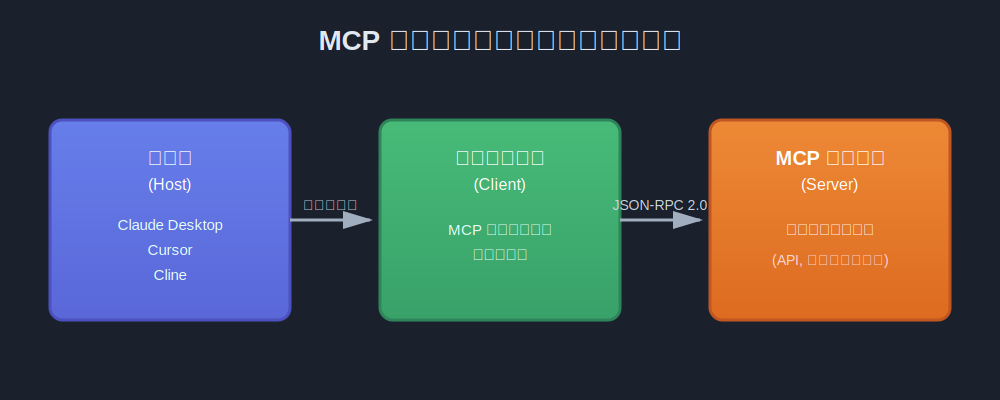
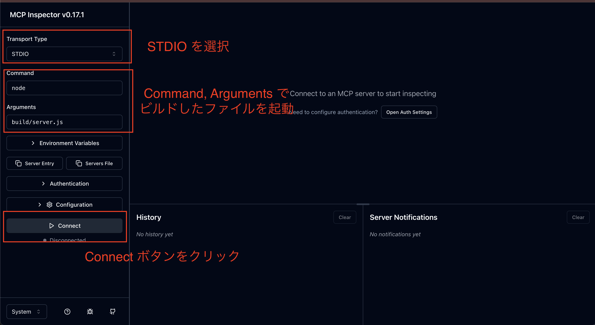
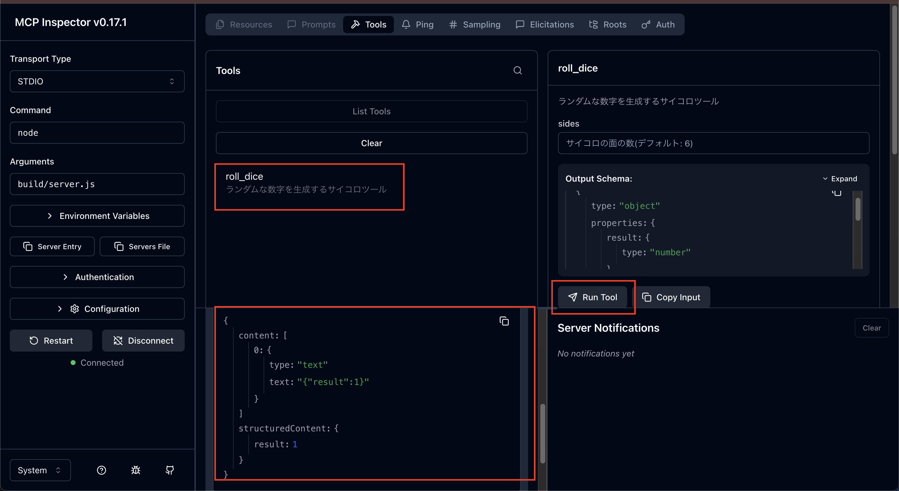
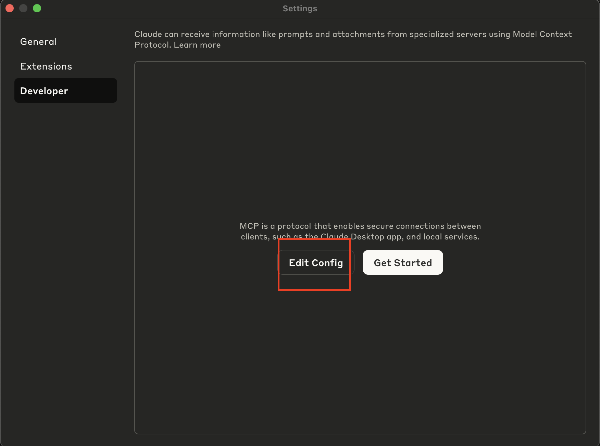
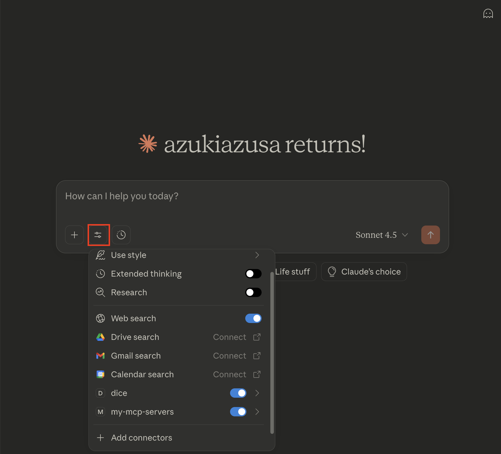
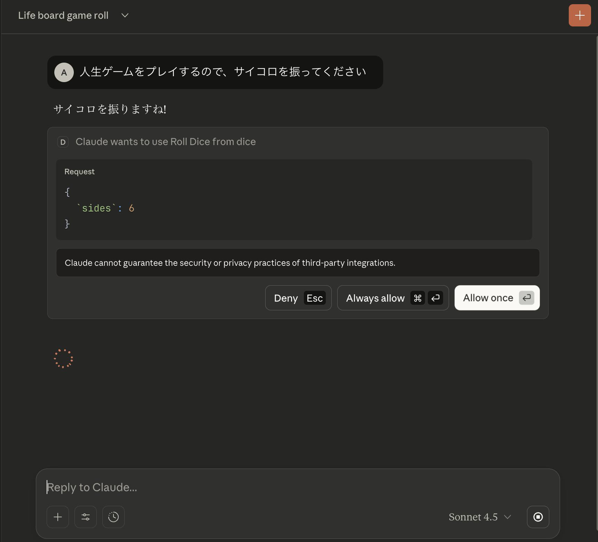
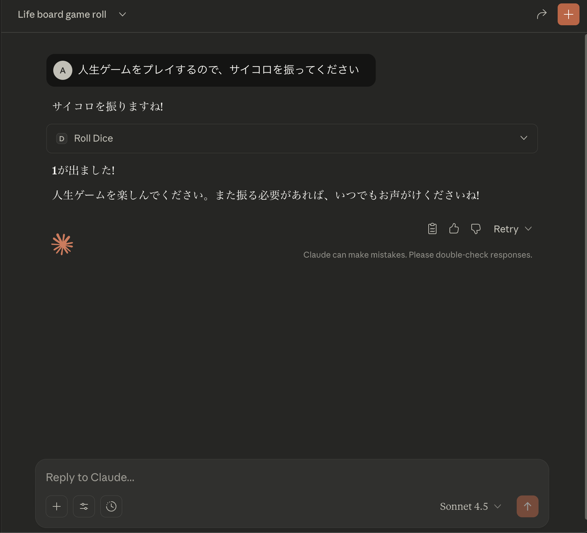
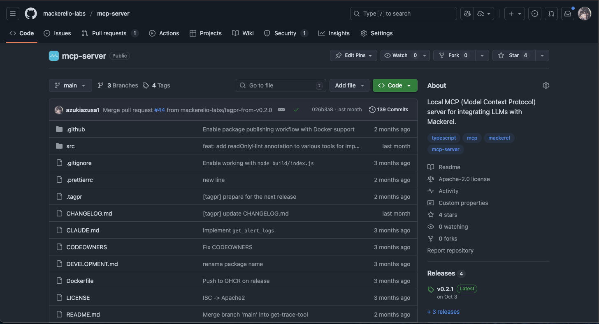

<div class="center">

# ないなら作る MCP サーバー構築ハンズオン

## MCP サーバーの基礎から実践レベルの知識まで

</div>

<!--
それでは「ないなら作る MCP サーバー構築ハンズオン」というタイトルで発表を初めます。この発表では、MCP サーバーの基礎的な内容から、実践的な知識までをカバーします。

 -->

---

## 自己紹介

- azukiazusa
- https://azukiazusa.dev
- FE(フロントエンド|ファイアーエムブレム)が好き


<!--
初めに簡単な自己紹介です。azukiazusa という名前で活動をしていて、主にフロントエンド領域を中心に開発をしています。azukiazusa.dev というブログも運営していて、最近は AI 関連の記事も多く書いています。

 -->

---

## アジェンダ

- MCP サーバーの基礎知識について(10分)
- MCP サーバー構築ハンズオン(20分)
- MCP サーバーの実践的な知識について(15分)

<!--
今回の発表ではまず初めに MCP サーバーとはなんなのか、どのような仕組みで動いているのかといった基礎的な知識について改めておさらいしたいと思います。続いて実際に MCP サーバーを構築するハンズオンを通じて、より具体的なイメージを持っていただければと思います。最後に私自身が実際に MCP サーバーを開発・運用してきた中で得た、実践的な知識について共有したいと思います。
 -->

---

<div class="center">

# MCP サーバーの基礎知識

</div>

---

## MCP とは何か

**Model Context Protocol (MCP)**

AI エージェントを外部システムに接続するための標準規格

- Claude を提供する Anthropic が開発・発表
- ツールのインターフェースを統一
- AI アプリケーション用の USB-C ポートのようなもの

<!--
MCP とは Model Context Protocol の略で、AI エージェントを外部システムに接続するための標準規格です。Claude を提供する Anthropic が開発・発表しました。MCP はツールのインターフェースを統一することで、ツールの開発者が LLM の実装の違いを意識せずにツールを開発できるようにすることを目的としています。

MCP は AI アプリケーション用の USB-C ポートのようなものと説明されており、、USB-C ポートがさまざまなデバイスで共通のインターフェースを提供するように、LLM が外部システムに接続できるようなイメージです。
 -->

---

## なぜ AI エージェントが外部システムと接続する必要があるのか

→ LLM の機能を拡張し、より高度なタスクを達成するため

- LLM には知識カットオフがあり、最新の情報や組織内の情報を取得できない
  - Web 検索をしたり、社内ドキュメントを参照しその情報をコンテキストに渡す必要がある
- ChatGPT の Plugins では外部のツールを呼び出す仕組みが提供された
  - Excel や PDF をアップロードして、組織内の情報を取得できるように
  - メールの送信やカレンダーの予定作成など、日常的なタスクを自動化できるように

→ ChatGPT の Plugins は OpenAI 独自の仕組みであり、他の LLM では利用できない

<!--
MCP の目的は AI エージェントが外部システムと接続することと述べましたが、なぜ外部システムと接続する必要があるのでしょうか？それは LLM の機能を拡張して、より高度なタスクを達成するためです。
LLM には知識カットオフがあり、最新の情報や組織内の情報を取得できないという課題があります。例えば、最新のニュースや株価情報、あるいは社内のドキュメントなど、LLM が直接アクセスできない情報を取得するために、Web 検索をしたり、社内ドキュメントを参照しその情報をコンテキストに渡す必要があります。

このような問題を解決するために、ChatGPT ではかつて Plugins と呼ばれる外部のツールを呼び出す仕組みが提供されていました。これを使うことにより、Excel や PDF をアップロードして、組織内の情報を取得できるようになったり、メールの送信やカレンダーの予定作成など、日常的なタスクを自動化できるようになりました。

しかし、ChatGPT の Plugins は OpenAI 独自の仕組みであり、せっかくプラグインを開発しても他の LLM では利用できないという課題がありました。
 -->

---

## function calling

- 開発者がコードレベルで LLM に外部ツールを呼び出させるためには、function calling といった仕組みが使われてきた
  - 天気情報を取得するために天気情報 API を呼び出したり、Slack API を呼び出してメッセージを送信したりする関数を LLM が呼び出す
- LLM の SDK ごとに異なる実装が必要で、開発者にとっては負担が大きい

<!--
他にも LLM アプリケーションを開発するうえで function calling といった仕組みが使われてきました。function calling では、天気情報を取得するために天気情報 API を呼び出したり、Slack API を呼び出してメッセージを送信したりする関数を LLM が呼び出すことで、外部ツールと連携します。

しかし、function calling は LLM の SDK ごとに異なる実装が必要で、開発者にとっては負担が大きいという課題がありました。
 -->

---

### function calling の例

<div class="grid">

<div>

```typescript
const response = await openai.chat.completions.create({
  model: "gpt-4",
  tools: [
    {
      type: "function",
      function: {
        name: "get_weather",
        description: "天気を取得",
        parameters: {
          type: "object",
          properties: {
            location: {
              type: "string",
            },
          },
        },
      },
    },
  ],
});
```

</div>

<div>

```typescript
const response = await anthropic.messages.create({
  model: "claude-3-5-sonnet",
  tools: [
    {
      name: "get_weather",
      description: "天気を取得",
      input_schema: {
        type: "object",
        properties: {
          location: {
            type: "string",
          },
        },
      },
    },
  ],
});
```

</div>

</div>

<!--
参考に OpenAI と Anthropic の SDK の function calling の例を示します。やりたいことは同じであっても、SDK ごとに異なるインターフェイスが提供されていることがわかりますね。
 -->

---

## MCP が解決したこと

- 1 つの MCP サーバーを開発すれば、複数のクライアントから利用できる
- 各プログラミング言語向けの SDK が提供されているため、効率よく MCP サーバーを開発し、パッケージマネージャーで配布できる
- 企業が自社のデータを LLM に提供する手段として普及が進んだ
- 現在では Anthropic が提供する Claude だけでなく、OpenAI の GPT や Google の Gemini など、主要な LLM が MCP をサポートし事実上の標準となっている

<!--
このような状況の中で、MCP が登場しました。MCP はツールのインターフェースを標準化したことにより、1 つの MCP サーバーを開発すれば、複数のクライアントから利用できるようになりました。また各プログラミング言語向けの SDK が提供されているため、効率よく MCP サーバーを開発し、パッケージマネージャーで配布できるようになりました。

さらに企業が自社のデータを LLM に提供する手段として MCP の普及が進みました。現在では Anthropic が提供する Claude だけでなく、OpenAI の GPT や Google の Gemini など、主要な LLM が MCP をサポートし事実上の標準となっています。
 -->

---

## MCP サーバーの例

- [Slack MCP サーバー](https://docs.slack.dev/ai/mcp-server/): Slack の情報を検索したり、メッセージを送信したりできる
- [Playwright MCP サーバー](https://github.com/microsoft/playwright-mcp): Web ブラウザを操作して情報を取得したり、操作を自動化したりできる
- [Figma MCP サーバー](https://help.figma.com/hc/en-us/articles/32132100833559-Guide-to-the-Figma-MCP-server): Figma のリソースを元にコードを生成
- [Sentry MCP サーバー](https://docs.sentry.io/product/sentry-mcp/): Sentry のエラー情報を取得し、原因の特定や修正方法を提案

MCP サーバーを探してみよう

- https://github.com/modelcontextprotocol/servers
- https://github.com/mcp
- https://hub.docker.com/u/mcp

---

## MCP の仕組み



<!--
MCP がどのような仕組みで動いているのか、簡単に説明します。MCP は クライアント・サーバーモデルに基づいています。Claude Desktop や Cursor などの LLM を使用するアプリケーションがホストとなり、 MCP クライアントにツールの呼び出しを要求します。

要求を受けた MCP クライアントは、MCP サーバーに対してツールの呼び出しを行います。MCP サーバーはツールの定義と実装を管理し、要求に応じてツールを実行し、その結果を MCP クライアントに返します。MCP クライアントはその結果を受け取り、LLM に返します。
 -->

---

## MCP のトランスポート

#### stdio(標準入出力)

- 標準入力/出力を使用した通信
- ローカル環境で動作するため、パッケージをインストールする必要がある

#### Streamable HTTP

- HTTP を使用した通信
- ユーザーは MCP をローカルにインストールする必要がない

#### SSE(非推奨)

- 互換性維持のために残されている
- Streamable HTTP を実装した場合、後方互換性のために SSE も実装する必要がある

<!--
MCP はクライアントとサーバー間の通信に複数のトランスポート方式をサポートしています。現在定義されているトランスポート方式は stdio、Streamable HTTP の 2 つです。

stdio は標準入力/出力を使用した通信方式で、ローカル環境で動作します。Streamable HTTP は HTTP を使用した通信方式で、使用するユーザーは MCP をローカルにインストールする必要がなく、手軽に使用できるので注目を集めています。

SSE は互換性維持のために残されているトランスポート方式で、現在は非推奨となっています。現在の仕様では Streamable HTTP を実装するときは同時に SSE も実装する必要があります。

 -->

---

## JSON-RPC 2.0

- JSON-RPC 2.0 (https://www.jsonrpc.org/specification)を使用して通信
- JSON-RPC とは、リモートプロシージャコール (RPC) を JSON フォーマットで実装するための軽量なプロトコル

```json
{
  "jsonrpc": "2.0",
  "id": 1,
  "method": "tools/call",
  "params": {
    "name": "get_weather",
    "arguments": {
      "location": "Tokyo"
    }
  }
}
```

<!--
MCP のクライアントとサーバーは JSON-RPC 2.0 を使用して通信します。JSON-RPC とは、リモートプロシージャコール (RPC) を JSON フォーマットで実装するための軽量なプロトコルです。

このコード例のように `method` フィールドに呼び出したいメソッド名を指定し、`params` フィールドに引数を指定することで、リモートのサーバーに対して関数を呼び出すことができます。
 -->

---

## MCP の 3 つの機能

#### リソース

- ユーザーや LLM がアクセスできるデータ
- 例: ドキュメント、画像、UI コンポーネント

#### プロンプト

- 再利用可能なプロンプトテンプレート
- 組織内で効果的なプロンプトを共有

#### ツール

- LLM が呼び出せる外部ツール

→ **この発表ではツールに焦点を当てる**

<!--

そして現在の MCP では、リソース、プロンプト、ツールの 3 つの主要な機能が提供されています。リソースはユーザーや LLM がアクセスできるデータを指し、例えば、ドキュメントや画像、あるいは UI コンポーネントなどが含まれます。プロンプトは再利用可能なプロンプトテンプレートを指し、LLM に対して効果的なプロンプトを共有するために使用されます。ツールは LLM が呼び出せる外部ツールを指し、例えば、天気情報の取得やタスク管理、あるいは計算などが含まれます。

現在の MCP では最後のツールの機能に最も注目が集まっており、この発表でもツールに焦点を当てて説明します。
 -->

---

<div class="center">

# MCP サーバー構築デモ

## TypeScript SDK を使用してサイコロツールを実装

</div>

---

## プロジェクトのセットアップ

```bash
git clone https://github.com/azukiazusa1/mcp-handson.git
```

```bash
cd mcp-handson
npm install
```

---

## 使用するパッケージ

- `@modelcontextprotocol/sdk`: MCP サーバーを構築するための公式 SDK
- `zod`: ツールの入力と出力のスキーマを定義するためのライブラリ
- `@modelcontextprotocol/inspector`: MCP サーバーの動作確認を行うためのツール

---

## サーバーの基本構造

`src/server.ts`

```typescript
import { McpServer } from "@modelcontextprotocol/sdk/server/mcp.js";

// MCP サーバーのインスタンスを作成
const server = new McpServer({
  name: "dice-server",
  version: "1.0.0",
});
```

<!--
ここから実際にコードの実装に入ります。`src/server.ts` ファイルを開いてください。
初めに、MCP サーバーのサーバーインスタンスを作成します。作成したサーバーインスタンスに対してツールの定義を追加してくわけです。

MCP サーバークラスを import して、`new McpServer` でサーバーインスタンスを作成します。`name` と `version` は任意の値を指定します。
 -->

---

## ツールの定義と実装

```typescript
import { z } from "zod";

server.registerTool(
  "roll_dice", // ツールの一意な名前
  {
    title: "Roll Dice", // 人間が読めるツールの名前
    description: "ランダムな数字を生成するサイコロツール", // ツールの説明
    // ツールの入力スキーマ
    inputSchema: {
      sides: z.number().optional().describe("サイコロの面の数(デフォルト: 6)"),
    },
    // ツールの出力スキーマ
    outputSchema: {
      result: z.number(),
    },
  },
  // LLM がツールを呼び出したときに実行される関数
  async ({ sides = 6 }) => {
    const result = Math.floor(Math.random() * sides) + 1;

    return {
      content: [{ type: "text", text: JSON.stringify({ result }) }],
      structuredContent: { result },
    };
  },
);
```

---

### ツールのポイント

- `title` はツールの一覧に表示されるため、人間が理解しやすい名前にする
- `description` は LLM がツールを呼び出す判断に影響するため重要
  - LLM のシステムプロンプトに自動で追加される
- `inputSchema` と `outputSchema` でツールのインターフェイスを定義
  - JSON Schema に基づいている。TypeScript では zod を使用して定義可能
- `outputSchema` は必須ではないが、定義することでクライアントや LLM がツールを適切に処理しやすくなる
- ツールの戻り値の `structuredContent` は `outputSchema` に準拠している必要がある
- `outputSchema` をサポートしていないクライアントのために、`content` も返す

---

## サーバーの起動(stdio)

```typescript
import { StdioServerTransport } from "@modelcontextprotocol/sdk/server/stdio.js";

// stdio transport を使用してサーバーを起動

async function main() {
  const transport = new StdioServerTransport();
  await server.connect(transport);
  // stdio で通信するので、console.log は使わない
  console.error("MCP Server is running...");
}
main();
```

---

## サーバーをビルド

```bash
npm run build
```

→ `build/server.js` が生成される

---

## MCP Inspector で動作確認

```bash
npx @modelcontextprotocol/inspector node build/server.js
```

- LLM は実装したツールを確実に呼び出してくれるとは限らない
- MCP Inspector はブラウザ上の UI でツールを直接呼び出して動作確認できる

---

## MCP Inspector での接続操作



---

## roll_dice ツールの動作確認



---

## Claude Desktop での設定

Settings > Developer > Edit Config

<div class="centered-image">



</div>

---

## JSON 設定例

`claude_desktop_config.json` ファイルに以下を追加

```json
{
  "mcpServers": {
    "dice": {
      "command": "node",
      "args": ["/path/to/build/server.js"]
    }
  }
}
```

---

## MCP サーバーのツールが追加されたことを確認

Claude Desktop を再起動して、ツールの一覧に `dice` が表示されていることを確認

<div class="centered-image">



</div>

---

## Claude Desktop で実行

`Roll Dice` ツールの呼び出しの許可が求められる

<div class="centered-image">



</div>

---

## サイコロを振った結果を元に Claude が応答

<div class="centered-image">



</div>

---

## MCP サーバーを提供するには

- stdio: プログラミング言語のパッケージマネージャー・もしくは Docker コンテナで配布するのが一般的
  - TypeScript: npm
  - Python: uv
- Streamable HTTP: HTTP サーバーとしてデプロイ

---

<div class="center">

# MCP サーバーの実践的な知識

- 私が実際に本番レベルで MCP サーバーを開発してきた中で得た知見・失敗談を共有

</div>

<!--
ここからはハンズオンでは触れられなかった、MCP サーバーの実践的な知識について共有したいと思います。私が実際に本番レベルで MCP サーバーを開発してきた中で得た知見や失敗談を中心にお話しします。

 -->

---

## Mackerel MCP サーバーを開発

<div class="flex">

<div>

- Mackerel は株式会社はてなが提供するクラウド型サーバー監視サービス
- MCP サーバーを利用して AI と連携することで、アラート情報の取得から原因分析、詳細な対処手順の提案までを AI が支援

</div>

<div>



</div>

</div>

---

<div class="center">

## MCP サーバー設計で大切なこと

</div>

---

<div class="center">

## Web API の設計知識は捨てる = アンラーニング

</div>

<!--
始めに伝えたいいちばん大切なことは、MCP サーバーを設計する際には、従来の Web API の設計知識を捨てる必要があるということです。MCP サーバーは LLM と連携するためのものであり、LLM の特性を理解し、それに合わせた設計が求められます。

 -->

---

## MCP サーバー設計で実際に失敗したこと

1. API のラッパーとして提供してしまう
2. レスポンスのコンテキストサイズが大きすぎる
3. LLM がツールの呼び出し方を誤る

---

<div class="center">

# 1. API のラッパーとして提供してしまう

</div>

---

## API のラッパーとして提供すると失敗する

- REST API はリソースベースの設計
  - 1 つのリソースに対して GET、POST、PUT、DELETE などの操作ごとにエンドポイントが存在
- ツールはユーザーが達成したいタスクベースの設計
- プログラミングでは 1 つのタスクを達成するために複数の API を組み合わせることが一般的
- LLM は複数のツールを組み合わせてタスクを達成することが苦手

<!--
よくある失敗例として、API のラッパーとして MCP サーバーを提供してしまうことが挙げられます。従来の REST API はリソースベースの設計であり、1 つのリソースに対して GET、POST、PUT、DELETE などの操作ごとにエンドポイントが存在します。
一方で MCP サーバーのツールはユーザーが達成したいタスクベースの設計が求められます。プログラムの世界では 1 つのタスクを達成するために複数の API を組み合わせることが一般的ですが、LLM は複数のツールを組み合わせてタスクを達成することが苦手です。

そのため、API のラッパーとして MCP サーバーを提供してしまうと、LLM が適切にツールを選択できず、期待した結果が得られないことがあります。
 -->

---

## 例: カレンダー API

#### 従来の API 設計

- `GET /users` - ユーザー取得
- `GET /events` - イベント取得
- `POST /events` - イベント作成

ユースケースの例: 参加者とのミーティングをスケジュール

1. `GET /events` で特定の日付の空き時間を取得
2. `GET /users` で参加者のユーザー ID を取得
3. `POST /events` でミーティングを作成

→ この設計に従うと、`get_users`, `get_events`, `create_event` といったツールを作りたくなる

<!--
例えば、カレンダー API を MCP サーバーで提供する場合を考えます。従来の API 設計では、`GET /users` でユーザーを取得し、`GET /events` でイベントを取得し、`POST /events` でイベントを作成するといったエンドポイントが存在します。この 3 つのエンドポイントを組み合わせて、参加者とのミーティングをスケジュールするユースケースといった例が考えられます。

この設計に従うと、MCP サーバーでは `get_users`, `get_events`, `create_event` といったツールを作りたくなります。
 -->

---

## 例: カレンダー API

#### LLM 向けのツール設計

- `schedule_meeting` - ミーティングをスケジュール（ツールの実装の中で複数のAPI を呼び出す）
  - **1 つのタスクを 1 つのツールで完結**
- 一方でツールの詳細度を上げすぎてしまうと、汎用性が低くなってしまうのでいい塩梅を見つける必要がある

<!--

しかし、より効果的なツール設計としては、`schedule_meeting` のように 1 つのタスクを 1 つのツールで完結させることが重要です。このツールの実装の中で複数の API を呼び出し、ユーザーがミーティングをスケジュールするというタスクを達成できるようにします。

一方でツールの詳細度を上げすぎてしまうと、汎用性が低くなってしまうのでいい塩梅を見つける必要があります。
  -->

---

<div class="grid">

<div>

### 従来のプログラミングの例

```typescript
app.get("/get_user", async (req, res) => {
  const user = await searchUser(req.query.name);
  res.json(user);
});

app.get("/get_events", async (req, res) => {
  const events = await getEvents(req.query.userId, req.query.date);
  res.json(events);
});

app.post("/create_event", async (req, res) => {
  const event = await createEvent(
    req.body.title,
    req.body.attendeeIds,
    req.body.timeSlot,
  );
  res.json(event);
});
```

</div>

<div>

### MCP サーバーの例

```typescript
// MCP ツール: 1 つのツールでタスクを完結
server.registerTool(
  "schedule_meeting",
  {
    title: "Schedule Meeting",
    description: "指定したメンバーとのミーティングをスケジュール",
    inputSchema: {
      attendeeName: z.string().describe("参加者の名前"),
      title: z.string().describe("ミーティングのタイトル"),
      date: z.string().describe("日付(YYYY-MM-DD)"),
      duration: z.number().describe("所要時間(分)"),
    },
    outputSchema: { eventId: z.string(), startTime: z.string() },
  },
  async ({ attendeeName, title, date, duration }) => {
    // ツール内部で全ての処理を実行
    const user = await searchUser(attendeeName);
    const freeSlot = await findFreeSlot(user.id, date, duration);
    const event = await createEvent(title, [user.id], freeSlot);

    return {
      content: [{ type: "text", text: `ミーティングを作成しました` }],
      structuredContent: { eventId: event.id, startTime: freeSlot.start },
    };
  },
);
```

</div>

<!--
従来型のプログラミングと MCP サーバーの設計の違いを具体的なコード例で示します。左側が従来のプログラミングの例で、右側が MCP サーバーの例です。

従来型のプログラミングは、1 つのタスクを達成するために複数の API を組み合わせて実装しています。一方で MCP サーバーの例では、`schedule_meeting` という 1 つのツールでタスクを完結させています。このツールの実装の中でユーザーの検索、予定の取得、空き時間の見つける、ミーティングの作成といった一連の処理を実行しています。
 -->

---

## ツール設計のポイント

### 提供するツールの数を絞る

- 提供するツールの数が多くなると、LLM がどのツールを使うべきか迷ってしまう
  - 多くのユーザーは複数の MCP サーバーを同時に利用するので、思ったよりもツールの数が多くなりがち
- さらに `description` の内容は LLM のシステムプロンプトに自動で追加されるため、コンテキストの圧迫につながる

<!--
ツール設計のポイントとして、提供するツールをよく選定することが重要です。提供するツールの数が多くなると、LLM がどのツールを使うべきか迷ってしまうことがあります。特に多くのユーザーは複数の MCP サーバーを同時に利用するので、思ったよりもツールの数が多くなりがちです。

またツールは LLM の起動時に自動で説明がコンテキストに追加されるため、提供するツールが多すぎるとコンテキストの圧迫につながります。MCP サーバーのコンテキストの圧迫という課題に対して Claude Skills という機能も発表されたりもしていますね。
 -->

---

<div class="box">

<div class="box-title">
コラム: Claude Skills
</div>

- MCP サーバーのコンテキストの圧迫という課題に対して Claude Skills という機能が発表された
- Claude Skills 必要なときに必要な情報をロードする **Progressive Disclosure** がコンセプト
- 最初はスキルのメタデータ（~100 tokens）だけを LLM に提供し、LLM がスキルを使いたいと判断したときに詳細な説明（~5,000 tokens）を提供する仕組み
- MCP サーバーのツールを直接呼び出すのではなく、コードを実行させるというアプローチも紹介されている [Code execution with MCP: building more efficient AI agents \ Anthropic](https://www.anthropic.com/engineering/code-execution-with-mcp)

---

## ツール設計のポイント

### タスクベースで設計

- ユーザーが何を達成したいのか、ユースケースを考えてツールを設計することが重要
- ユーザーが `GET /users` を呼び出したいのは何のためか?
  - `POST /events` でミーティングを作成するために参加者のユーザー ID を知りたいのが真の目的で、最終的なタスクはミーティングのスケジュール
- ツールの実装の中で複数の API を組み合わせてタスクを達成

<!--
そのため、ユーザーが何を達成したいのか、ユースケースを考えてツールを設計することが重要です。例えば、ユーザーを取得したいのは何のためかと考えると、 `POST /events` でミーティングを作成するために参加者のユーザー ID を知りたいのが真の目的であり、最終的なタスクはミーティングのスケジュールであることがわかります。
 -->

---

<div class="center">

# 2. レスポンスのコンテキストが大きすぎる

</div>

---

## レスポンスのコンテキストが大きすぎる問題

LLM にはツールレスポンスのコンテキスト長の制限がある

- Claude Code: デフォルトで 25,000 トークン
  - これを超えるとレスポンスを返してしまうとエラーとなり、やり取りが終了してしまう
- コンテキストが大きいと性能が低下
  - LLM が無関係な情報に注意を奪われる → コンテキスト汚染

<!--
2つ目の問題は、コンテキストが大きくなりすぎる問題です。LLM にはコンテキスト長の制限があり、例えば Claude Code ではデフォルトで 25,000 トークンまでしか扱えません。これを超えるとエラーレスポンスが返され、やり取りが終了してしまいます。

たとえエラーが発生しなくても、コンテキストが大きいと性能が低下する恐れがります。。LLM が無関係な情報に注意を奪われることで、コンテキスト汚染が発生し、期待した応答が得られなくなることがあります。
 -->

---

## 従来のプログラミングとの考え方の違い

- 現代の富豪的プログラミングでは 1,000 件のリストをメモリに載せてフィルタリング・ソートしても問題ない
- LLM ではコンテキスト制限があるため同じアプローチは不可
- 限られたコンテキストサイズで必要な情報だけを提供する工夫が必要

→ API の応答をそのまま返すのは避ける

<!--
富豪的プログラミングと呼ばれる現代のプログラミングでは、メモリが豊富にあるため、1,000 件のリストをメモリに載せてフィルタリング・ソートしても問題なく動作することでしょう。しかし、LLM ではコンテキスト制限があるため、同じアプローチはできません。限られたコンテキストサイズで必要な情報だけを提供する工夫が必要です。

一般的に、API の応答をそのまま返すのは避けるべきです。
 -->

---

## 解決策 1: ページネーションの導入

```typescript
server.registerTool(
  "search_users",
  {
    inputSchema: {
      query: z.string().describe("検索クエリ"),
      limit: z.number().optional().default(10).describe("取得件数"),
      offset: z.number().optional().default(0).describe("オフセット"),
    },
  },
  async ({ query, limit = 10, offset = 0 }) => {
    const users = await db.users.search(query).limit(limit).offset(offset);
    // ...
    return {
      content: [{ type: "text", text: JSON.stringify(result) }],
      structuredContent: result,
    };
  },
);
```

<!--
コンテキストが大きくなりすぎる問題の解決策として、ページネーションの導入が挙げられます。ツールの入力スキーマに `limit` と `offset` のパラメータを追加し、取得するデータの件数を制限します。これにより、一度に大量のデータを返すことを避け、コンテキストのサイズを抑えることができます。

 -->

---

## 解決策 2: 必要なフィールドだけ取得

```typescript
server.registerTool(
  "get_user",
  {
    inputSchema: {
      userId: z.string().describe("ユーザー ID"),
      fields: z
        .array(z.enum(["name", "email", "avatar", "bio"]))
        .optional()
        .default(["name", "email"])
        .describe("取得するフィールド"),
    },
  },
  async ({ userId, fields = ["name", "email"] }) => {
    const user = await db.users.findById(userId).select(fields);

    return {
      content: [{ type: "text", text: JSON.stringify(user) }],
      structuredContent: user,
    };
  },
);
```

<!--
2つ目の解決策として、必要なフィールドだけを取得する方法があります。イメージとしては GraphQL のクエリに似ています。ツールの入力スキーマに `fields` パラメータを追加し、ユーザーが必要とするフィールドだけを指定できるようにします。これにより、不要なデータを返すことを避け、コンテキストのサイズを抑えることができます。
 -->

---

## 解決策 3: データの粒度を選択させる

```typescript
server.registerTool(
  "get_log_summary",
  {
    inputSchema: {
      responseFormat: z
        .enum(["detailed", "summary"])
        .optional()
        .default("summary"),
    },
  },
  async ({ responseFormat = "summary" }) => {
    const logs = await parseLogs(date);
    const result = responseFormat === "summary" ? summarizeLogs(logs) : logs;
    return {
      content: [{ type: "text", text: JSON.stringify(result) }],
      structuredContent: result,
    };
  },
);
```

<!--
最後の解決策として、データを要約・整形する方法があります。ツールの入力スキーマに `responseFormat` パラメータを追加し、LLM が詳細なデータか要約されたデータかを選択できるようにします。これにより、必要に応じてコンテキストのサイズを調整できます。
 -->

---

<div class="center">

# 3. LLM が誤ったツール呼び出しを行う

</div>

---

## 3. LLM が正しいツールの呼び出し方を理解していない問題

- ホストメトリック取得ツールを実装
- 存在しないメトリック名を繰り返し呼び出して失敗し続ける

<div class="box">

_ホストメトリック: 監視対象のホストに対応する指標。例えば..._

- `cpu.user.percentage`: CPU 使用率
- `memory.used`: メモリ使用率
- `lambda.count.invocations`: AWS Lambda の呼び出し回数

</div>

<!--
3つ目の問題は、LLM が誤ったツール呼び出しを行うことです。例えば、ホストメトリック取得ツールで存在しないメトリック名を繰り返し呼び出して失敗し続けるといったケースがありました。

Mackerel におけるホストメトリックとは、監視対象のホストに対応する指標のことです。例えば以下のようなメトリックがあり、メトリック名があらかじめ決まっています。
-->

---

## 解決策 1: description のプロンプトエンジニアリング

<div class="f">

<div>

- ツールの説明は LLM のコンテキストに含まれるので、プロンプトエンジニアリングの知識が活用できる
  - 特殊なクエリ形式、ニッチな用語の定義があれば明示的に記述する
    - 反対に SQL のように広く知られた形式は説明しない方が良い
  - ユーザーがどのような場面でツールを使うべきかを明示する
  - ツールの使用例を Few-shot で示す

https://www.oreilly.co.jp/books/9784814401130/

</div>

<div>


<!--
解決策の 1 つ目は、ツールの description のプロンプトエンジニアリングです。ツールの説明は LLM のコンテキストに含まれるため、これを適切に設計することで、LLM に正しいツールの使い方を理解させることが期待できます。

ツールが特殊なクエリ記法を使用していたり、ニッチな用語が含まれている場合は、description に明示的に記述するべきです。反対に、SQL のように広く知られた形式は説明しない方が良いでしょう。余分にコンテキストを消費してしまう可能性があります。

また、ユーザーがどのような場面でツールを使うべきかを明示したり、ツールの使用例を Few-shot で示すことも効果的です。これにより、LLM がツールの正しい使い方を学習しやすくなります。

 -->

---

## ツールの description の例

```typescript
{
  name: "get_host_metric",
  description: `ホストのメトリックを取得します。

サポートされているメトリック:
- cpu.user.percentage: CPU 使用率
- memory.used: メモリ使用率
- disk.used.percentage: ディスク使用率

以下のユーザーの質問に答えるためにこのツールを使用してください:
- ホスト A はスケールアップが必要かどうか調査してください
- ホスト B のパフォーマンスをグラフで表示してください
- ホスト C のディスク使用率が高いか確認してください

<example>
- ホスト A の CPU 使用率を取得: get_host_metric("host A", "cpu.user.percentage")
- ホスト B のメモリ使用率を取得: get_host_metric("host B", "memory.used")
</example>
  `,
  // ...
}
```

<!--
実際に MAckerel MCP サーバーで使用したホストメトリック取得ツールの description の例を示します。この例では、サポートされているメトリックの一覧を提供し、ユーザーがどのような質問に答えるためにこのツールを使用すべきかを明示しています。また、具体的な使用例も Few-shot で示しています。description を工夫することで、実際に LLM が誤ったツール呼び出しを行う頻度が減少することが確認できました。
 -->

---

## 解決策 2: エラー応答を詳細にする

#### 悪い例

```json
{
  "code": 404,
  "message": "Not Found"
}
```

- LLM にとって意味のない応答で、この結果を元に LLM がどのように問題を解決すればよいか分からない
- AI エージェントの「行動・フィードバック・改善」フィードバックループが回せない

<!--
また LLM がツールの呼び出しに失敗した返されるエラー応答も重要です。API が返すエラーメッセージをそのまま帰すような実装になっていると、この例のように素朴なエラーメッセージが返されてしまいます。このような応答は LLM にとって意味がなく、この結果を元に LLM がどのように問題を解決すればよいか分からないため、AI エージェントの「行動・フィードバック・改善」フィードバックループが回せないという問題があります。

 -->

---

### エラー応答をプロンプトエンジニアリングする

- なぜツールの呼び出しが失敗したのか、どのように問題を解決できるのかをマークダウン形式で返す
  - エラーコードやスタックトレースを返すのではなく、具体的かつ実用的な情報を提供
- 必ずしも JSON 形式で返す必要はない
  - ツールの実装はついプログラミング的に処理しやすい構造化されたデータで考えてしまいがちだが、LLM にとっては対話形式の方が理解しやすいことを忘れてはならない

<!--
エラー応答も description と同様にプロンプトエンジニアリングの一種と考え、なぜツールの呼び出しが失敗したのか、どのように問題を解決できるのかをマークダウン形式で返すことが推奨されます。エラーコードやスタックトレースを返すのではなく、具体的かつ実用的な情報を提供することで、LLM が問題を理解し、適切な対処方法を学習しやすくなります。

また、エラー応答は必ずしも JSON 形式で返す必要はありません。ツールの実装はついプログラミング的に処理しやすいデータ構造で考えてしまいがちですが、LLM にとっては対話形式の方が理解しやすいことを忘れてはならないでしょう。
 -->

---

## 良いエラー応答の例

```typescript
server.registerTool("get_host_metric", async ({ host, metric }) => {
  try {
    // ...
  } catch (error) {
    const errorMessage = `# メトリクスが見つかりません

指定されたメトリクス名が無効であるか、このホストで利用できないため、リクエストが失敗しました。

## 考えられる原因

- メトリクス名にタイプミスまたは誤った形式が含まれています
- このホストではメトリクスが利用できない可能性があります
- メトリクスの収集が有効になっていない可能性があります

## メトリクスの問題を解決する方法

- メトリクス名のタイプミスを確認してください
- このホストタイプでメトリクスが利用可能か確認してください`;

    return {
      content: [{ type: "text", text: errorMessage }],
      isError: true,
    };
  }
});
```

<!--
実際に実装したホストメトリック取得ツールの良いエラー応答の例を示します。この例では、なぜメトリクスが見つからなかったのか、考えられる原因、問題を解決する方法を具体的に説明しています。
 -->

---

<div class="center">

# その他の Tips

</div>

---

## ID より人間が読める名前を使う

#### 問題点

LLM は難解な識別子の処理が苦手

- UUID: `e5b6d8c2-7dad-438e-8b05-92c5cce00246`
- 英数字 ID: `abc123xyz`

---

<!--
エージェントは、難解な識別子よりも自然言語の名前、用語、識別子の方がはるかにうまく処理する傾向があります。これは LLM が自然言語で対話を行うように訓練されていることが影響されているでしょう。


 -->

## 推奨されるアプローチ

### 良い例

```typescript
search_user_by_name("Alice");
get_product_by_name("iPhone 15 Pro");
```

### 悪い例

```typescript
get_user_by_id("usr_1234567890");
get_product_by_id("prod_abc123");
```

<!--
推奨されるアプローチとしては、ユーザー名や製品名など、人間が読める名前を使用することです。これにより、LLM がツールの呼び出しを理解しやすくなります。

 -->

---

## ツールを実際に試してフィードバックを収集する

- 従来のプログラミングと異なり、LLM のツール呼び出しは決定的ではない
- 実際に LLM を通じてツールを試してみないと発見できない問題が多い
- ツールで達成したいユースケースを通じてフィードバックを収集し、ツールを改善していく

<!--

ツールは作って終わりではなく継続的に改善していく必要があります。従来のプログラミングと異なり、LLM のツール呼び出しは決定的ではないため、実際に LLM を通じてツールを試してみないと発見できない問題が多くあります。ツールで達成したいユースケースを通じてフィードバックを収集し、ツールを改善していくことが重要です。
 -->

---

## まとめ

- MCP はツールのインターフェースを標準化するプロトコル
- Claude だけでなく主要な LLM が MCP をサポートし事実上の標準に

- TypeScript SDK でツールの開発を行った
- ツールの description と入力スキーマの設計が重要

- Web API のラッパーではなく、タスクベースでツールを設計
- コンテキストサイズを意識し、ページネーションや要約を活用
- LLM に優しい description とエラー応答で誤呼び出しを防ぐ

---

## 参考資料

- Model Context Protocol公式ドキュメント
  https://modelcontextprotocol.io/
- やさしい MCP 入門
  https://www.shuwasystem.co.jp/book/9784798075730.html
- Python ではじめる MCP 開発入門
  https://www.kodansha.co.jp/book/products/0000419324
- TypeScript SDK
  https://github.com/modelcontextprotocol/typescript-sdk

---

## 参考資料 (続き)

- Writing Tools for Agents
  https://www.anthropic.com/engineering/writing-tools-for-agents
- The second wave of MCP: Building for LLMs, not developers
  https://vercel.com/blog/the-second-wave-of-mcp-building-for-llms-not-developers
- Equipping agents for the real world with Agent Skills
  https://www.anthropic.com/engineering/equipping-agents-for-the-real-world-with-agent-skills
- Code execution with MCP: building more efficient AI agent
  https://www.anthropic.com/engineering/code-execution-with-mcp

---
