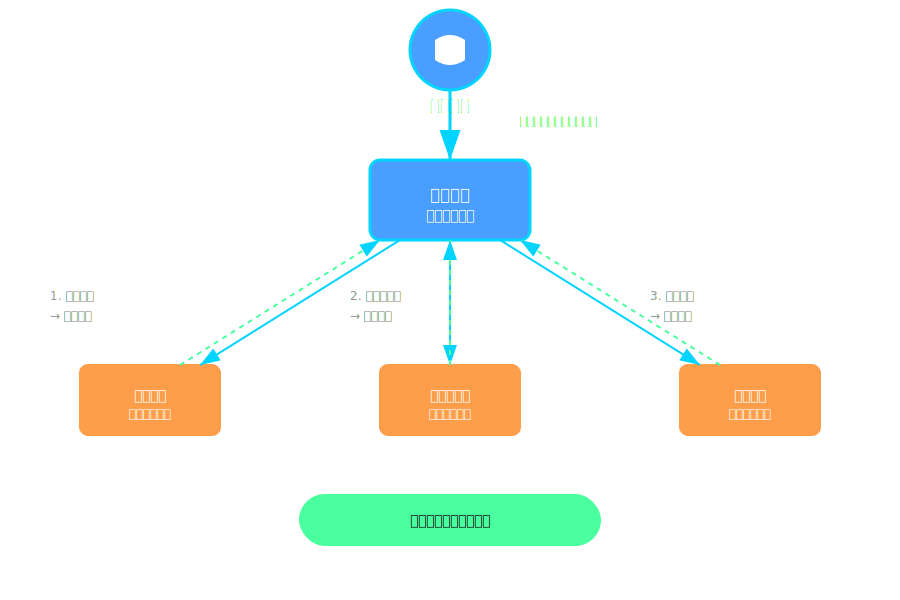
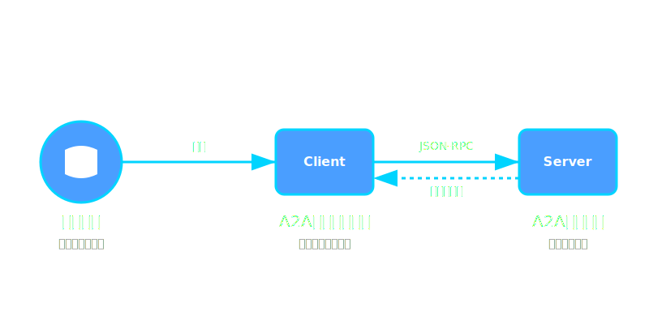
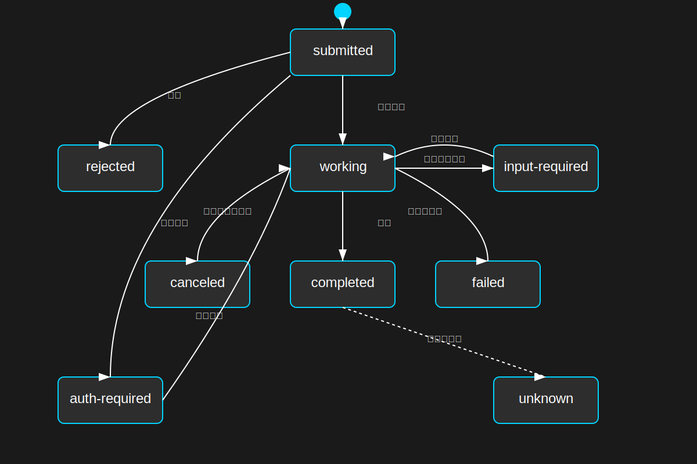

# A2A プロトコルを試してみる

さくらのAI Meetup vol.11「Agent2Agent（A2A）」
2025/06/25(水)

<!--
私は azukiazusa と申します。今日は「A2A プロトコルを試してみる」というテーマで、TypeScript を使った実装についてお話しさせていただきます。
-->

---

# 自己紹介

- azukiazusa
- https://azukiazusa.dev
- FE（フロントエンド|ファイアーエムブレム）が好き


<!-- はじめに簡単に自己紹介です。普段 azukiazusa という名前で活動していています。azukiazusa.dev というブログを運営してフロントエンドや AI 関連の記事を書いています。
好きなものはフロントエンドとファイアーエムブレムです。 -->

---

## Agent2Agent（A2A）プロトコルとは

AI エージェント間の連携を標準化するプロトコル

- Google が開発・発表
- 異なるベンダーのエージェント同士が連携
- 標準的な HTTP 上に構築
- Linux Foundation に寄贈された
  - https://developers.googleblog.com/en/google-cloud-donates-a2a-to-linux-foundation

<!--
まず、A2A プロトコルとは何かについてご説明いたします。
Agent2Agent プロトコル、略して A2A は、AI エージェント間の連携を標準化するために設計されたプロトコルです。
これは Google が開発・発表したもので、異なるベンダーや組織が開発した AI エージェント同士が、統一された方法で通信できるようにするものです。
重要なのは、標準的な HTTP の上に構築されているということです。これにより、既存の Web 技術の上で実装できるという利点があります。
-->

---

## なぜ A2A が必要か？

AI エージェントが効果的に目的を達成するためには、多様なエージェントがエコシステム内で連携できることが重要

- 旅行計画の例：
  - 天気予報を調べる
  - 宿泊先を予約する
  - 交通機関を予約する


<!--
では、なぜ A2A プロトコルが必要なのでしょうか。
AI エージェントが効果的に目的を達成するためには、多様なエージェントがエコシステム内で連携することが重要です。
例えば、旅行の計画を立てる場合を考えてみてください。AI エージェントを使わずに人間が計画を立てたとしても、天気予報を調べて最適な日程を決める、宿泊先を検索・比較して予約する、交通機関の空き状況を確認して予約するなど、様々なタスクがあると思います。
-->

---



<!--
それぞれのタスクには専門性が求められていて、単独のエージェントだけでは完結できないことが多いです。とはいえそれぞれの専門家に対してユーザーが個別に指示を出すのは効率が悪いですよね。
そこで AI エージェント同士の連携が必要になります。おそらく天気予報を調べるエージェントと宿泊先を予約するエージェント、は別々の会社や部門で開発されることになると思うんですよね。それぞれ持っているデータは異なるでしょうし。ただ会社ごとに　 API を作ってしまうと、連携が困難になってしまう、そこで標準的なプロトコルが必要になるわけです。
--> 
---


<h2 class="top">A2A の 3 つのアクター</h2>

<!--
A2A プロトコルでは、3つのアクターが登場します。
まず「ユーザー」。これは目的を達成するためにエージェントに指示を出す人間です。
次に「クライアント」。これはユーザーに代わってサーバーのエージェントにアクションを要求する役割を担います。A2A プロトコルは JSON-RPC 形式で通信を行うため、クライアントはそのリクエストを適切な形式に変換して送信します。
そしてサーバー。これは HTTP サーバー上で動作し、クライアントからのリクエストを受け取り、処理を行います。リモートエージェントは、ユーザーの要求に応じて必要なタスクを実行し、その結果をクライアントに返します。例えばホテルの予約などですね。
-->



---

## AgentCard

エージェントの機能を記述するメタデータ

- エージェントの名前・説明
- サポートされている機能（ストリーミング、プッシュ通知）
- 提供するスキル
- 認証メカニズム
- `/.well-known/agent.json` でホスト

<!--
A2A プロトコルによってエージェントがどのようにやり取りを行うのか見ていきましょう。A2A サーバーはエージェントカードと呼ばれるものを JSON 形式で公開する必要があります。
エージェントカードによりエージェントが持つ機能やスキルを公開します。例えばストリーミングによる配信をサポートしているとか、天気予報を調べるスキルを持っているとか、そういった情報が含まれます。
エージェントカードは `/.well-known/agent.json` というパスで公開することが推奨されています。クライアントはこのエンドポイントにアクセスすることで、エージェントの機能を把握し、どのタスクをどのエージェントに依頼すればよいかを判断できます。
-->

---

## AgentCard の実装

```typescript
export const agentCard: AgentCard = {
  name: "Dice Agent",
  description: "サイコロを振るエージェント",
  url: "https://localhost:3000",
  version: "1.0.0",
  defaultInputModes: ["text/plain"],
  defaultOutputModes: ["text/plan"],
  capabilities: {
    streaming: true,
    pushNotifications: false,
  },
  skills: [{
    id: "dice-roll",
    name: "diceRoll",
    description: "ランダムな数字を生成するサイコロツール",
    examples: [
      "サイコロを振ってください",
      "12面のサイコロを振ってください",
    ],
    tags: ["dice", "random"],
    inputModes: ["text/plain"],
    outputModes: ["text/plain"],
  }]
};
```

<!--
エージェントカードの実装例です。ここでは、サイコロを振るエージェントを定義しています。
skills は配列形式になっていて、ランダムな数字を生成するサイコロツールを提供することがわかります。examples フィールドではスキルの使用方法を示すプロンプトやユースケースを提供しています。このエージェントは例えば「12 面のサイコロを振ってください」といったリクエストをプロンプトとして渡せば、サイコロを降るツールを実行してくれるとわかるわけですね。
-->

---

## AgentCard の実装

```typescript
import { Hono } from 'hono'
import { agentCard } from './agentCard';
const app = new Hono()

app.get("/.well-known/agent.json", (c) => {
  return c.json(agentCard);
});

```

<!--
作成したエージェントカードを Hono フレームワークを使って公開する例です。先ほど紹介した `/.well-known/agent.json` エンドポイント に GET リクエストを受け付けるようにルーティングを定義しています。このエンドポイントにアクセスすると、先ほど定義した `agentCard` オブジェクトが JSON 形式で返されます。
--> ｀

---

## Task オブジェクト

クライアントとサーバー間の通信を管理

- クライアントは `Message` にプロンプトを含めて送信
- サーバーはリクエストを受け取ったらタスクを作成
- サーバーはタスクの現在の状態（作業開始・完了・失敗など）を更新して返す
- 最終結果として `Message` や `Artifact` を返す
  - `Message`: プロンプトに対する応答
  - `Artifact`: ファイルやデータのような具体的な成果物
- クライアントはタスクの進行状況を追跡できる

<!--
続いて、A2A プロトコルの中心となる Task オブジェクトについて説明します。クライアントとサーバーは Task オブジェクトを通じて通信を行います。
クライアントは `Message` オブジェクトにプロンプトを含めてサーバーに送信します。サーバーはそのタスクの現在の状態を更新し、作業が開始されたことや完了したこと、失敗した場合はその理由などを返します。
最終的な結果として、サーバーは `Message` や `Artifact` を返します。`Message` プロンプトに対する応答や、`Artifact` はファイルやデータのような具体的な成果物を指します。
Task オブジェクトにより、クライアントはタスクの進行状況を追跡できるわけです。
-->
---

## Task の状態遷移

- `submitted`: サーバーにリクエストが受理された
- `working`: エージェントによりタスクの処理が開始された
- `input-required`: 追加の入力が必要
- `completed`: 完了
- `canceled`: キャンセル
- `failed`: 失敗
- `rejected`: 拒否
- `auth-required`: 認証必要
- `unknown`: 不明な状態

<!--
タスクが持ちうる状態は Enum 型で定義されていて、以下のような状態があります。
-->

---



<!-- 
サーバーリクエストを受け取ると "submitted" 状態でタスクを新しく作成して、処理が開始されると "working" 状態に遷移します。タスクを完了するためにさらに追加の入力が必要な場合は "input-required" 状態でクライアントに通知して待機状態になります。
エージェントの実行中にクライアントからキャンセルリクエストが送られることもあり、その場合には "canceled" 状態に遷移します。最終的にタスクが完了すると "completed" 状態になり、クライアントに成果物を返します。
 -->
---

## JSON-RPC 2.0 形式の通信

リクエストとレスポンスは JSON-RPC 2.0 形式で行われる。POST リクエストで送信

```json
{
  "jsonrpc": "2.0",
  "id": 1,
  "method": "message/send",
  "params": {
    "id": "uuid",
    "message": {
      "role": "user",
      "parts": [{"type": "text", "text": "サイコロを振って"}]
    }
  }
}
```

<!-- 
A2A プロトコルでは、リクエストとレスポンスは JSON-RPC 2.0 形式で行われます。JSON-RPC 2.0 はリモートプロシージャコールを行うための標準的なフォーマットで、HTTP POST リクエストで送信されます。
例えば、クライントとサーバーのやり取りが開始されるリクエストは以下のような形式になります。

メソッドは `message/send` で、サーバーはこの値を見て適切な処理を行います。`params` フィールドには `message` オブジェクトが含まれ、ユーザーからのプロンプトが `text` フィールドに格納されています。
-->

---

## レスポンス例

```json
{
  "jsonrpc": "2.0",
  "id": 1,
  "result": {
    "id": "de38c76d-d54c-436c-8b9f-4c2703648d64",
    "sessionId": "a3e5f7b6-3e4b-4f5a-8b9f-4c2703648d64",
    "status": {
      "state": "completed",
      "message": [
        {
          "role": "agent",
          "parts": [{"type": "text", "text": "サイコロの目は 1 でした"}]
        }
      ]
    },
  }
}
```

<!--
レスポンスの例です。`result` フィールドにはタスクの結果が含まれています。
タスクの状態は `status` の `state` フィールドで表され、ここでは `completed` となっていて処理が完了していることがわかります。
`message` フィールドにはサーバーエージェントからの応答が含まれています。
-->

---

## プロトコルRPCメソッド

定義済みの `method` に対応する `params` を含むリクエストを送信

- `message/send`: メッセージを送信
- `message/stream`: メッセージをストリーミング送信
- `tasks/get`: 実行中のタスクの状態を取得
- `tasks/cancel`: タスクをキャンセル

<!--
A2A プロトコルでは、いくつかの定義済みの RPC メソッドが用意されています。
例えば、`message/send` もしくは `message/stream` メソッドはクライアントからサーバーに最初のメッセージを送信するために使用されます。
`tasks/get` メソッドはクライアントとサーバーのやり取りが開始された後に、クライアントが現在のタスクの状態を取得するために使用します。
`tasks/cancel` メソッドは、実行中のタスクをキャンセルを要求するために使用されます。
-->

---

## サーバーを実装してみる

- エンドポイント `/` で POST リクエストを受け付ける
- JSON-RPC 2.0 形式のリクエストか検証

```typescript
import { Hono } from "hono";
const taskApp = new Hono();

taskApp.post("/", async (c) => {
  const body = await c.req.json();
  if (!isValidJsonRpcRequest(body)) {
    const errorResponse = {
      code: -32600,
      message: "Invalid Request",
    };
    return c.json(errorResponse, 400);
  }
  // リクエストの処理ロジックをここに実装
});
```

<!-- 
それでは、A2A プロトコルのサーバーを実装例を見ていきましょう。ルートエンドポイント `/` で POST リクエストを受け付けるようにします。
最初にやるべきことは、リクエストが JSON-RPC 2.0 形式であるかどうかを検証することです。リクエストが正しい形式でない場合は、JSON-RPC のエラーコード `-32600` を返します。
 -->

---

### body の `method` を確認

```typescript
taskApp.post("/", async (c) => {
  const body = await c.req.json();
  // ...
  switch (body.method) {
    case "message/send":
      return handleSendMessage(c, body);
    case "tasks/get":
      return handleGetTask(c, body);
    // 省略
    default:
      const errorResponse: ErrorMessage = {
        code: -32601,
        message: "Method not found",
      };
      return c.json(errorResponse, 404);
  }
});
```

<!--
次に、リクエストの `method` フィールドを確認して、適切なハンドラーにルーティングします。存在しないメソッドが指定された場合は、JSON-RPC のエラーコード `-32601` を返します。 
-->

---

### `params` の検証

```typescript
async function handleSendMessage(c: Context, body: any) {
  const params: MessageSendParams = body.params;
  // params の検証
  if (!params || !params.id || !params.message) {
    const errorResponse: ErrorMessage = {
      code: -32602,
      message: "Invalid params",
    };
    return c.json(errorResponse, 400);
  }
}

```

<!--
`send/message` メソッドのハンドラの例を見てみましょう。ここでは、`params` フィールドを検証して、必要な情報が含まれているか確認します。`send/message` メソッドでは、`params` に `id` と `message` が含まれていることが期待されます。
もし `params` が不正な場合は、JSON-RPC のエラーコード `-32602` を返します。
-->

---

### エージェントを呼び出し結果を返す

```typescript
async function handleSendTask(c: Context, body: any) {
  const getOrCreateTaskResult = getOrCreateTask(params.id, params.message);
  // タスクの状態を "working" に更新する
  taskStore.set(params.id, {})
  // AI エージェントを呼び出す
  const result = await generateText({...});
  // タスクの状態を "completed" に更新する
  taskStore.set(params.id, {
    status: {
      state: "completed",
      timestamp: new Date().toISOString(),
      message: [
        {
          role: "agent",
          parts: [{ type: "text", text: `サイコロの目は ${result} でした` }],
        },
      ],
    },
  });

  return c.json({...})
}
```

<!--
次に、タスクを処理するロジックを実装します。ここではまず、タスクストアからタスクを取得または新規作成します。新規作成する場合は、タスクの状態を "submitted" に設定します。
続いてタスクの状態を "working" に更新し、AI エージェントを呼び出して処理を行います。ストリーミング応答の場合には、タスクが更新されるたびにクライアントに通知されます。タスクは更新するたびにデータベースなどに保存しておいて、`tasks/get` メソッドでクライアントがタスクの状態を取得できるようにします。
最後に AI エージェントを呼び出して結果を取得し、タスクの状態を "completed" に更新して、最終的な応答をクライアントに返します。エラーハンドリングが認証の処理などは省略していますが、大まかな流れはこのようになります。
-->

---

## クライアント実装

```typescript
export class A2AClient {
  async sendMessage(params: MessageSendParams): Promise<any> {
    const response = await fetch(`${this.baseUrl}/`, {
      method: "POST",
      headers: { "Content-Type": "application/json" },
      body: JSON.stringify({
        jsonrpc: "2.0",
        id: crypto.randomUUID(),
        method: "message/send",
        params,
      })
    });
    return response.json();
  }

  agentCard(): Promise<AgentCard> {
    return fetch(`${this.baseUrl}/.well-known/agent.json`)
      .then((res) => res.json());
  }
}
```

<!--
クライアントの実装例です。クライアント TypeScript のクラスで作成していて A2A サーバーに対してメッセージを送信するための `sendMessage` メソッドを持っています。RPC メソッドごとに class のメソッドを定義するイメージですね。
`sendMessage` メソッドは、JSON-RPC 2.0 形式のリクエストを作成し、サーバーに POST リクエストを送信します。
他にもエージェントカードを取得するための `agentCard` メソッドも定義されています。これにより、クライアントはエージェントの機能やスキルを把握できます。
-->

---

## CLI ツールの作成

```typescript
const agentCard = await client.agentCard();
const tools: ToolSet = {};

for (const skill of agentCard.skills) {
  tools[skill.id] = tool({
    description: skill.description,
    execute: async ({ input }) => {
      return await client.sendMessage({
        message: { role: "user", parts: [{ type: "text", text: input }] }
      });
    }
  });
}
```

<!--
A2A クライアントを使って CLI ツールを作ってみます。　まずはエージェントカードを取得して、そこからスキルを読み取ります。
スキルごとにツールを定義して、`tools` オブジェクトに追加していきます。
ツールは `execute` メソッドを持ち、ここでクライアントの `sendMessage` メソッドを呼び出して、ユーザーからの入力をサーバーに送信します。
-->
---

### `main()` 関数の実装

```typescript
async function main() {
  const input = await lr.question("You: ");
  const response = await generateText({
    messages: [{ role: "user", content: input }],
    tools, // エージェントカードを元に定義したツールをセット
  }); 

  console.log(`AI: ${response.message.parts[0].text}`);
}
```

<!--
main関数では、ユーザーからの入力を受け取り、`generateText` 関数を呼び出して AI エージェントにメッセージを送信します。
このとき、先ほど定義したツールを `tools` オブジェクトとして渡します。AI エージェントはこのツールを使って、必要な処理を実行します。
-->

---

### 実行結果

```bash
あなた: サイコロを振って
AI: サイコロを振った結果は 4 でした！

もう一度振りますか？
```

<!--
実行結果の例です。ユーザーが「サイコロを振って」と入力すると、AI エージェントがサイコロを振って結果を返します。
サーバーのエージェントの結果が帰ってきたことがわかりますね
-->

---

## JavaScript SDK

Google が提供する公式 SDK で A2A エージェント開発を簡略化

https://github.com/google-a2a/a2a-js

```bash
npm install @a2a-js/sdk
```

<!--
ここまででは A2A の仕様を知るために手動で実装してきましたが、実際のプロダクション環境では、より簡単に実装できる SDK やフレームワークを使いたいものです。
Google 公式の A2A プロトコルのクライアント SDK も提供されているので、これを使ってみましょう。
-->

---

## エージェントカード

```typescript
import { AgentCard } from "@a2a-js/sdk";

export const agentCard: AgentCard = {
  name: "Dice Agent",
  description: "サイコロを振るエージェント",
  // ... 他のフィールドは省略
};
```

<!--
エージェントカードの定義方法は SDK を使わない方法と同じです。AgentCard 型をインポートして、JavaScript オブジェクトとしてエージェントカードを定義します。
ここで定義したエージェントカードは後からサーバーを起動する際に使用します。
-->

---

## AgentExecutor クラスを継承する

```typescript
import { AgentExecutor } from "@a2a-js/sdk";
import type { RequestContext, ExecutionEventBus } from "@a2a-js/sdk";

export class DiceAgent extends AgentExecutor {
  public cancelTask = async (
      taskId: string,
      eventBus: ExecutionEventBus,
  ): Promise<void> => {
    // tasks/cancel メソッドが呼び出されたときに実行される
    // 実行中のタスクをキャンセルするロジックを実装
  };
  async execute(
    requestContext: RequestContext,
    eventBus: ExecutionEventBus
  ): Promise<void> {
    // message/send or message/stream が呼び出されたときの処理を実装
  }
}
```

<!--
JavaScript SDK では `AgentExecutor` クラスを継承して独自のエージェントを実装できます。
開発者は `execute` メソッドと `cancelTask` メソッドを実装することが求められます。
`execute` メソッドがメインの処理ロジックで message/send もしくは message/stream が呼び出され処理が開始された時に実行されます。
`cancelTask` は `tasks/cancel` メソッドが呼び出されたときに実行され、実行中のタスクをキャンセルするロジックを実装します。
-->

---
### `execute` メソッドの実装

```typescript
async function execute(
  requestContext: RequestContext,
  eventBus: ExecutionEventBus
): Promise<void> {
  const { taskId, message } = requestContext;
  // 新しいタスクを作成してクライアントに通知する
  eventBus.publish({ id: taskId, status: { state: "submitted" }});
  // タスクの状態を "working" に更新
  eventBus.publish({ id: taskId, status: { state: "working" }});

  const result = generateText(message.parts[0].text);
  // タスクの状態を "completed" に更新して結果を返す
  eventBus.publish({
    id: taskId,
    status: {
      state: "completed",
      message: [{ role: "agent", parts: [{ type: "text", text: `サイコロの目は ${result} でした` }] }],
    },
  });
}
```
// クライアントのリクエストを受け取る
const { taskId, message } = requestContext;

// 新しいタスクを作成してクライアントに通知する
eventBus.publish({ id: taskId, status: { state: "submitted" }});
// タスクの状態を "working" に更新
eventBus.publish({ id: taskId, status: { state: "working" }});

const result = generateText(message.parts[0].text);
// タスクの状態を "completed" に更新して結果を返す
eventBus.publish({
  id: taskId,
  status: {
    state: "completed",
    message: [{ role: "agent", parts: [{ type: "text", text: `サイコロの目は ${result} でした` }] }],
  },
});
```

<!--
`execute` メソッド内での処理を見ていきましょう。
クライアントから受け取ったパラメータは `requestContext` から取得できるので、ここからユーザーからのメッセージを取得します。
taskId を使って新しいタスクを作成し、処理が受理されたことを意味する `submitted` 状態を EventBus を使用して通知します。
次にタスクの状態を `working` に更新し、実際の処理を行います。
ここではサイコロを振る処理を `generateText` 関数で行い、その結果を取得します。
最後にタスクの状態を `completed` に更新し、結果をクライアントに返します。
この実装により、同期的な処理とストリーミングの両方に対応できます。
-->

---

## サーバーを起動

```typescript
import { InMemoryTaskStore, DefaultRequestHandler, A2AExpressApp } from "@a2a-js/sdk";
import express from "express";

const taskStore: TaskStore = new InMemoryTaskStore();
const agentExecutor: AgentExecutor = new DiceAgent();

const requestHandler = new DefaultRequestHandler(
  agentCard,
  taskStore,
  agentExecutor
);

const appBuilder = new A2AExpressApp(requestHandler);
const expressApp = appBuilder.setupRoutes(express(), '');

expressApp.listen(3000, () => {
  console.log("A2A server is running on https://localhost:3000");
});
```
<!--
A2A プロトコルのサーバーを起動するためのコードです。
defaultRequestHandler を使って、エージェントカードとタスクストア、エージェントの実装をセットアップします。
ここでは InMemoryTaskStore を使ってタスクの状態をメモリ上で管理していますが、本番環境ではデータベースのような永続的なストレージを使用することになるでしょう。
A2AExpressApp を使って Express アプリケーションにルーティングを設定し、サーバーを起動します。
-->

---
## クライアントの実装

`A2AClient` を使ってエージェントと通信

```typescript
import { A2AClient } from "@a2a-js/sdk";
import { randomUUID } from "node:crypto";
const client = new A2AClient("http://localhost:41241");

const response = await client.sendMessage({
  id: randomUUID(),
  message: {
    role: "user",
    parts: [{ type: "text", text: "サイコロを振って" }],
  },
});

if (response.result.kind === "message") {
  console.log(`AI: ${response.result.message.parts[0].text}`);
} 
```

<!--
SDK ではクライアント側の実装も用意されています。
`A2AClient` を使ってサーバーのエンドポイントを指定してインスタンスを作成します。sendMessage を使って "message/send" メソッドを
呼び出します。
結果は A2A プロトコルの仕様に従った形式で `result` フィールドに格納されます。
-->

---

## ストリーミングで応答を受け取る

```typescript
const stream = client.sendMessageStream({
  message: {
    messageId: randomUUID(),
    kind: "message",
    role: "user",
    parts: [{ kind: "text", text: "サイコロを振ってください" }],
  },
});

for await (const event of stream) {
  if (event.kind === "message") {
    console.log(`AI: ${event.parts[0].text}`);
  } else if (event.kind === "task") {
    console.log(`Task status: ${event.status.state}`);
  }
}
```

<!-- 
sendMessageStream メソッドを使うことで、ストリーミングで応答を受け取ることもできます。
結果は AsyncIterable として返されるので、for-await-of ループで処理できます。
 -->

---

## Mastra での A2A サポート

TypeScript AI エージェントフレームワーク

- **自動対応**: 特別な設定不要
- **クライアント SDK**: `@mastra/client-js`
- **ストリーミング**: SSE による実時間更新

<!--
次に Mastra というフレームワークをご紹介します。
Mastra は TypeScript で AI エージェントを構築するためのフレームワークで、
A2A プロトコルを標準でサポートしています。
特別な設定をしなくても、エージェントを作成するだけで自動的に A2A 準拠のサーバーが立ち上がります。
また、クライアント SDK も提供されているので、A2A プロトコルを使った通信も簡単に実装できます。
-->

---

## Mastra サーバーのセットアップ

```bash
npx create-mastra@latest my-mastra-app
cd my-mastra-app
npm run dev
```

<!--
Mastra のサーバーをセットアップするには、まず `create-mastra` コマンドを使って新しいプロジェクトを作成します。
その後、プロジェクトディレクトリに移動して、`npm run dev` で開発サーバーを起動します。
--> 
---

## エージェントカード

- `/.well-known/{agentId}/agent.json` でエージェントカードを公開
- 作成したエージェントの内容から自動でエージェントカードが生成される

---

## Mastra エージェントの作成

```typescript
export const travelAgent = new Agent({
  name: "travel-agent",
  instructions: "旅行プランを提案するエージェント",
  model: anthropic("claude-4-sonnet-20250514"),
  tools: { weatherTool }
});
```

---

## Mastra のエントリーポイント

```typescript
import { Mastra } from "@mastra/core";
import { travelAgent } from "./agents/travelAgent";
 
export const mastra = new Mastra({
  agents: { travelAgent },
});
```

- `/a2a/travelAgent` で A2A エージェントとして公開される

<!--
Mastra のエントリーポイントでは Mastra クラスをインスタンス化し、作成したエージェントを登録します。
この例では `travelAgent` というエージェントを登録しています。これにより、`/a2a/travelAgent` エンドポイントで A2A エージェントとして公開され、`/send/message` メソッドを通じてクライアントからのリクエストを受け付けることができます。
 -->
---

## Mastra クライアント

```bash
npm install @mastra/client-js
```

<!--
Mastra クライアントを使うためには、`@mastra/client-js` パッケージをインストールします。
このクライアント SDK を使うことで、A2A プロトコルに準拠したエージェントとの通信が簡単に行えます。
-->

---

### A2A クライアントの初期化

```typescript
import { MastraClient } from "@mastra/client-js";

const client = new MastraClient({
  baseUrl: "http://localhost:4111"
});

// エージェントの ID を指定して A2A クライアントを取得
const a2a = client.getA2A("travelAgent");

// エージェントカードを取得
const agentCard = await a2a.getCard();
```

<!-- 
Mastra クライアントを初期化するには、`MastraClient` クラスを使います。`baseUrl` には Mastra サーバーの URL を指定します。
その後、`getA2A` メソッドを使って特定のエージェントの A2A クライアントを取得します。
このクライアントを使うことで、エージェントカードの取得やメッセージの送信が可能になります。
a2a.getCard() メソッドを使うと、エージェントカードを取得できます。
-->

---

### Mastra でのメッセージ送信

```typescript
const response = await a2a.sendMessage({
  id: crypto.randomUUID(),
  message: {
    role: "user",
    parts: [{ type: "text", text: "箱根旅行プランを提案して" }]
  }
});
```

<!--
Mastra クライアントを使ってメッセージを送信するには、`sendMessage` メソッドを使用します。
このメソッドにより `message/send` メソッドが呼び出され、エージェントにユーザーからのメッセージを送信します。
-->

---

### ストリーミング通信

```typescript
const response = await a2a.sendAndSubscribe({
  id: crypto.randomUUID(),
  message: { /* メッセージ */ }
});

const reader = response.body?.getReader();
while (true) {
  const { done, value } = await reader.read();
  if (done) break;
  console.log(new TextDecoder().decode(value));
}
```

<!--
sendAndSubscribe メソッドを使うことで、/message/stream メソッドを呼び出し、ストリーミングで応答を受け取ることができます。
このメソッドは、サーバーからの応答をリアルタイムで受け取ることができ、`ReadableStream` として返されます。
`getReader` メソッドを使ってストリームのリーダーを取得し、`while` ループでデータを読み取ります。
ストリーミング応答は、サーバーからのデータが到着するたびに処理できるため、リアルタイムでの応答が可能です。
-->

---


## まとめ

- A2A はエージェント間連携の標準プロトコル
- エージェントカードでエージェントの機能やスキルを公開
- タスクオブジェクトでクライアントとサーバー間の通信
- JSON-RPC 2.0 形式でリクエストとレスポンスをやり取り
- JavaScript SDK や Mastra で A2A に準拠したエージェントを簡単に実装可能

<!--
最後に、A2A プロトコルのまとめです。
A2A はエージェント間の連携を標準化するプロトコルであり、エージェントカードを使ってエージェントの機能やスキルを公開します。
タスクオブジェクトを通じてクライアントとサーバー間の通信を行い、JSON-RPC 形式でリクエストとレスポンスをやり取りします。
また、JavaScript SDK や Mastra フレームワークを使うことで、A2A 準拠のエージェントを簡単に実装できます。
これにより、AI エージェント同士の連携がよりスムーズになり、複雑なタスクを効率的に処理できるようになります。
-->
---

## 参考資料

 
- https://google.github.io/A2A/
- https://github.com/google-a2a/a2a-samples/tree/main/samples
- https://www.jsonrpc.org/specification
- https://github.com/google-a2a/a2a-js
- https://mastra.ai/

---

## 詳細はブログ記事を参照

- https://azukiazusa.dev/blog/ai-a2a-protocol/
- https://azukiazusa.dev/blog/a2a-protocol-js-sdk/
- https://azukiazusa.dev/blog/mastra-a2a-protocol-support/

<!--
以上で発表を終わらせていただきます。
ご清聴いただき、ありがとうございました。
A2A プロトコルについて、少しでもご理解いただけたでしょうか。
もし何かご質問がございましたら、お聞かせください。
また、より詳細な実装については私のブログにも記事を投稿しておりますので、
ぜひそちらもご参考にしていただければと思います。
ありがとうございました。
-->