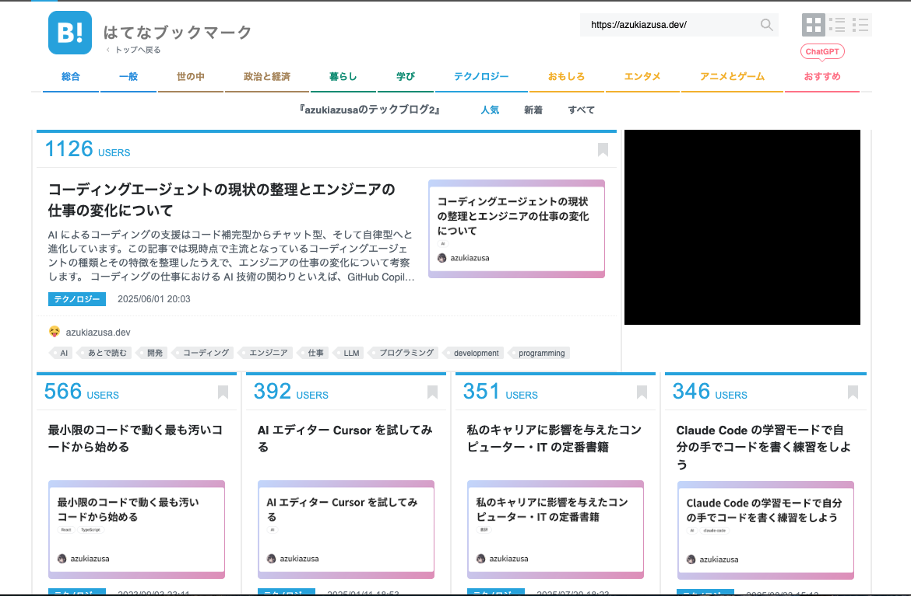
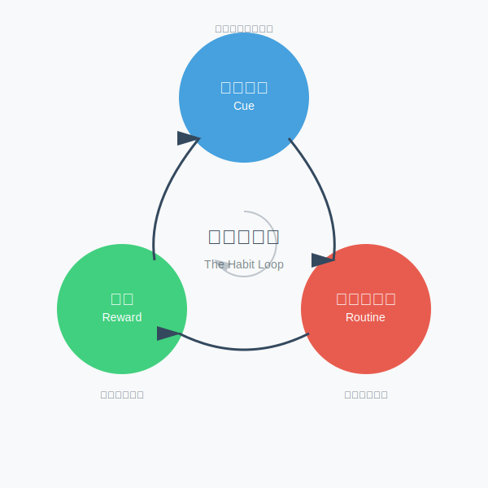
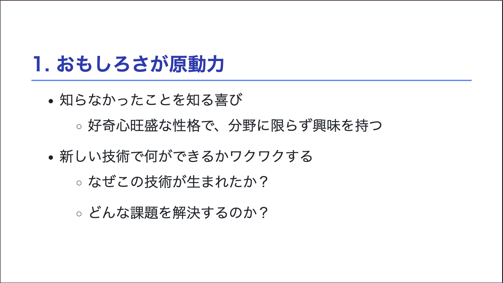
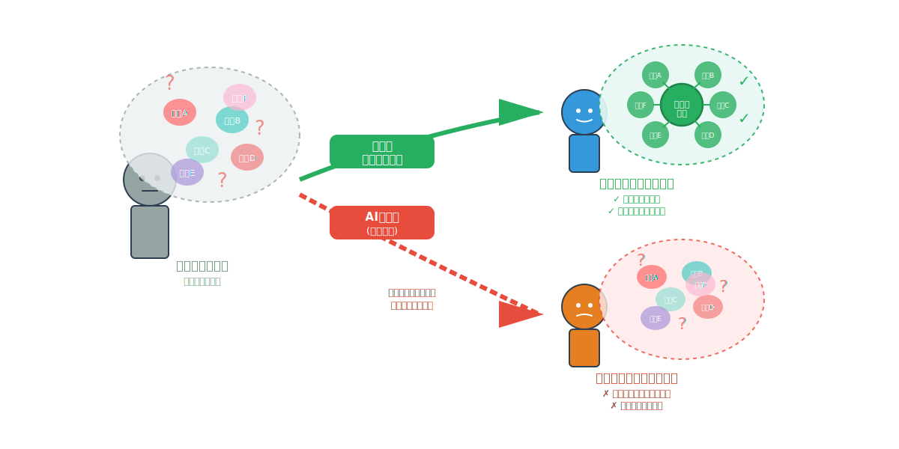

# 習慣×AI×環境 — 技術探求を続ける3つの鍵

エキスパートとしてのキャリア
「技術に取り残される」不安への処方箋

<!--
今日は「習慣×AI×環境 — 技術探求を続ける3つの鍵」というテーマで、なぜ私たちエンジニアが新しい技術を学び続けるのか、そしてそれを継続するための方法についてお話しします。
-->

---

## 自己紹介

<div class="flex justify-between">

<div>

- **azukiazusa**
- フロントエンドが好き
- azukiazusa.dev
  - 週に1回技術記事を公開 (5年以上継続中)

</div>

<div>


</div>

</div>

<!--
私はazukiazusa1という名前で活動しているフロントエンドエンジニアです。現在、週に1回技術記事をブログで公開することを5年以上続けています。
-->

---

## ブログを書いてます

<div class="center">



</div>

<!--

私のブログでは、主にフロントエンド技術やAIに関する記事を執筆しています。はてなブックマークで人気の記事も多く、技術コミュニティでのフィードバックもいただいています。
 -->

---

## 今日のアジェンダ

1. なぜ新しい技術を学び続けるのか
2. AI を活用した技術記事執筆法
3. 「自分にはまだ早い」と思っているあなたへ

---

## なぜ探求するのか

1. おもしろいから
2. 自分のためにアウトプットをする
3. 習慣化しているから

<!--
なぜ私が新しい技術を探求し続けるのか、主に3つの理由があります。

まず第一に、「おもしろいから」。新しい技術を学ぶこと自体が楽しいと感じるからこそ、自然と探求が続くのだと思います。

続いて、「自分のためにアウトプットをする」。アウトプットを通じて自分の理解を深めることができます。

そして最後に、「習慣化しているから」。習慣になっているため、自然と新しい技術に触れる機会が増えています。
-->

---

## 1. おもしろさが原動力

- 知らなかったことを知る喜び
  - 好奇心旺盛な性格で、分野に限らず興味を持つ
- 新しい技術で何ができるかワクワクする
  - なぜこの技術が生まれたか？
  - どんな課題を解決するのか？

<div class="mt-2 center">

**毎週「新しいおもちゃ」が届く感覚**

</div>

<!--
前提として、私自身好奇心が旺盛で、今まで知らなかったことを知るのが好きなんですよね。これはエンジニアリング関連の技術に限らず、いろんな分野で興味を持ちます。

特に技術系の新しいツールやフレームワークであれば、なぜこの技術が生まれたのか、どんな課題を解決するのかといった背景を深く掘り下げることにつながります。

毎週新しいおもちゃが届くような感覚で、追いかけるのではなく、楽しむというスタンスが大事だと思っています。
-->

---

## 2. アウトプットは自分のため

<div class="highlight">他人からの評価を期待するのではなく、自分自身の学習効果を最大化するためにアウトプットを行う</div>

- 人に教えるように学ぶと理解が深まる
  - 理解があいまいな部分の発見
  - 長期記憶への定着
  - 知識の整理整頓

<!--
2つ目のポイント、アウトプットは自分のために行うということです。他人からの評価を期待するのではなく、自分自身の学習効果を最大化するためにアウトプットを行う。これがアウトプットを継続できている要因の一つだと考えています。

人に教えるように学ぶと理解が深まるというのはよく知られた事実です。ブログ記事の形式で誰かに教えるように書くことで、理解があいまいな部分を発見したり、知識が整理されたりします。
-->

---

## 内発的動機づけ vs 外発的動機づけ

<style>
  .flex-column {
    display: flex;
    flex-direction: column;
    align-items: center;
    gap: 0.8rem;
  }
</style>

<div class="flex-column">

|                | 例                     | 効果               |
| -------------- | ---------------------- | ------------------ |
| 内発的動機づけ | 自分の興味や好奇心から | 長期的な継続性     |
| 外発的動機づけ | 報酬や評価を目的に学ぶ | 短期的な成果の向上 |

<div class="highlight">長くアウトプットを続けられてる要因の 1 つは内発的動機づけ</div>

</div>

<!--
私が長期間アウトプットを続けられている要因の一つに、内発的動機づけが大きく関わっていると考えています。内発的動機づけとは、自分の興味や好奇心から行動することであり、これは長期的な継続性をもたらします。

一方、外発的動機づけは、報酬や評価を目的に学ぶことであり、短期的な成果の向上には効果的ですが、長期的な継続性にはつながりにくいと言われています。
-->

---

## 3. 習慣の力

<div class="flex">

<div >

- 私達の行動の約40%は習慣によって決定される
- 習慣化することで、意志力に頼らず行動できる
  - 毎日の歯磨きを億劫に思ったり、意志力を振り絞ってやっているわけではない
- 私にとって、技術の収集やアウトプットは習慣化されている行動

<div class="mt-2 small">

https://www.hayakawa-online.co.jp/shop/g/g0000612738/

</div>

</div>

<div>


</div>

</div>

<!--
書籍『習慣の力』によると、私たちの行動の約40%は習慣によって決定されていると言われています。習慣化することで、意志力に頼らず行動できるようになります。

私にとっては、技術の収集やアウトプットは習慣化されているため、ブログを書かないという選択肢がそもそも頭に浮かばない状態になっています。
-->

---

## きっかけ・ルーティン・報酬

<div class="center">



</div>

<!--
習慣化は、きっかけ、ルーティン、報酬の3つの要素から成り立っています。
きっかけは習慣を始めるトリガーであり、朝起きて口の中がネバネバする感覚があったら、歯を磨こうと思うようなものです。ルーティンは実際の行動そのものであり、例えば朝起きたら歯を磨くとか、週に 3 回ランニングをするなどが該当します。
最後に報酬は、その行動を終えた結果得られる満足感や利益であり、習慣を続けるためのモチベーションとなるものです、例えば歯を磨いた後の爽快感や、ランニングを終えた後の達成感などが該当します。
 -->

---

## 発信の原点：週報から始まった

<div class="center">

週報に「今週学んだこと」を書く（小さな習慣）

↓

「自分の理解を整理できる」という報酬

↓

もっと詳しく書きたい

↓

ブログへ

</div>

<!--
週報に学んだことを書くという小さな習慣が、ブログでの発信へと発展していきました。

週報を書くことで自分の理解を整理でき、「もっと詳しく書きたい」という気持ちが生まれ、それがブログへとつながっていったんですね。

特別なスキルがあったわけではなく、小さなアウトプットから始まったのです。
-->

---

## いきなり大きな目標を立てるのではなく、小さな習慣を作ることが大事

- 小さなことか始めて継続することを目指す
  - 週報は毎週1回、3行程度
- ランニングを始めたときは 2 ~ 3km から始めた
  - 継続したことで、徐々に距離を伸ばして 10km 走れるようになった
- SNS のいいね数やアクセス数を報酬にしない
  - 他人からの反応はコントロールできない

---

## 習慣化のコツ: 私の週次習慣

- 平日: X, はてなブックマークを眺め、気になった投稿をブクマ
  - 「気になったものをストックする」軽い作業
- 土曜の昼頃: ブックマークから1つを選んで深堀り開始
  - 実際に動かしながら並行してブログ記事を執筆
- 記事が完成したらプルリクエストのマージボタンを押す
  - このタイミングが一種の達成感となる

<!--
ここで、私自身の週次の習慣を具体例として紹介します。

平日は X やはてなブックマークを眺めて、気になった投稿をブックマークしています。この時点では深く読み込むわけではなく、あくまで「気になったものをストックする」という軽い作業です。

そして、土曜の昼くらいから、ブックマークした中から1つを選んで深堀りを始めます。実際にコードを動かしたり、技術を試したりしながら、並行してブログ記事を書いていきます。

最後に、ブログを書き終えてプルリクエストのマージボタンを押すタイミングが、一種の達成感となります。
-->

---

## 今日のアジェンダ

<ol>
  <li>なぜ新しい技術を学び続けるのか</li>
  <li class="bold">AI を活用した技術記事執筆法</li>
  <li>「自分にはまだ早い」と思っているあなたへ</li>
</ol>

---

## AI は自分の知識を増幅する道具として使用する

<div class="highlight">

技術記事の執筆は人間がやるべきだが、<br />AI を全く使わないのもナンセンス

</div>

- AIに記事を書かせると、学習の機会を失う
- 補助的な役割として使用するのが効果的

<!--
技術記事の執筆は人間がやるべきだと考えていますが、AI を全く使わないというのもナンセンスだと思います。AI は自分の知識を増幅する道具として補助的な役割として使用するのが良いと考えています。

AIに記事を書かせてしまうと、学習の機会を失ってしまいます。自分で書くプロセスを通じて理解が深まるという効果を大切にしたいですね。
-->

---

## AIとの共創による技術記事執筆

- 壁打ち相手として文書構成を検討
- 校正・誤字脱字チェック
- 文書の形式の変換

<!--
ここで紹介する3つの使い方は、いずれも自分の思考や知識を基盤として、それをより効果的に表現するためのサポートとしてAIを活用しています。

-->

---

## 壁打ち相手として文書構成を検討

<div class="flex">

<div>

- 頭の中で漠然と考えているだけでは見落としていた点に気づける
  - ラバーダッキング効果
- ステップバイステップで論理的に考える訓練にもなる
- AI と対話することで第三者の視点を取り入れられる

</div>


</div>

<!--
壁打ち相手にしてAIを活用する方法はよく知られているテクニックです。
チャット形式で会話することによって、頭の中で漠然と考えているだけでは見落としていた点に気づけるという効果があります。これはラバーダッキング効果と呼ばれるもので、問題を他人に説明する過程で自分の理解が深まる現象です。

AIと対話することで第三者の視点を取り入れられるため、自分一人で考えるよりも多角的な視点から問題を検討できるようになります。

 -->

---

## AIを活用した文章校正

- 誤字脱字や文法の誤りをチェック
  - このような作業は本質的な部分ではない
  - 機械的なチェックは AI の得意分野
- 表現の改善提案
  - より自然な言い回しや、わかりやすい表現への変更提案
  - 「xxx」という単語は突然出てくるため説明を加えたほうが良い、など

<!--
AIを活用した文章校正について詳しく見ていきましょう。

ブログ記事を書く際には、どうしても誤字脱字や文法の誤りが発生してしまいます。ですがこのようなチェックは、技術記事を書く効果の観点からは本質的な部分ではないんですよね。また、機械的なチェックはAIの得意分野でもありますので、こういった部分はAIに任せてしまうのが効率的です。

また、表現の改善提案もしてもらえます。例えば、より自然な言い回しや、読者にとってわかりやすい表現への変更提案などですね。ただし、ここでは注意すべきポイントがあります。次のスライドで詳しく見ていきましょう。
-->

---

### Claude Codeの活用例

カスタムスラッシュコマンド（`/article-review`）で文章校正

````markdown
---
allowed_tools: Bash(git:*), Bash(npm:*), Read(*.md), Fetch(*)
description: "引数で指定した記事のレビューを行います。"
---

あなたはプロの編集者です。技術記事を読んで、誤字脱字、文法的な誤り、不自然な表現を指摘してください。

## 出力形式

```

【誤字脱字・表記ミス】

- 該当箇所：「〇〇〇」
  修正案：「×××」
  理由：[具体的な理由]

  ...
```
````

<!--
実際に私がどのようにAIを活用して文章校正を行っているか、Claude Codeを例に紹介します。

Claude Codeでは、カスタムスラッシュコマンドという機能を使って、自分専用のプロンプトを作成できます。この例では `/article-review` というコマンドで、技術記事の校正を行えるようにしています。

ポイントとしては、誤字脱字、文法的な誤りといった明確な誤りにフォーカスさせていて、また出力形式も指定することで、一貫性のあるフィードバックが得られるようにしています。
-->

---

## 文書の形式の変換

<style>
.conversion-container {
  display: flex;
  align-items: center;
  justify-content: center;
  gap: 2rem;
}

.conversion-source {
  display: flex;
  flex-direction: column;
  align-items: center;
  gap: 0.5rem;
}

.conversion-caption {
  font-size: 1rem;
  color: #666;
  margin: 0;
}

.conversion-targets {
  display: flex;
  flex-direction: column;
  gap: 1.5rem;
}

.conversion-item {
  display: flex;
  align-items: center;
  gap: 0.75rem;
}

.conversion-arrow {
  flex-shrink: 0;
}

.conversion-target {
  display: flex;
  flex-direction: column;
  align-items: center;
  gap: 0.5rem;
}

.conversion-label {
  font-size: 0.6rem;
  color: #666;
  margin: 0;
}
</style>

<div class="conversion-container">
  <div class="conversion-source">
    
    <p class="conversion-caption">
      メモや箇条書きでアイデアを整理
    </p>
  </div>
  <div class="conversion-targets">
    <div class="conversion-item">
      
      <div class="conversion-target">
        
        <p class="conversion-label">ブログ記事</p>
      </div>
    </div>
    <div class="conversion-item">
      
      <div class="conversion-target">
        
        <p class="conversion-label">スライド</p>
      </div>
    </div>
    <div class="conversion-item">
      
      <div class="conversion-target">
        
        <p class="conversion-label">図</p>
      </div>
    </div>
  </div>
</div>

<!--
AIを活用した3つ目の使い方として、文書の形式の変換があります。

私の場合、まずメモや箇条書きでアイデアを整理します。この段階では構造化されていない、断片的な情報が中心です。そこからAIを活用して、ブログ記事やスライド、図といった異なる形式に変換することができます。

-->

---

# 無から AI に生成させるのではなく、<br />自分の頭の中にあるアイデアを形にする補助として活用する

<!--
重要なのは、無からAIに生成させるのではなく、自分の頭の中にあるアイデアを形にする補助としてAIを活用しているという点です。メモという形で自分の考えをアウトプットし、それをAIが整形・変換することで、効率的にコンテンツを作成できます。

大切なのは、自分の頭の中にあるアイデアや知識をまずアウトプットすることです。そのうえで、AIをそれを整形したり、形式を変換したり、表現を改善したりする補助として活用する。このアプローチであれば、学習効果を損なうことなく、効率的にコンテンツを作成できます。

AIは道具です。道具を使いこなすことで、より効果的に、より速く、より質の高いアウトプットを生み出すことができるのです。
-->

---

## 今日のアジェンダ

<ol>
  <li>なぜ新しい技術を学び続けるのか</li>
  <li>AI を活用した技術記事執筆法</li>
  <li class="bold">「自分にはまだ早い」と思っているあなたへ</li>
</ol>

---

## 「自分にはまだ早い」と思っているあなたへ

<div class="center large">

自己ラベリングに縛られない

</div>

- 「私は喋るのが苦手なキャラだから、登壇なんてできない」と思っていた
- 「私は〇〇な人間だから」と決めつけてしまうのは自己ラベリングと呼ばれる
- 自己ラベリングは行動の幅を狭めてしまう

<!--
「自分にはまだ早い」と思っているあなたへ、私からメッセージです。

自己ラベリングに縛られないでください。「私は〇〇だから」という思い込みを捨てることが第一歩です。

環境を変えることで、自分も変われます。登壇を推奨する会社やコミュニティに参加するのも良いでしょう。

そして、小さなアウトプットから始めればいいんです。週報やメモから始める、SNSでの「いいね」を気にしない。これだけでも十分です。

最初から自信がある人はいません。私もそうでした。
-->

---

## 自己ラベリングを脱却するには

<div class="highlight center">環境を変える</div>

<div class="flex">

<div>

- 自己のキャラクターは環境によって形成される
- 環境を変えることで、自分の行動や思考パターンも変わる
- 私が所属している会社では登壇を推奨する文化がある

<div class="mt-2 small">

https://www.sbcr.jp/product/4799109655/

</div>

</div>


</div>

<!--
私が自己ラベリングから脱却できたのは、環境を変えたことが大きかったです。私が所属している会社では登壇を推奨する文化があり、まずは社内勉強会から始めました。

また、週報に「今週学んだこと」を書くという習慣がありました。これが私の発信の原点となっています。特別なことではなく、自分用のメモから始まったんですね。

環境が変われば、自分も変われる。これは本当だと実感しています。
-->

---

## 毎年新しいことを始めるのもおすすめ

- 人間は変化を嫌う生き物なので、新しいことを始めるのは負荷がかかる行為
- マンネリ化したルーティンを繰り返しても、脳はあまり刺激を受けない
- 自分には向いてないと思ってたことに意外とハマったりなど、自己理解を更新する
- 2025 年に初めてライブに参戦した

---

## 「技術に取り残される」 不安に対する回答

- 行動を習慣化する
- AI は道具として活用する
- 自己ラベリングに縛られないために、環境を変える
<!--
これら全てに共通するのは、技術探求は自分自身の成長のためであり、その過程そのものに価値があるということです。

自己ラベリングに縛られず、小さなアウトプットから始めてみてください。環境を変えることで、あなたも変われます。

ご清聴ありがとうございました。
-->
